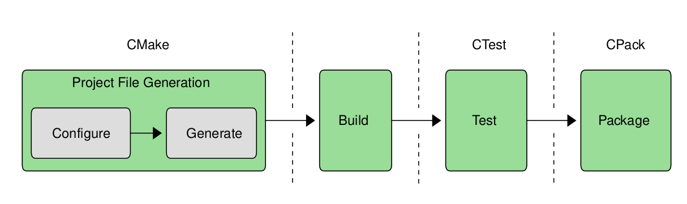
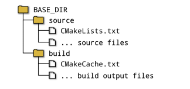

## 介绍

为了将源码转化为最终用户可以实际使用的东西，需要使用到==编译器、链接器、测试框架、打包系统==等，这些都增加了开发高质量、健壮性软件的复杂性，虽然一些`IDE`能够将这些过程简化一点，但是开发跨平台的软件并不是总能用到这些`IDE`的特性。

幸运的是，`CMake`就是一套可以使上述开发过程易于管理的==一套工具==，它涵盖了从建立代码工程到发布包的<font color = red>所有</font>过程everything)，`CMake`不仅涵盖了所有的开发流程，还支持广泛的平台、工具和不同的编程语言。

`CMake`使用的几个阶段如下：



- 阶段一、`CMake`最出名的阶段-使用项目描述文件，生成特定平台的项目文件，这些生成的项目文件适合开发者结合(`make`、`Xcode`、`Visual Studio`)使用。
- 阶段二、使用阶段一生成的构建工具构建工程工程(如 make)
- 阶段三、后台测试管理
- 阶段四、打包管理

上述整个过程`CMake`都可以通过调用对应的工具完成，甚至构建工具(make)也可以被`CMake`调用。


## 建立一个工程

脱离构建系统，工程只是一堆文件的集合。

`CMakeLists.txt` 是一个平台无关的描述文件。`CMake`使用可读文件`CMakeLists.txt`为工程的构建制定了一些规则，定义了哪些文件应该编译，以及如何编译、跑哪些测试和创建什么包，`cmake`使用该描述文件生成特定平台相关工程文件。

`CMake`的基本原则就是项目同时要拥有一个源码路径和二进制文件目录，源码目录是放置`CMakeLists.txt` 文件、源码文件和一些需要构建的文件的地方，源码目录通常处于`git、subversion`或者类似工具的版本控制之下。

所有构建过程生成的文件都会放置到二进制目录，因此二进制目录通常也被称为构建目录。本书中倾向于使用构建目录，因为这样更直观。`CMake`调用构建工具(`eg: make`)、`CTest`和`CPack`的过程中，会在构建目录中生成一系列的文件- 可执行文件、库、测试输出和包。`CMake`还会在构建目录中生成一个名为`CMakeCache.txt`的特殊文件，用于存储各种后期运行时可重用的信息，开发人员不需要关心`CMakeCache.txt`文件，后面章节会讨论`CMakeCache.txt`文件。构建工具的项目文件也是在构建目录中创建的(`eg:makefile`)，这些`CMake`生成的文件不应该处于版本控制之下。

### 在源码中构建

虽然不是很鼓励这样做，但是在使用`CMake`时是可以在源码的目录进行构建的，并将这种构建方式称为内源构建`in-source build`，因为这种方式更加简单，所以开发者刚开始通常会使用这种构建方式。

在源码目录进行构建的主要问题：

- 源码和构建输出都混杂在一起，使得工程的管理变得非常的困难
- 要承担源文件可能被构建输出覆盖的风险
- 许多由构建创建的文件，使得版本控制系统的工作变得更加的困难
- 清除所有构建输出并使用干净源码树并不是件容易的事情

基于以上原因，不建议开发人员在源码中进行构建，即使是一个简单的项目

### 在源码外构建(`out-of-source builds`)

相比之下在源码外构建更加可取，因为：

- 源码与构建文件彻底分离
- 开发人员可以为一份源码创建多个构建目录，比如调试版本一个构建目录，发布版本一个构建目录

本书将始终使用源码外构建，并和遵循源目录和构建目录位于公共父目录下的模式，构建根目录将称为`build`



一些开发人员会使用该方法的一些变体，将构建目录作为源目录的子目录，这样做虽然能顾有在源码外构建的大部分优势，但是让然会有部分内源构建的部分缺点，除非有很好的理由这样使用，否则建议将构建目录完全置于源码树之外。


### 生成项目文件

目录结构定下来后，开发人员可以运行`CMake`，它读入`CMakeList.txt`文件并在构建目录中创建项目文件。开发人员通过选择特定的项目文件生成器，来选择要创建的项目文件的类型。支持一系列不同的生成器，下表列出了更常用的生成器。

| `Category`      | `Generator Examples`    | `Multi-config` |
| --------------- | ----------------------- | -------------- |
| `Visual Studio` | `Visual Studio 15 2017` | `YES`          |
| `Visual Studio` | `Visual Studio 14 2015` | `YES`          |
| `Xcode`         | `Xcode`                 | `YES`          |
| `NinJa`         | `NinJa`                 | `NO`           |
| `Makefiles`     | `UNIX Makefiles`        | `NO`           |
| `Makefiles`     | `MSYS Makefiles`        | `NO`           |
| `Makefiles`     | `MinGW Makefiles`       | `NO`           |
| `Makefiles`     | `NMake Makefiles`       | `NO`           |

` Multi-config`-是否支持多配置构建项目，支持就可以在不重新运行`CMake`的前提下构建不同的项目(`eg: debug release`)

**最简单的调用`CMake`方式**

- 在构建目录中将生成器类型和源码目录的位置传递给`cmake`

```cmake
mkdir build
cd build
cmake -G "Unix Makefiles" ../source
```

如果省略`-G`选项，`cmake`会根据主机的平台选择默认的生成器类型。对于所有的生成器类型，`CMake`将执行一系列的测试并询问系统，以确定如何建立项目文件。这些工作包含验证编译器是否工作、确定支持的编译器特性集和其他的各种任务，在`CMake`完成之前将会给出类似如下的日志信息：

```bash
-- Configuring done
-- Generating done
-- Build files have been written to: /some/path/build
```

上面强调了项目文件的创建，实际上包含两个步骤-配置和生成。在配置阶段，`CMake`通过读取`CMakeLists.txt`文件完成对整个项目的内部表示的构建。在完成这些之后，生成阶段创建项目文件，配置和生成对与基本的`CMake`使用，并不是很重要，但是在后面的章节中，配置和生成分离变得很重要。会在` Chapter 10, Generator Expressions.`章节中进行更加详细的介绍。

当首次完成`CMake`的运行时，它将在构建目录中保存一个`cmakecase.txt`的文件，`CMake`使用这个文件来保存详细信息，这样当它再次运行时，他可以重用第一次计算的信息，并加速项目的生成。后面的章节将会介绍如何使用该文件在不同的运行之间保留开发者选项。`CMake`的`gui`程序使用将在第5章中进行介绍。

### 运行构建工具

此时，项目文件已经可用，开发人员可以按照他们习惯使用他们选择的构建工具。构建目录将包含必要的项目文件，这些文件可以加载到`IDE`中、通过命令行工具读取等，或者`CMake`能够代表开发者调用构建工具如：

```bash
cmake --build /some/path/build --config Debug --target MyApp
```

使用`Xcode`或`Visual Studio`这样`IDE`的开发者，更加习惯这种工作方式。`build`选项指向生成步骤中使用的构建目录对于支持多配置生成器，`config`选项指定要构建哪个配置，而单个配置生成器将忽略`--config`选项，详细信息将在第13章中进行介绍，`target`选项可以用来告诉构建工具要构建什么，或者如果省略将构建默认的目标。

虽然在日常开发中，开发人员通常自己调用构建工具，但是通过`cmake`进行调用在脚本驱动的自动化构建中更加的有用。使用这种方法，一个简单的脚本构建如下：

```bash
mkdir build
cd build
cmake -G "Unix Makefiles" ../source
cmake --build . --config Release --target MyApp
```

如果开发人员想更换不同的生成器，所需要做的就是更改`-G`参数，然后将`cmake`将自动调用正确的构建工具。

### 建议

即使首次使用`cmake`也建议将构建目录与源码进行完全分离，为相同的源码目录设置两个设置跟多不同的构建。

跨平台工作的开发者，定期使用不同生成器进行构建


