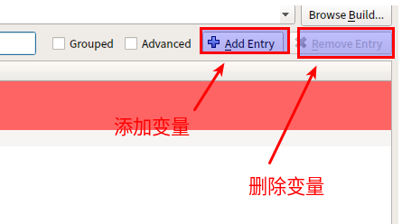
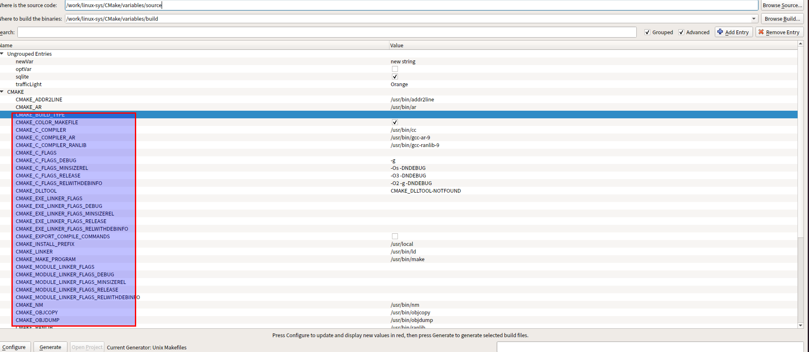

## `Variables`

为有用的参数命名

### `Variable Basics`

像其他编程语言一样，变量是`CMake`工作的基石。使用`set()`命令进行变量的命名，变量对大小写敏感。

```cmake
set(varName value... [PARENT_SCOPE])
```

In `CMake`, a variable has a particular scope, much like how variables in other languages have scope limited to a particular function, file, etc. A variable cannot be read or modified outside of its scope.

`CMake` treats all variables as strings.

```cmake
set(myVar a b c)  # myVar = "a;b;c"
set(myVar a;b;c)  # myVar = "a;b;c"
set(myVar "a b c")  # myVar = "a b c"
set(myVar a b;c)  # myVar = "a;b;c"
set(myVar a "b c")  # myVar = "a;b c"
```

In addition, `CMake` doesn’t require variables to be defined before using them. Use of an undefined variable simply results in an empty string being substituted with no error or warning, much like Unix shell scripts

```cmake
set(foo ab)  # foo = "ab"
set(bar ${foo}cd) # bar = "abcd"
set(baz ${foo} cd) # baz = "ab;cd"
set(myVar ba) # myVar = "ba"
set(big "${${myVar}r}ef") #big = "${bar}ef"="abcdef"
set(${foo} xyz) # ab = "xyz"
set(bar ${notSetVar}) # bar = ""
```

Strings are not restricted to being a single line, they can contain embedded newline characters. They can also contain quotes, which require escaping with backslashes.

```cmake
set(myVar "goes here")
set(multiLine "First line ${myVar}
Second line with a \"quoted\" word")
```


```cmake
# Simple multi-line content with bracket syntax,
# no = needed between the square bracket markers
# 没有等号的语法用于简单的多行文本
set(multiLine [[
First line
Second line
]])
# Bracket syntax prevents unwanted substitution
# 带等号括号语法能阻止不必要的替换
set(shellScript [=[
#!/bin/bash
[[ -n "${USER}" ]] && echo "Have USER"
]=])
# Equivalent code without bracket syntax
# 特殊字符需要转义
set(shellScript
"#!/bin/bash
[[ -n \"\${USER}\" ]] && echo \"Have USER\"
")
```

As the above example shows, bracket syntax is particularly well suited to defining content like Unix shell scripts. Such content uses the ${...} syntax for its own purpose and frequently contains quotes, but using bracket syntax means these things do not have to be escaped, unlike the traditional quoting style of defining `CMake` content.

A variable can be unset either by calling unset() or by calling set() with no value for the named variable.

```cmake
set(myVar)
unset(myVar)
```

### Environment Variables

`CMake`允许设置环境变量，环境变量通过特殊的形式`$ENV{varName}`的小姑娘是设置，`${varName}`可以单独的使用，环境变量设置和普通变量一样，除了要以`ENV{varName}`开头外。

```cmake
set(ENV{PATH} "$ENV{PATH}:/opt/myDir")
```

这样设置的环境变量仅仅是影响当前的`CMake`，当前`CMake`运行结束之后环境变量也就跟着消失了，环境变量也只是影响`Cmake`阶段，在`build`阶段将不会受到影响。

### Cache Variables

In addition to normal variables discussed above, `CMake` also supports cache variables. Unlike normal variables which have a lifetime limited to the processing of the `CMakeLists.txt` file, cache variables are stored in the special file called `CMakeCache.txt` in the build directory and they persist between `CMake runs.Once` set, cache variables remain set until something explicitly removes them from the cache. but the set() command is different when used to set a cache variable:

```cmake
set(varName value... CACHE type "docstring" [FORCE])
```

When the CACHE keyword is present, the set() command will apply to a cache variable named  `varName` instead of a normal variable. The type must be one of the following:

==最主要的用途是用于GUI用户可以查看具体信息，定位问题==

**`BOOL`**

ON/OFF, TRUE/FALSE, 1/0, etc.

**`FILEPATH`**

**`PATH`**

**`STRING`**

**`INTERNAL`**

The variable is not intended to be made available to the user. Internal cache variables are  sometimes used to persistently record internal information by the project, such as caching the result of an intensive query or computation. GUI tools do not show INTERNAL variables.

设置`boolean`很频繁，`CMake`中有更加简洁的专门的设置命令用于设置`boolean`类型的变量。

```cmake
option(optVar helpString [initialValue])
```

If `initialValue` is omitted, the default value OFF will be used

上述的命令等价于：

```cmake
set(optVar initialValue CACHE BOOL helpString)
```

An important difference between normal and cache variables is that the set() command will only overwrite a cache variable if the `FORCE` keyword is present, unlike normal variables where the set() command will always overwrite a `pre-existing` value.

option 命令没有`FORCE`选项，设置`cache`变量，会像set()命令设置普通变量一样，默认覆盖原有的设置。

临时变量和普通变量使用一样的命名会带来很多意料之外的结果。

```cmake
set(myVar foo)                         # Local myVar
set(result ${myVar})                   # result = foo
set(myVar bar CACHE STRING “”)         # Cache myVarm 第二次运行因为已经存在所有这里不会再设置，除非加上 FROCE

set(result ${myVar})                   # First run:
result = bar                           # Subsequent runs: result = foo

set(myVar fred)
set(result ${myVar})                   # result = fred
```

### Manipulating Cache Variables

Using set() and option(), a project can build up a useful set of customization points for its developers. Different parts of the build can be turned on or off, paths to external packages can be set, flags for compilers and linkers can be modified and so on.

==Manipulating 操纵==

#### Setting Cache Values On The Command Line

`CMake` allows cache variables to be manipulated directly via command line options passed to `cmake`.

```bash
cmake -D myVar:type=someValue ...
```

命令行设置的变量为`cache`变量，能被带有`CACHE` 和 `FORCE`选项的set()指令覆盖掉，多次使用`-D`能设置多个临时变量。

通过命令行设置临时变量，`socstring`是空的，`type`类型也是可以忽略的。

```bash
cmake -D foo:BOOL=ON ...
cmake -D "bar:STRING=This contains spaces" ...
cmake -D hideMe=mysteryValue ...
cmake -D helpers:FILEPATH=subdir/helpers.txt ...
cmake -D helpDir:PATH=/opt/helpThings ...
```

使用`-U`选项可以删除`cache`，支持同时删除多个`*`

```cmake
cmake -U 'help*' -U foo ...
```

#### `CMake` GUI Tools

In the first stage, the `CMakeLists.txt` file is read and a representation of the project is built up in memory.
This is called the configure stage. If the configure stage is successful, the generate stage can then be executed to create the build tool’s project files in the build directory. When running `cmake` from the command line, both stages are executed automatically, but in the GUI application, they are triggered separately with the Configure and Generate buttons.



设置变量，并增加变量的可选项，经过`set_property(CACHE trafficLight PROPERTY STRINGS Red Orange Green)`设置，变量`trafficLight` GUI上进行编辑变量时就会出现设置的可选项。

```cmake
set(trafficLight Green CACHE STRING "Status of something")
set_property(CACHE trafficLight PROPERTY STRINGS Red Orange Green)
```

In the above, the `trafficLight` cache variable will initially have the value Green. When the user attempts to modify `trafficLight` in `cmake-gui,` they will be given a `combobox` containing the three values Red, Orange and Green instead of a simple line edit widget which would otherwise have allowed them to enter any arbitrary text.


Cache variables can also have a property marking them as advanced or not. This too only affects the way the variable is displayed in `cmake-gui`, it does not in any way affect how `CMake` uses the variable during processing. By default, `cmake-gui` only shows non-advanced variables, which typically presents just the main variables a developer would be interested in viewing or modifying.

```cmake
mark_as_advanced([CLEAR|FORCE] var1 [var2...])
```

The CLEAR keyword ensures the variables are not marked as advanced, while the FORCE keyword ensures the variables are marked advanced. Without either keyword, the variables will only be marked as advanced if they don’t already have an advanced/non-advanced state set.

一旦标记为`advanced`变量，就只能通过界面上勾选`Advanced`选项进行查看。




### Debugging Variables And Diagnostics

使用`message()`命令，可以打印变量的值，可以解决当编译出现意想不到的情况时使用。

```cmake
message([mode] msg1 [msg2]...)
```

```cmake
set(myVar HiThere)
message("The value of myVar = ${myVar}")：
```

This will give the following output :

```bash
andrew@ubuntu:/work/linux-sys/CMake/variables/build$ cmake ./../source/
The value of myVar = HiThere
```

`message`中的`mode`选项，可以影响打印如何输出，甚至可以使编译时抛出错误。

**`STATUS`**

附加信息，打印信息会使用两个连字符的方式显示

**`WARNING`**

通常会按照高亮输出，实测没有效果

**`AUTHOR_WARNING`**

Like WARNING, but only shown if developer warnings are enabled (requires the `-Wdev` option on the `cmake` command line). Projects do not often use this particular type of message.

**`SEND_ERROR`**

触发个错误，并停止`cmake`的运行

```bash
CMake Error at CMakeLists.txt:30 (message):
  The value of myVar = HiThere


-- Configuring incomplete, errors occurred!
```

**`FATAL_ERROR`**

硬件异常，立刻停止`cmake`，并将产生的日志放到`CMakeOutput.log`中

```bash
CMake Error at CMakeLists.txt:32 (message):
  The value of myVar = HiThere


-- Configuring incomplete, errors occurred!
See also "/work/linux-sys/CMake/variables/build/CMakeFiles/CMakeOutput.log".
```

**`DEPRECATION`**

Special category used to log a deprecation message. If the `CMAKE_ERROR_DEPRECATED` variable is defined to a boolean true value, the message will be treated as an error. If `CMAKE_WARN_DEPRECATED` is defined to a boolean true, the message will be treated as a warning. If neither variable is defined, the message will not be shown.

If no mode keyword is provided, then the message is considered to be important information and is logged without any modification.

`cmake`支持变量监控，被监控的变量任何时候被修改都会通过消息的方式打印出来。

```cmake
variable_watch(myVar [command])
```


#### String Handling

随着项目的复杂度增加，命令处理也会越来越复杂，`cmake`提供了一个强大的字符串处理工具`string()`命令，支持查找、替换、匹配、大小写转换、替换空格等等，

The first argument to string() defines the operation to be performed and subsequent arguments depend on the operation being requested. These arguments will generally require at least one input string and since `CMake` commands cannot return a value, an output variable for the result of the operation. In the material below, this output variable will generally be named `outVar`.

```cmake
string(FIND inputString subString outVar [REVERSE])
```

FIND searches for `subString` in `inputString` and stores the index of the found `subString` in `outVar` (the first character is index 0). The first occurrence is found unless REVERSE is specified, in which case the last occurrence will be found instead. If `subString` does not appear in `inputString`, then `outVar` will be given the value -1.

```cmake
set(longStr abcdefabcdef)
set(shortBit def)
string(FIND ${longStr} ${shortBit} fwdIndex)
# 反方向查找
string(FIND ${longStr} ${shortBit} revIndex REVERSE)
message("fwdIndex = ${fwdIndex}, revIndex = ${revIndex}")
```

查找之后会给出首次出现的字符串下标，下表从0开始

```bash
fwdIndex = 3, revIndex = 9
```

替换字符串

```cmake
string(REPLACE matchString replaceWith outVar input [input...])
```

The REPLACE operation will replace every occurrence of `matchString` in the input strings with `replaceWith` and store the result in `outVar`.

```cmake
set(matchString abc)
set(replaceWith zzz)
string(REPLACE ${matchString} ${replaceWith} replaceOutVar abcdjdiuegnkajkjfajabcabcabcdskfjksdjkabc abc)
message("replace string = ${replaceOutVar}")
```

输出结果

```bash
replace test ============
replace string = zzzdjdiuegnkajkjfajzzzzzzzzzdskfjksdjkzzzzzz
```

字符串后面出现6个z可以看出，当给出多个input字符串的时候，会将多个字符串进行连接之后按照一个整体输出，因此实际使用的时候，尽量一次只替换一个字符串。

字符串处理支持正则，只需要在使用具体方法的时候在方法前面加上`REGEX`操作

```cmake
string(REGEX MATCH regex outVar input [input...])
string(REGEX MATCHALL regex outVar input [input...])
string(REGEX REPLACE regex replaceWith outVar input [input...])
```

The MATCH operation finds just the first match and stores it in `outVar`. `MATCHALL` finds all matches and stores them in `outVar` as a list.

```cmake
set(longStr abcdefabcdef)
string(REGEX MATCHALL "[ace]" matchVar ${longStr})
string(REGEX REPLACE "([de])" "X\\1Y" replVar ${longStr})
message("matchVar = ${matchVar}")
message("replVar = ${replVar}")
```

提取子串

```cmake
string(SUBSTRING input index length outVar)
```

input输入的字符串， index索引字符串下标，length子串长度。

==如果length的值为-1，代表的是从当前索引一直到字符串结尾==

```cmake
string(LENGTH input outVar)   # 获取字符串长度
string(TOLOWER input outVar)  # 将字符串转换为小写
string(TOUPPER input outVar)  # 将字符串转换为大写
string(STRIP input outVar)    # 将字符串空格剔除
```

### Lists

`Lists`在`cmake`中使用的非常普遍。

获取列表

```cmake
list(LENGTH listVar outVar)
list(GET listVar index [index...] outVar)
```

The output of the above example would be :

```cmake
length = 3
letters = c;b
```

向列表中追加和插入元素 

```cmake
list(APPEND listVar item [item...])
list(INSERT listVar index item [item...])
```

```cmake
set(myList a b c)
list(APPEND myList d e f)
message("myList (first) = ${myList}")
list(INSERT myList 2 X Y Z)
message("myList (second) = ${myList}")
```

```bash
myList (first) = a;b;c;d;e;f
myList (second) = a;b;X;Y;Z;c;d;e;f
```

查询对应列表的索引，可以使用以下方法

```cmake
list(FIND myList value outVar)
```

```cmake
message("list test +++++++++++++++++++++")
# Example
set(testList a b c d e)
list(FIND testList d bIndex)
message("index = ${bIndex}")
```

```cmake
list test +++++++++++++++++++++
index = 3
```

需要注意的是在`FIND`函数中，变量不需要在使用`${}`解引用

三种可以直接`移除`列表元素的操作，这三种操作都是直接操作列表进行的

```cmake
list(REMOVE_ITEM myList value [value...])
list(REMOVE_AT myList index [index...])
list(REMOVE_DUPLICATES myList)
```

`REMOVE_ITEM`移除一个或多个指定的元素，指定的元素不存在也不会报错

`REMOVE_AT`移除指定索引的元素，元素不存在会报错

`REMOVE_DUPLICATES`确保列表中只包含独一无二的元素

**重新排序**

List items can also be reordered with REVERSE or SORT operations (sorting is alphabetical):

```cmake
list(REVERSE myList)
list(SORT myList)
```

### Math


```cmake
math(EXPR outVar mathExpr)
```

第一个参数为固定`EXPR`，`mathExpr`定义计算过程，结果最终存储在`outVar`中。支持`+ - * / % | & ^ ~ << >> * / %.`等运算符，具体使用和C语言中的完全一样。`mathExpr`支持使用变量`${myVar}`

```cmake
set(x 3)
set(y 7)
math(EXPR z "(${x}+${y}) / 2")
message("result = ${z}")
```

Expected output:

```bash
result = 5
```


