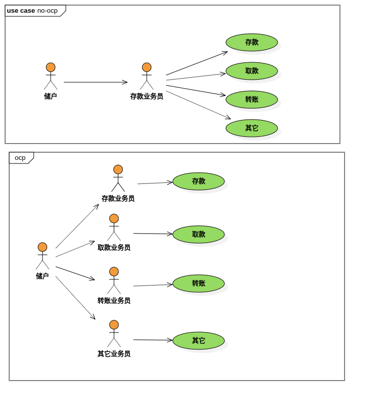
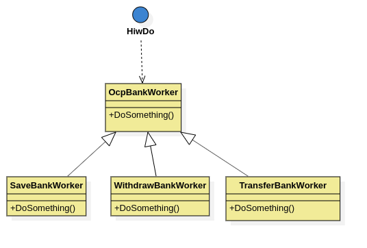
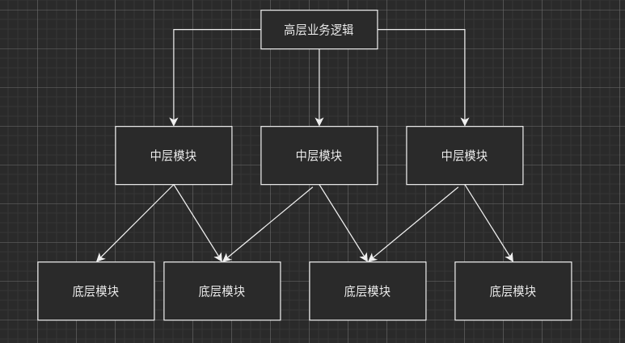
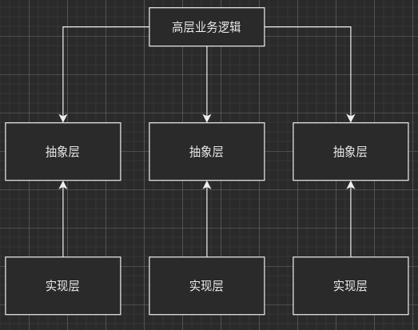
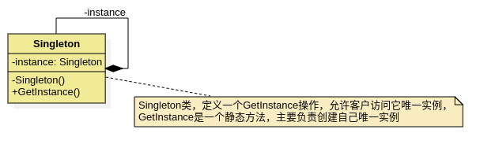
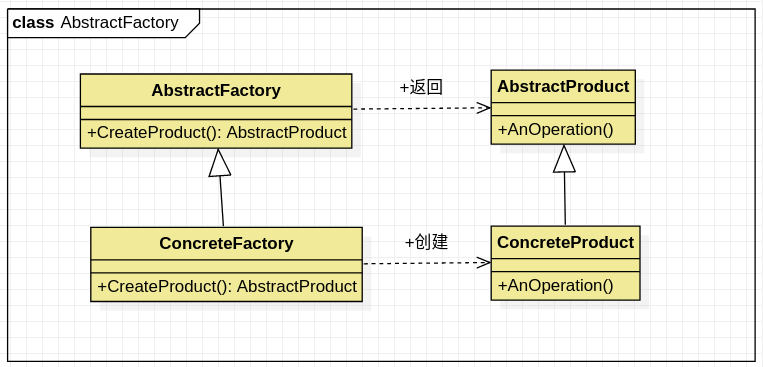
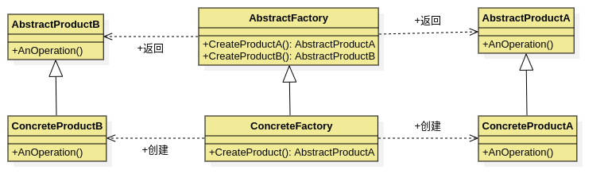
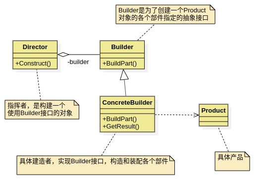

[TOC]

---

## 设计模式


### 设计模式前言

代码路径: [代码仓库路径](https://github.com/zzu-andrew/linux-sys/tree/dfew/DesignPatterns)


模式：在一定环境中解决某一问题的方案，包括三个基本元素-问题，解决方案和环境。即在一定环境下，用固定的套路解决问题。

**创建型模式**

创建型模式用来处理对象的创建过程，主要包含以下 5 种设计模式：

1. 工厂方法模式（`Factory Method Pattern`）的用意是定义一个创建产品对象的工厂接口，将实际创建工作推迟到子类中。
2. 抽象工厂模式（Abstract Factory Pattern）的意图是提供一个创建一系列相关或者相互依赖的接口，而无需指定它们具体的类。
3. 建造者模式（Builder Pattern）的意图是将一个复杂的构建与其表示相分离，使得同样的构建过程可以创建不同的表示。
4. 原型模式（Prototype Pattern）是用原型实例指定创建对象的种类，并且通过拷贝这些原型创建新的对象。
5. 单例模式（Singleton Pattern）是保证一个类仅有一个实例，并提供一个访问它的全局访问点。

**结构型模式**

结构型模式用来处理类或者对象的组合，主要包含以下 7 种设计模式：

6. 代理模式（Proxy Pattern）就是为其他对象提供一种代理以控制对这个对象的访问。
7. 装饰者模式（Decorator Pattern）动态的给一个对象添加一些额外的职责。就增加功能来说，此模式比生成子类更为灵活。
8. 适配器模式（Adapter Pattern）是将一个类的接口转换成客户希望的另外一个接口。使得原本由于接口不兼容而不能一起工作的那些类可以一起工作。
9. 桥接模式（Bridge Pattern）是将抽象部分与实际部分分离，使它们都可以独立的变化。
10. 组合模式（Composite Pattern）是将对象组合成树形结构以表示“部分--整体”的层次结构。使得用户对单个对象和组合对象的使用具有一致性。
11. 外观模式（Facade Pattern）是为子系统中的一组接口提供一个一致的界面，此模式定义了一个高层接口，这个接口使得这一子系统更加容易使用。
12. 享元模式（Flyweight Pattern）是以共享的方式高效的支持大量的细粒度的对象。

**行为型模式**

行为型模式用来对类或对象怎样交互和怎样分配职责进行描述，主要包含以下 11 种设计模式：

13. 模板方法模式（Template Method Pattern）使得子类可以不改变一个算法的结构即可重定义该算法的某些特定步骤。

14. 命令模式（Command Pattern）是将一个请求封装为一个对象，从而使你可用不同的请求对客户端进行参数化；对请求排队或记录请求日志，以及支持可撤销的操作。

15. 责任链模式（Chain of Responsibility Pattern），在该模式里，很多对象由每一个对象对其下家的引用而连接起来形成一条链。请求在这个链上传递，直到链上的某一个对象决定处理此请求，这使得系统可以在不影响客户端的情况下动态地重新组织链和分配责任。
16.  策略模式（Strategy Pattern）就是准备一组算法，并将每一个算法封装起来，使得它们可以互换。
17. 中介者模式（Mediator Pattern）就是定义一个中介对象来封装系列对象之间的交互。终结者使各个对象不需要显示的相互调用 ，从而使其耦合性松散，而且可以独立的改变他们之间的交互。
18. 观察者模式（Observer Pattern）定义对象间的一种一对多的依赖关系，当一个对象的状态发生改变时，所有依赖于它的对象都得到通知并被自动更新。
19. 备忘录模式（Memento Pattern）是在不破坏封装的前提下，捕获一个对象的内部状态，并在该对象之外保存这个状态。
20. 访问者模式（Visitor Pattern）就是表示一个作用于某对象结构中的各元素的操作，它使你可以在不改变各元素的类的前提下定义作用于这些元素的新操作。
21. 状态模式（State Pattern）就是对象的行为，依赖于它所处的状态。
22. 解释器模式（Interpreter Pattern）就是描述了如何为简单的语言定义一个语法，如何在该语言中表示一个句子，以及如何解释这些句子。
23. 迭代器模式（Iterator Pattern）是提供了一种方法顺序来访问一个聚合对象中的各个元素，而又不需要暴露该对象的内部表示。


### 设计模式基本原则

最终目的：高内聚低耦合

1. 开放封闭原则 (`OCP,Open For Extension, Closed For Modification Principle`)类的改动是通过增加代码进行的，而不是修改源代码。
2.  单一职责原则 (`SRP,Single Responsibility Principle`)类的职责要单一，对外只提供一种功能，而引起类变化的原因都应该只有一个。
3. 依赖倒置原则 (`DIP,Dependence Inversion Principle`)依赖于抽象(接口),不要依赖具体的实现(类)，也就是针对接口编程。
4. 接口隔离原则 (`ISP,Interface Segegation Principle`)不应该强迫客户的程序依赖他们不需要的接口方法。一个接口应该只提供一种对外功能，不应该把所有操作都封装到一个接口中去。
5. 里氏替换原则 (`LSP, Liskov Substitution Principle`)任何抽象类出现的地方都可以用他的实现类进行替换。实际就是虚拟机制，语言级别实现面向对象功能。
6. 优先使用组合而不是继承原则(`CARP,Composite/Aggregate Reuse Principle`)如果使用继承，会导致父类的任何变换都可能影响到子类的行为。如果使用对象组合，就降低了这种依赖关系。
7. 迪米特法则(`LOD,Law of Demeter`)一个对象应当对其他对象尽可能少的了解，从而降低各个对象之间的耦合，提高系统的可维护性。例如在一个程序中，各个模块之间相互调用时，通常会提供一个统一的接口来实现。这样其他模块不需要了解另外一个模块的内部实现细节，这样当一个模块内部的实现发生改变时，不会影响其他模块的使用。(黑盒原理)


### 类和类之间的相互关系

- 依赖(虚线)，一个类是另外一个类的函数参数或者函数返回值，要借助一个类去实现一项工作，如坐公交车去上班，人与公交车之间是依赖关系
- 关联(实线)，一个类是另外一个类的成员变量，之间有关联，如你的车你有行驶证，登记的是你的名字
- 聚合(菱形实线)，整体和部分的关系，部分组成整体，但是部分是可以替换的
- 组合(实心菱形实线)，生命体，部分是整体不可分割的一部分，如人的五脏六腑与人之间的关系


### 设计模式原则实例

#### 开闭原则

使用开闭原则之前一个银行柜员会将所有的工作都操作一遍，这样会大大降低办事的效率，而且银行的业务不适合扩展，没扩展一项业务就要培训所有的业务员。改为使用开闭原则之后，每个银行业务员只负责一项业务即可，这样做增加了系统的复杂性，但是想要新增业务只需要增加个人员，培训一个人新技能即可。也即是增加系统复杂性，但是原有的基础不变的情况下就可实现对业务的扩展。



代码中类之间的关系如图：

`HowDo`的参数是`OcpBankWorker`类的引用，`SaveBankWorker, WithdrawBankWorker,TransferBankWorker`是`OcpBankWorker`的子类



具体的`CPP`代码如下：

```cpp
#include <iostream>

using namespace std;

// 在使用开闭原则之前
// 所有的事情都一个对象中完成，显得类很臃肿
class BankWorker
{
public:
    void SaveMoney(void)
    {
        cout << "save money" << endl;
    }

    void WithdrawMoney(void)
    {
        cout << "withdraw money" << endl;
    }

    void TransferMoney(void)
    {
        cout << "transfer money" << endl;
    }
};

/* 使用开闭原则之后 */
// 定义一个虚类，相当于java中的接口
class OcpBankWorker
{
public:
    virtual void DoSomething(void) = 0;
};

// 虚函数实现
class SaveBankWorker : public OcpBankWorker
{
public:
    virtual void DoSomething(void)
    {
        cout << "save money ocp" << endl;
    }
};

class WithdrawBankWorker : public OcpBankWorker
{
public:
    virtual void DoSomething(void)
    {
        cout << "withdraw money ocp" << endl;
    }
};

class TransferBankWorker : public OcpBankWorker
{
public:
    virtual void DoSomething(void)
    {
        cout << "transfer money ocp" << endl;
    }

};

// 框架函数
void HowDo(OcpBankWorker &ocpBankWorker)
{
    ocpBankWorker.DoSomething();
}

// 使用多态的三个原则
// 1.要有继承
// 2.要有函数重写
// 3.要有父类指针(父类引用)指向子类对象
int main(int argc, char const *argv[])
{
    // 在使用开闭原则之前
    cout << "before use open close principle" << endl;

    BankWorker *bw = new BankWorker;
    bw->SaveMoney();
    bw->TransferMoney();
    bw->WithdrawMoney();

    cout << "=========================================" << endl;
    // 使用开闭原则之后
    // 使用多态技术实现
    OcpBankWorker *aw = NULL;
    aw = new SaveBankWorker;
    HowDo(*aw);
    delete aw;

    aw = new WithdrawBankWorker;
    HowDo(*aw);
    delete aw;

    aw = new TransferBankWorker;
    HowDo(*aw);
    delete aw;

    cout << "open close principle" << endl;
    return 0;
}

```

#### 依赖颠倒原则


没有使用依赖颠倒之前，上层业务逻辑依赖底层业务逻辑



使用了依赖颠倒之后，上层业务逻辑和底层模块都依赖于抽象层，代码复杂了，但是系统易于维护了



依赖颠倒的实现也是基于多态的基础之上，，具体的`Cpp`代码实现如下：

```cpp
#include <iostream>
using namespace std;

// 让computer框架和具体的厂商 进行解耦合
// 1. 定义虚类，主要目的是为了规定后期子类的行为
class HardDisk
{
public:
    virtual void work(void) = 0;
};

class Memory
{
public:
    virtual void work(void) = 0;
};

class Cpu
{
public:
    virtual void work(void) = 0;
};

class Computer
{
public:
    Computer(HardDisk *hardDisk, Memory *memory, Cpu *cpu)
    {
        m_hardDisk = hardDisk;
        m_memory = memory;
        m_cpu = cpu;
    }
    void work()
    {
        m_hardDisk->work();
        m_memory->work();
        m_cpu->work();
    }

private:
    HardDisk *m_hardDisk;
    Memory *m_memory;
    Cpu *m_cpu;
};

class InterCpu : public Cpu
{
public:
    void work(void)
    {
        cout << "inter cpu work status ok." << endl;
    }
};

class XSDisk : public HardDisk
{
public:
    void work(void)
    {
        cout << "xs data work status ok." << endl;
    }

};

class KingStonMemory : public Memory
{
public:
    void work(void)
    {
        cout << "KingSton memory status is ok." << endl;
    }
};

int main(int argc, char const *argv[])
{
    // 基于多态实现依赖颠倒
    HardDisk *hardDisk = NULL;
    Memory *memory = NULL;
    Cpu *cpu = NULL;

    hardDisk = new XSDisk;
    memory = new KingStonMemory;
    cpu = new InterCpu;

    Computer *myComputer = new Computer(hardDisk, memory, cpu);
    myComputer->work();

    delete myComputer;
    delete cpu;
    delete memory;
    delete hardDisk;

    cout << "hello world." << endl;
    return 0;
}
```


### 设计模式实践


#### 单例模式

单例模式是一种对象创建模式，使用单例模式，可以保证为一个类生成唯一的实例对象。也就是说在这个程序空间该类只有一个实例对象。

`GoF`对单例的定义：保证一个类、只有一个实例存在，同时提供对该实例加以访问的全局访问方法。

**单例模式`UML`图**

单例模式的目的就是保证一个类只有一个实例，并提供一个访问它的全局访问点。




**使用单例模式的原因**

在应用系统开发中，我们常常有以下需求：

- 多个线程公用一个`socket`资源，或者操作同一个对象
- 在整个程序空间需要使用全局变量，共享资源
- 大规模系统中，为了性能考虑，需要节省对象创建的时间等

实现步骤：

1. 构造函数私有化
2. 提供一个全局的静态方法(全局访问点)
3. 在类中定义一个静态指针，指向本类的变量的静态变量指针

构造函数私有化的作用：构造函数私有化之后，则构造该类的对象，必须在类内部完成。

**懒汉式单例模式**

叫懒汉式的原因，是因为只有再用的时候才会创建类中的全局指针。

代码实现如下：

```cpp
#include <iostream>

using namespace std;

class Singleton
{
private:
    Singleton()
    {
        cout << "sluggard singleton construct start." << endl;
    }

public:
    static Singleton *getInstance(void)
    {
        if(NULL == m_psl) // 懒汉式，每次获取实例都要判断，在多线程中会存在问题
        {
            m_psl = new Singleton;
        }
        return m_psl;
    }

    static void FreeInstance()
    {
        if(NULL != m_psl)
        {
            delete m_psl;
            m_psl = NULL;
        }
    }
private:
    static Singleton *m_psl;
};

// 静态变量初始化的方法，要放到类的外面
Singleton *Singleton::m_psl = NULL;

// 懒汉式，只有在使用的时候才会去创建
// 存在的问题，多个线程同时首次调用时，可能会出现创建多次的问题(导致内存泄漏)

int main(int argc, char const *argv[])
{
    // 使用功能去全局获取接口获取资源
    Singleton *p1 = Singleton::getInstance(); 
    Singleton *p2 = Singleton::getInstance();

    if(p1 == p2)
    {
        cout << "p1 equal p2" << endl;
    }
    else
    {
        cout << "p1 not equal p2" << endl;
    }
    
    // 手动释放单例模式创建的唯一一个对象
    Singleton::FreeInstance();
 
    cout << "singleton." <<  endl;
    return 0;
}
```

编译之后输出结果：

```bash
sluggard singleton construct start.
p1 equal p2
singleton.
```

**饿汉式**

饿汉式，与懒汉式唯一的差别就是创建方式上，懒汉式是在首次调用的时候才创建，饿汉式是不管是否调用，在静态指针初始化的时候就创建指针指向的对象。

```cpp
#include <iostream>

using namespace std;

class Singleton
{
private:
    Singleton()
    {
        cout << "sluggard singleton construct start." << endl;
    }
    
public:
    static Singleton *getInstance(void)
    {
        return m_psl;
    }

    static void FreeInstance()
    {
        if(NULL != m_psl)
        {
            delete m_psl;
            m_psl = NULL;
        }
    }
private:
    static Singleton *m_psl;
};

// 静态变量初始化的方法，要放到类的外面
// 饿汉式是在初始化指变量的时候就对其进行创建，不管是否被调用
Singleton *Singleton::m_psl = new Singleton;

int main(int argc, char const *argv[])
{
    // 使用功能去全局获取接口获取资源
    Singleton *p1 = Singleton::getInstance(); 
    Singleton *p2 = Singleton::getInstance();

    if(p1 == p2)
    {
        cout << "p1 equal p2" << endl;
    }
    else
    {
        cout << "p1 not equal p2" << endl;
    }
    
    // 手动释放单例模式创建的唯一一个对象
    Singleton::FreeInstance();
 
    cout << "singleton." <<  endl;
    return 0;
}

```

饿汉式执行之后输出结果：

```bash
sluggard singleton construct start.
p1 equal p2
hungry singleton.
```

两者分析：

懒汉式因为使用的时候才会创建内存，所以当多个线程同时使用的时候可能会出现多次创建的问题，饿汉式不存在这个问题。

懒汉式虽然有有点，但是每次调用`GetInstance()`静态方法都必须判断静态指针是否为`NULL`使程序相对开销增大，多喜爱能成中会导致多个实例产生，从而导致运行代码不正确以及内存泄漏，也有可能是多次释放资源。

这是因为`C++`中构造函数并不是线程安全的，`C++`中的构造函数简单分为两步

1. 内存分配
2. 初始化成员变量

由于多线程的关系，可能内存放分配好，还没有给成员赋值，就发生了线程切换，导致下个线程中又申请了一遍内存。

---


#### 简单工程模式

简单工厂模式，属于类的创建型模式，又叫做静态工厂方法模式。通过专门定义一个类来负责创建其他类的实例，被创建的实例通常都具有共同的父类。


##### 模式中包含的角色及其职责

**工厂角色**

简单工厂模式的核心，它负责实现创建所有实例的内部逻辑。工厂可以被外界直接调用，创建所需的产品对象。

**抽象角色**

简单工厂模式所创建的所有对象的父类，它负责描述所有实例所共有的公共接口。

**具体产品角色**

简单工厂模式所创建的具体实例对象


==说明==：产品和工厂之间的关系是依赖，产品和抽象产品之间的关系是继承。

依赖：一个类的对象当另外一个类的函数参数或者返回值

**简单工厂模式的优缺点**

在简单工厂模式中，工厂类是整个魔偶是的关键所在。它包含必要的判断逻辑，能够根据外界给定的信息，决定究竟应该创建哪个具体类的对象。用户在使用的时候，可以直接根据工厂类去创建所需的实例，而无需了解这些对象是如何创建以及如何组织的。有利于整个软件体系结构的优化。不难发现，简单工厂模式的有点也体现在工厂类上，由于工厂类集中了所有实例创建的逻辑，所以高内聚方面做的不好，另外，当系统中的具体产品类不断增多时，可能出现要求工厂也要做响应的修改，扩展性不好。

**简单工厂模式的实现**

```cpp
#include <iostream>
#include <string>

using namespace std;

//  抽象类中定义子类中需要实现的功能，也就是限定了子类必须实现的一些函数
class Fruit
{
public:
    virtual void GetFruit(void) = 0;
    virtual ~Fruit(void)
    {

    }
};

class Banana : public Fruit
{
public:
    virtual void GetFruit(void)
    {
        cout << "I'm banana." << endl;
    }
};


class Apple : public Fruit
{
public:
    virtual void GetFruit(void)
    {
        cout << "I'm apple." << endl;
    }
};

class Factory
{
public:
    Fruit *CreateFruit(string &pStr)
    {
        if(0 == pStr.compare("banana"))
        {
            return new Banana;
        }
        else if(0 == pStr.compare("apple"))
        {
            return new Apple;
        }
        else
        {
           cout << "Factory not support" << endl;
        }
        return NULL;
    }
};


int main(int argc, char const *argv[])
{
    Factory *f = new Factory;

    Fruit *fruit = NULL;
    string bananaStr("banana");
    string appleStr("apple"); 


    // 工厂声场香蕉
    fruit = f->CreateFruit(bananaStr);
    if(NULL != fruit)
    {
        fruit->GetFruit();
        delete fruit;
    }
    // 工厂生产苹果
    fruit = f->CreateFruit(appleStr);
    if(NULL != fruit)
    {
        fruit->GetFruit();
        delete fruit;
    }

    delete f;
    cout << "simple factory test" << endl;
    return 0;
}
```

执行结果：

```bash
I'm banana.
I'm apple.
simple factory test
```

通过结果可以看出，工厂通过传入的字符串已经正确的生产出想要的产品。


#### 工厂模式

工厂方法模式同样属于类的创建型模式，又被称为多态工厂模式。工厂方法的意义是定义一个创建产品对象的工厂接口，将实际创建工作推迟到子类当中。

核心工厂类不在负责产品的创建，这样核心类成为一个抽象工厂角色，仅负责具体工厂子类必须实现的接口，这样进一步抽象化的好处就是使得工厂方法模式可以使系统不再修改具体工厂角色的情况下引进新的产品。

##### 模式中包含的角色极其职责

**抽象工厂角色**

工厂方法的核心，任何工厂类都必须实现这个接口

**具体工厂角色**

具体工厂是抽象工厂的一个实现，负责实例化产品对象。

**抽象角色**

工厂方法模式所创建的所有对象的父类，它负责描述所有实例所共有的公共接口。

**具体产品**

工厂方法模式所创建的具体实例对象



##### 工厂模式和简单工厂模式比较

工厂模式与简单工厂模式在结构上的不同不是很明显，工厂方法类的核心是一个抽象工厂类，而简单工厂模式把核心放在一个具体的类上。

工厂方法模式之所以有一个别名叫多态型工厂模式是因为具体工厂类都是共同的接口或者有共同的抽象父类。

当系统扩展需要添加新的产品对象时，仅仅需要添加一个具体对象以及一个具体工厂对象，原有工厂对象不需要进行任何修改，也不需要修改客户端，很好的符合了 - <font color= green>开放封闭</font>-原则。而简单工厂模式再添加新产品对象后不得不修改工厂方法，扩展性不好。工厂模式退化后可演变成简单工厂模式。

开放－封闭，通过添加代码的方式，不是通过修改代码的方式完成功能的增强

<font size=4 color = yellow>特点 </font>:不需要修改源代码就可以实现新工能的添加  :yellow_heart:

源码实现：

```cpp
#include <iostream>
#include <string>

using namespace std;

//  抽象类中定义子类中需要实现的功能，也就是限定了子类必须实现的一些函数
class Fruit
{
public:
    virtual void GetFruit(void) = 0;
    virtual ~Fruit(void)
    {

    }
};

class Banana : public Fruit
{
public:
    virtual void GetFruit(void)
    {
        cout << "I'm banana." << endl;
    }
};


class Apple : public Fruit
{
public:
    virtual void GetFruit(void)
    {
        cout << "I'm apple." << endl;
    }
};

class AbstructFactory
{
public:
    virtual Fruit *CreateProduct(void) = 0;
    // 这里析构函数使用虚函数的原因是因为，只有父类中析构函数使用虚函数，
    // 多态时才会从子类析构函数一直调用到基类结束，否则只会调用父类的不会调用子类的析构函数
    virtual ~AbstructFactory(void)
    {

    }
};

class BananaFactory : public AbstructFactory
{
public:
    virtual Fruit *CreateProduct(void)
    {
        return new Banana;
    }
};

class AppleFactory : public AbstructFactory
{
public:
    virtual Fruit *CreateProduct(void)
    {
        return new Apple;
    }
};

/**
 * 后期产品扩展
 */

class Peer : public Fruit
{
public:
    virtual void GetFruit(void)
    {
        cout << "I'm peer." << endl;
    }
};

class PeerFactory : public AbstructFactory
{
public:
   virtual Fruit *CreateProduct()
   {
       return new Peer;
   }

};

int main(int argc, char const *argv[])
{
    AbstructFactory  *factory = NULL;
    Fruit            *fruit = NULL;

    // 制造香蕉
    factory = new BananaFactory;
    fruit = factory->CreateProduct();
    fruit->GetFruit();

    delete fruit;
    delete factory;

    factory = new AppleFactory;
    fruit = factory->CreateProduct();
    fruit->GetFruit();

    delete fruit;
    delete factory;

    // 前期系统稳定之后，后期扩展
    cout << "extern" << endl;
    factory = new PeerFactory;
    fruit = factory->CreateProduct();
    fruit->GetFruit();
    
    delete fruit;
    delete factory;

    cout << "simple factory test" << endl;
    return 0;
}
```

编译之后执行结果：

```bash
I'm banana.
I'm apple.
extern
I'm peer.
simple factory test
```

总结：工厂模式实现了系统整体和具体产品的解耦合


#### 抽象工厂

抽象工厂模式是所有形态的工厂模式中，最为抽象和最具一般性的工厂模式。抽象工厂模式可以向客户端提供一个接口，使得客户端在不必指定产品的具体类型的情况下，能够创建多个产品族的产品对象。

工厂模式，要么生产A要么生产B，但是不能同时生产一个产品族。抽象工厂：能同时生产一个产品族

重要区别：

工厂模式只能生产一个产品，要么香蕉要么苹果；

抽象共产可以一下生产一个产品族(里面有很多产品组成)

##### 模式中包含的角色极其职责

**抽象工厂角色**

抽象工厂模式的核心，包含对多个产品结构的声明，任何工厂类都必须实现这个接口

**具体工厂角色**

具体工厂是抽象工厂的一个实现，负责实例化摸个产品族中的产品对象

**抽象角色**

抽象模式所创建的所有对象的父类，它负责描述所有实例所共有的公共接口

**具体产品角色**

抽象模式所创建的具体实例对象




抽象工厂`C++`代码实现：

```cpp
#include <iostream>
#include <string>

using namespace std;

//  抽象类中定义子类中需要实现的功能，也就是限定了子类必须实现的一些函数
class Fruit
{
public:
    virtual void GetFruit(void) = 0;
    virtual ~Fruit(void)
    {

    }
};

class AbstractFactory
{
public:
    virtual Fruit *CreateBanana(void) = 0;
    virtual Fruit *CreateApple(void) = 0;
    // 这里析构函数使用虚函数的原因是因为，只有父类中析构函数使用虚函数，
    // 多态时才会从子类析构函数一直调用到基类结束，否则只会调用父类的不会调用子类的析构函数
    virtual ~AbstractFactory(void)
    {

    }
};

class NorthBanana : public Fruit
{
public:
    virtual void GetFruit(void)
    {
        cout << "I'm North banana." << endl;
    }
};

class NorthApple : public Fruit
{
public:
    virtual void GetFruit(void)
    {
        cout << "I'm North apple." << endl;
    }
};

class SourthBanana : public Fruit
{
public:
    virtual void GetFruit(void)
    {
        cout << "I'm Sourth banana." << endl;
    }
};

class SourthApple : public Fruit
{
public:
    virtual void GetFruit(void)
    {
        cout << "I'm Sourth apple." << endl;
    }
};

class NorthFactory : public AbstractFactory
{
public:
    virtual Fruit *CreateBanana(void)
    {
        return new NorthBanana;
    }

    virtual Fruit *CreateApple(void)
    {
        return new NorthApple;
    }
};

class SourthFactory : public AbstractFactory
{
public:
    virtual Fruit *CreateBanana(void)
    {
        return new SourthBanana;
    }

    virtual Fruit *CreateApple(void)
    {
        return new SourthApple;
    }
};

int main(int argc, char const *argv[])
{
    AbstractFactory  *abstractFactory = NULL;
    Fruit            *fruit = NULL;

    abstractFactory = new SourthFactory;
    fruit = abstractFactory->CreateApple();
    fruit->GetFruit();
    delete fruit;
    fruit = abstractFactory->CreateBanana();
    fruit->GetFruit();
    delete fruit;

    delete abstractFactory;

    abstractFactory = new NorthFactory;
    fruit = abstractFactory->CreateApple();
    fruit->GetFruit();
    delete fruit;
    fruit=abstractFactory->CreateBanana();
    fruit->GetFruit();
    delete fruit;
    delete abstractFactory;

    cout << "simple factory test" << endl;
    return 0;
}
```

编译之后的执行结果：

```bash
andrew@andrew-G3-3590:/work/linux-sys/DesignPatterns/cpp/build$ ./abstract_factory 
I'm Sourth apple.
I'm Sourth banana.
I'm North apple.
I'm North banana.
simple factory test
```


#### 建造者模式

`Builder`模式也叫建造者模式或者生成器模式，是由`GoF`提出的23种设计模式中的一种。`Builder`模式是一种对象创建模式之一，用来隐藏复合对象的创建过程。他把复合对象的创建过程加以抽象，通过子类继承和重载的方式，动态地创建具有复合属性的对象。

对象的创建：`Builder`模式是为了对象的创建而设计的模式-创建的是一个复合对象，被创建的对象为一个具有复合属性的复合对象，关注对象创建的各个部分的创建过程，不同工厂(`Builder`)对产品属性有不同的创建方法。

- `Builder`：为创建产品各个部分，统一抽象接口
- `ConcreteBuilder`: 具体的创建产品的各个部分，部分A，部分B，部分C
- `Director`: 构造一个使用`Builder`接口的对象
- `Product`：表示被构造的复杂对象

`ConcreteBuilder`创建该产品的内部表示并定义它的装配过程，包含定义组成部分的类，包含将这些部件装配成最终产品的接口。

适用情况：

​	一个对象的构建比较复杂，将一个对象的构建和对象的表示进行分离。

说白了：建造者模式，其实就是相当于一个设计师，指挥建造师造房子，建造师可能是不同的，因为每个建造师建造水平和会造的房子都是不一样的。




##### 创建者模式和工厂模式的对比

`Factory`模式中：

1. 有一个抽象的工厂
2. 实现一个具体的工厂 - 汽车工厂
3. 工厂生产的汽车A，得到汽车产品A
4. 工厂生产汽车B，得到汽车产品B

实现了购买者和生产线的隔离，强调的是结果

`Builder`模式

1. 引擎工厂生产引擎产品，得到汽车的部件A
2. 轮胎工厂生产轮子产品，得到汽车部件B
3. 底盘工厂生产车身产品，得到汽车部件C
4. 将这些部件放到一起，形成刚好能够组装成一辆汽车的整体

这样做，目的是为了实现复杂对象生产线和其部件的解耦。强调的是过程

两者的区别在于以下几种情况：

工厂模式不考虑对象的组装过程，而直接生成一个我想要的对象。

`Builder`模式先一个个的创建对象的每一个部件，再统一组装成一个对象

工厂模式所解决的问题是，工厂生产产品

而`Builder`模式解决的是工厂控制产品 生成器组装各个部件的过程，然后从产品生成器中得到产品。


**前期问题的抛出-需要建造者模式的原因**

```cpp
#include <iostream>
#include <string>
using namespace std;


class House
{
public:
    void setDoor(string door)
    {
        this->m_door = door;
    }
    void setWall(string wall)
    {
        this->m_wall = wall;
    }
    void setWindow(string window)
    {
        this->m_window = window;
    }
    string getDoor(void)
    {
        cout << m_door << endl;
        return m_door;
    }
    string getWall(void)
    {
        cout << m_wall << endl;
        return m_wall;
    }
    string getWindow(void)
    {
        cout << m_window << endl;;
        return m_window;
    }

private:
    string m_door;
    string m_wall;
    string m_window;
};

class Builder
{
public:
    Builder(void)
    {
        m_house = new House;
    }
    ~Builder(void)
    {
        delete m_house;
    }
    void MakeBuilder(void)
    {
        BuildDoor(m_house);
        BuildWall(m_house);
        BuildWindow(m_house);
    }
    void BuildDoor(House *h)
    {
        h->setDoor("door");
    }
    void BuildWall(House *h)
    {
        h->setWall("wall");
    }
    void BuildWindow(House *h)
    {
        h->setWindow("window");
    }
    House *GetHouse(void)
    {
        return m_house;
    }

private:
    House *m_house;
};

int main(int argc, char const *argv[])
{
    
    // 不需要建造者，客户直接造房子
    //  门窗  墙体玻璃等都需要用户管理
    House *house = new House;
    house->setDoor("user door");
    house->setWall("user Wall");
    house->setWindow("big window");
    house->getDoor();
    house->getWall();
    house->getWindow();
    delete house;

    // 华丽的分割线
    cout << "=========================" << endl;
    // 请工程队 建造房子
    // 将建造过程交给工程队， 是不是还可以请个指挥建造的？ 这样客户就能完全解放出来了
    Builder *builder = new Builder;
    builder->MakeBuilder();
    house = builder->GetHouse();
    house->getDoor();
    house->getWall();
    house->getWindow();
    delete builder;

    cout << "builder pattern." << endl;
    return 0;
}
```

两者，虽然都建造好了房子，但是建筑队参加之后，客户就不需要参与房子的建造的每个过程了，将建造过程与使用者之间进行分离，这就是建造者模式想要达到的效果

```bash
andrew@andrew-G3-3590:/work/linux-sys/DesignPatterns/cpp/build$ ./builder_pattern_question 
user door
use Wall
big window
=========================
door
wall
window
builder pattern.
```

那除了这样其实可以再请一个指挥者过来，因为实际中会有不同的建造者参与竞争，每个建造者精通的地方都是不一样的，指挥者参与之后，用户只需要把自己的需求告知指挥者就行。


