[TOC]

---

## 设计模式


### 设计模式前言

代码路径: [代码仓库路径](https://github.com/zzu-andrew/linux-sys/tree/dfew/DesignPatterns)


模式：在一定环境中解决某一问题的方案，包括三个基本元素-问题，解决方案和环境。即在一定环境下，用固定的套路解决问题。

**创建型模式**

创建型模式用来处理对象的创建过程，主要包含以下 5 种设计模式：

1. 工厂方法模式（`Factory Method Pattern`）的用意是定义一个创建产品对象的工厂接口，将实际创建工作推迟到子类中。
2. 抽象工厂模式（Abstract Factory Pattern）的意图是提供一个创建一系列相关或者相互依赖的接口，而无需指定它们具体的类。
3. 建造者模式（Builder Pattern）的意图是将一个复杂的构建与其表示相分离，使得同样的构建过程可以创建不同的表示。
4. 原型模式（Prototype Pattern）是用原型实例指定创建对象的种类，并且通过拷贝这些原型创建新的对象。
5. 单例模式（Singleton Pattern）是保证一个类仅有一个实例，并提供一个访问它的全局访问点。

**结构型模式**

结构型模式用来处理类或者对象的组合，主要包含以下 7 种设计模式：

6. 代理模式（Proxy Pattern）就是为其他对象提供一种代理以控制对这个对象的访问。
7. 装饰者模式（Decorator Pattern）动态的给一个对象添加一些额外的职责。就增加功能来说，此模式比生成子类更为灵活。
8. 适配器模式（Adapter Pattern）是将一个类的接口转换成客户希望的另外一个接口。使得原本由于接口不兼容而不能一起工作的那些类可以一起工作。
9. 桥接模式（Bridge Pattern）是将抽象部分与实际部分分离，使它们都可以独立的变化。
10. 组合模式（Composite Pattern）是将对象组合成树形结构以表示“部分--整体”的层次结构。使得用户对单个对象和组合对象的使用具有一致性。
11. 外观模式（Facade Pattern）是为子系统中的一组接口提供一个一致的界面，此模式定义了一个高层接口，这个接口使得这一子系统更加容易使用。
12. 享元模式（Flyweight Pattern）是以共享的方式高效的支持大量的细粒度的对象。

**行为型模式**

行为型模式用来对类或对象怎样交互和怎样分配职责进行描述，主要包含以下 11 种设计模式：

13. 模板方法模式（Template Method Pattern）使得子类可以不改变一个算法的结构即可重定义该算法的某些特定步骤。

14. 命令模式（Command Pattern）是将一个请求封装为一个对象，从而使你可用不同的请求对客户端进行参数化；对请求排队或记录请求日志，以及支持可撤销的操作。

15. 责任链模式（Chain of Responsibility Pattern），在该模式里，很多对象由每一个对象对其下家的引用而连接起来形成一条链。请求在这个链上传递，直到链上的某一个对象决定处理此请求，这使得系统可以在不影响客户端的情况下动态地重新组织链和分配责任。
16.  策略模式（Strategy Pattern）就是准备一组算法，并将每一个算法封装起来，使得它们可以互换。
17. 中介者模式（Mediator Pattern）就是定义一个中介对象来封装系列对象之间的交互。终结者使各个对象不需要显示的相互调用 ，从而使其耦合性松散，而且可以独立的改变他们之间的交互。
18. 观察者模式（Observer Pattern）定义对象间的一种一对多的依赖关系，当一个对象的状态发生改变时，所有依赖于它的对象都得到通知并被自动更新。
19. 备忘录模式（Memento Pattern）是在不破坏封装的前提下，捕获一个对象的内部状态，并在该对象之外保存这个状态。
20. 访问者模式（Visitor Pattern）就是表示一个作用于某对象结构中的各元素的操作，它使你可以在不改变各元素的类的前提下定义作用于这些元素的新操作。
21. 状态模式（State Pattern）就是对象的行为，依赖于它所处的状态。
22. 解释器模式（Interpreter Pattern）就是描述了如何为简单的语言定义一个语法，如何在该语言中表示一个句子，以及如何解释这些句子。
23. 迭代器模式（Iterator Pattern）是提供了一种方法顺序来访问一个聚合对象中的各个元素，而又不需要暴露该对象的内部表示。


### 设计模式基本原则

最终目的：高内聚低耦合

1. 开放封闭原则 (`OCP,Open For Extension, Closed For Modification Principle`)类的改动是通过增加代码进行的，而不是修改源代码。
2.  单一职责原则 (`SRP,Single Responsibility Principle`)类的职责要单一，对外只提供一种功能，而引起类变化的原因都应该只有一个。
3. 依赖倒置原则 (`DIP,Dependence Inversion Principle`)依赖于抽象(接口),不要依赖具体的实现(类)，也就是针对接口编程。
4. 接口隔离原则 (`ISP,Interface Segegation Principle`)不应该强迫客户的程序依赖他们不需要的接口方法。一个接口应该只提供一种对外功能，不应该把所有操作都封装到一个接口中去。
5. 里氏替换原则 (`LSP, Liskov Substitution Principle`)任何抽象类出现的地方都可以用他的实现类进行替换。实际就是虚拟机制，语言级别实现面向对象功能。
6. 优先使用组合而不是继承原则(`CARP,Composite/Aggregate Reuse Principle`)如果使用继承，会导致父类的任何变换都可能影响到子类的行为。如果使用对象组合，就降低了这种依赖关系。
7. 迪米特法则(`LOD,Law of Demeter`)一个对象应当对其他对象尽可能少的了解，从而降低各个对象之间的耦合，提高系统的可维护性。例如在一个程序中，各个模块之间相互调用时，通常会提供一个统一的接口来实现。这样其他模块不需要了解另外一个模块的内部实现细节，这样当一个模块内部的实现发生改变时，不会影响其他模块的使用。(黑盒原理)


### 类和类之间的相互关系

- 依赖(虚线)，一个类是另外一个类的函数参数或者函数返回值，要借助一个类去实现一项工作，如坐公交车去上班，人与公交车之间是依赖关系
- 关联(实线)，一个类是另外一个类的成员变量，之间有关联，如你的车你有行驶证，登记的是你的名字
- 聚合(菱形实线)，整体和部分的关系，部分组成整体，但是部分是可以替换的
- 组合(实心菱形实线)，生命体，部分是整体不可分割的一部分，如人的五脏六腑与人之间的关系


### 设计模式原则实例

#### 开闭原则

使用开闭原则之前一个银行柜员会将所有的工作都操作一遍，这样会大大降低办事的效率，而且银行的业务不适合扩展，没扩展一项业务就要培训所有的业务员。改为使用开闭原则之后，每个银行业务员只负责一项业务即可，这样做增加了系统的复杂性，但是想要新增业务只需要增加个人员，培训一个人新技能即可。也即是增加系统复杂性，但是原有的基础不变的情况下就可实现对业务的扩展。


代码中类之间的关系如图：

`HowDo`的参数是`OcpBankWorker`类的引用，`SaveBankWorker, WithdrawBankWorker,TransferBankWorker`是`OcpBankWorker`的子类


具体的`CPP`代码如下：

```cpp
#include <iostream>

using namespace std;

// 在使用开闭原则之前
// 所有的事情都一个对象中完成，显得类很臃肿
class BankWorker
{
public:
    void SaveMoney(void)
    {
        cout << "save money" << endl;
    }

    void WithdrawMoney(void)
    {
        cout << "withdraw money" << endl;
    }

    void TransferMoney(void)
    {
        cout << "transfer money" << endl;
    }
};

/* 使用开闭原则之后 */
// 定义一个虚类，相当于java中的接口
class OcpBankWorker
{
public:
    virtual void DoSomething(void) = 0;
};

// 虚函数实现
class SaveBankWorker : public OcpBankWorker
{
public:
    virtual void DoSomething(void)
    {
        cout << "save money ocp" << endl;
    }
};

class WithdrawBankWorker : public OcpBankWorker
{
public:
    virtual void DoSomething(void)
    {
        cout << "withdraw money ocp" << endl;
    }
};

class TransferBankWorker : public OcpBankWorker
{
public:
    virtual void DoSomething(void)
    {
        cout << "transfer money ocp" << endl;
    }

};

// 框架函数
void HowDo(OcpBankWorker &ocpBankWorker)
{
    ocpBankWorker.DoSomething();
}

// 使用多态的三个原则
// 1.要有继承
// 2.要有函数重写
// 3.要有父类指针(父类引用)指向子类对象
int main(int argc, char const *argv[])
{
    // 在使用开闭原则之前
    cout << "before use open close principle" << endl;

    BankWorker *bw = new BankWorker;
    bw->SaveMoney();
    bw->TransferMoney();
    bw->WithdrawMoney();

    cout << "=========================================" << endl;
    // 使用开闭原则之后
    // 使用多态技术实现
    OcpBankWorker *aw = NULL;
    aw = new SaveBankWorker;
    HowDo(*aw);
    delete aw;

    aw = new WithdrawBankWorker;
    HowDo(*aw);
    delete aw;

    aw = new TransferBankWorker;
    HowDo(*aw);
    delete aw;

    cout << "open close principle" << endl;
    return 0;
}

```

#### 依赖颠倒原则


没有使用依赖颠倒之前，上层业务逻辑依赖底层业务逻辑


使用了依赖颠倒之后，上层业务逻辑和底层模块都依赖于抽象层，代码复杂了，但是系统易于维护了


依赖颠倒的实现也是基于多态的基础之上，，具体的`Cpp`代码实现如下：

```cpp
#include <iostream>
using namespace std;

// 让computer框架和具体的厂商 进行解耦合
// 1. 定义虚类，主要目的是为了规定后期子类的行为
class HardDisk
{
public:
    virtual void work(void) = 0;
};

class Memory
{
public:
    virtual void work(void) = 0;
};

class Cpu
{
public:
    virtual void work(void) = 0;
};

class Computer
{
public:
    Computer(HardDisk *hardDisk, Memory *memory, Cpu *cpu)
    {
        m_hardDisk = hardDisk;
        m_memory = memory;
        m_cpu = cpu;
    }
    void work()
    {
        m_hardDisk->work();
        m_memory->work();
        m_cpu->work();
    }

private:
    HardDisk *m_hardDisk;
    Memory *m_memory;
    Cpu *m_cpu;
};

class InterCpu : public Cpu
{
public:
    void work(void)
    {
        cout << "inter cpu work status ok." << endl;
    }
};

class XSDisk : public HardDisk
{
public:
    void work(void)
    {
        cout << "xs data work status ok." << endl;
    }

};

class KingStonMemory : public Memory
{
public:
    void work(void)
    {
        cout << "KingSton memory status is ok." << endl;
    }
};

int main(int argc, char const *argv[])
{
    // 基于多态实现依赖颠倒
    HardDisk *hardDisk = NULL;
    Memory *memory = NULL;
    Cpu *cpu = NULL;

    hardDisk = new XSDisk;
    memory = new KingStonMemory;
    cpu = new InterCpu;

    Computer *myComputer = new Computer(hardDisk, memory, cpu);
    myComputer->work();

    delete myComputer;
    delete cpu;
    delete memory;
    delete hardDisk;

    cout << "hello world." << endl;
    return 0;
}
```


### 设计模式实践


#### 单例模式

单例模式是一种对象创建模式，使用单例模式，可以保证为一个类生成唯一的实例对象。也就是说在这个程序空间该类只有一个实例对象。

`GoF`对单例的定义：保证一个类、只有一个实例存在，同时提供对该实例加以访问的全局访问方法。

**单例模式`UML`图**

单例模式的目的就是保证一个类只有一个实例，并提供一个访问它的全局访问点。


**使用单例模式的原因**

在应用系统开发中，我们常常有以下需求：

- 多个线程公用一个`socket`资源，或者操作同一个对象
- 在整个程序空间需要使用全局变量，共享资源
- 大规模系统中，为了性能考虑，需要节省对象创建的时间等

实现步骤：

1. 构造函数私有化
2. 提供一个全局的静态方法(全局访问点)
3. 在类中定义一个静态指针，指向本类的变量的静态变量指针

构造函数私有化的作用：构造函数私有化之后，则构造该类的对象，必须在类内部完成。

**懒汉式单例模式**

叫懒汉式的原因，是因为只有再用的时候才会创建类中的全局指针。

代码实现如下：

```cpp
#include <iostream>

using namespace std;

class Singleton
{
private:
    Singleton()
    {
        cout << "sluggard singleton construct start." << endl;
    }

public:
    static Singleton *getInstance(void)
    {
        if(NULL == m_psl) // 懒汉式，每次获取实例都要判断，在多线程中会存在问题
        {
            m_psl = new Singleton;
        }
        return m_psl;
    }

    static void FreeInstance()
    {
        if(NULL != m_psl)
        {
            delete m_psl;
            m_psl = NULL;
        }
    }
private:
    static Singleton *m_psl;
};

// 静态变量初始化的方法，要放到类的外面
Singleton *Singleton::m_psl = NULL;

// 懒汉式，只有在使用的时候才会去创建
// 存在的问题，多个线程同时首次调用时，可能会出现创建多次的问题(导致内存泄漏)

int main(int argc, char const *argv[])
{
    // 使用功能去全局获取接口获取资源
    Singleton *p1 = Singleton::getInstance(); 
    Singleton *p2 = Singleton::getInstance();

    if(p1 == p2)
    {
        cout << "p1 equal p2" << endl;
    }
    else
    {
        cout << "p1 not equal p2" << endl;
    }
    
    // 手动释放单例模式创建的唯一一个对象
    Singleton::FreeInstance();
 
    cout << "singleton." <<  endl;
    return 0;
}
```

编译之后输出结果：

```bash
sluggard singleton construct start.
p1 equal p2
singleton.
```

**饿汉式**

饿汉式，与懒汉式唯一的差别就是创建方式上，懒汉式是在首次调用的时候才创建，饿汉式是不管是否调用，在静态指针初始化的时候就创建指针指向的对象。

```cpp
#include <iostream>

using namespace std;

class Singleton
{
private:
    Singleton()
    {
        cout << "sluggard singleton construct start." << endl;
    }
    
public:
    static Singleton *getInstance(void)
    {
        return m_psl;
    }

    static void FreeInstance()
    {
        if(NULL != m_psl)
        {
            delete m_psl;
            m_psl = NULL;
        }
    }
private:
    static Singleton *m_psl;
};

// 静态变量初始化的方法，要放到类的外面
// 饿汉式是在初始化指变量的时候就对其进行创建，不管是否被调用
Singleton *Singleton::m_psl = new Singleton;

int main(int argc, char const *argv[])
{
    // 使用功能去全局获取接口获取资源
    Singleton *p1 = Singleton::getInstance(); 
    Singleton *p2 = Singleton::getInstance();

    if(p1 == p2)
    {
        cout << "p1 equal p2" << endl;
    }
    else
    {
        cout << "p1 not equal p2" << endl;
    }
    
    // 手动释放单例模式创建的唯一一个对象
    Singleton::FreeInstance();
 
    cout << "singleton." <<  endl;
    return 0;
}

```

饿汉式执行之后输出结果：

```bash
sluggard singleton construct start.
p1 equal p2
hungry singleton.
```

两者分析：

懒汉式因为使用的时候才会创建内存，所以当多个线程同时使用的时候可能会出现多次创建的问题，饿汉式不存在这个问题。

懒汉式虽然有有点，但是每次调用`GetInstance()`静态方法都必须判断静态指针是否为`NULL`使程序相对开销增大，多喜爱能成中会导致多个实例产生，从而导致运行代码不正确以及内存泄漏，也有可能是多次释放资源。

这是因为`C++`中构造函数并不是线程安全的，`C++`中的构造函数简单分为两步

1. 内存分配
2. 初始化成员变量

由于多线程的关系，可能内存放分配好，还没有给成员赋值，就发生了线程切换，导致下个线程中又申请了一遍内存。

---


#### 简单工程模式

简单工厂模式，属于类的创建型模式，又叫做静态工厂方法模式。通过专门定义一个类来负责创建其他类的实例，被创建的实例通常都具有共同的父类。


##### 模式中包含的角色及其职责

**工厂角色**

简单工厂模式的核心，它负责实现创建所有实例的内部逻辑。工厂可以被外界直接调用，创建所需的产品对象。

**抽象角色**

简单工厂模式所创建的所有对象的父类，它负责描述所有实例所共有的公共接口。

**具体产品角色**

简单工厂模式所创建的具体实例对象


==说明==：产品和工厂之间的关系是依赖，产品和抽象产品之间的关系是继承。

依赖：一个类的对象当另外一个类的函数参数或者返回值

**简单工厂模式的优缺点**

在简单工厂模式中，工厂类是整个魔偶是的关键所在。它包含必要的判断逻辑，能够根据外界给定的信息，决定究竟应该创建哪个具体类的对象。用户在使用的时候，可以直接根据工厂类去创建所需的实例，而无需了解这些对象是如何创建以及如何组织的。有利于整个软件体系结构的优化。不难发现，简单工厂模式的有点也体现在工厂类上，由于工厂类集中了所有实例创建的逻辑，所以高内聚方面做的不好，另外，当系统中的具体产品类不断增多时，可能出现要求工厂也要做响应的修改，扩展性不好。

**简单工厂模式的实现**

```cpp
#include <iostream>
#include <string>

using namespace std;

//  抽象类中定义子类中需要实现的功能，也就是限定了子类必须实现的一些函数
class Fruit
{
public:
    virtual void GetFruit(void) = 0;
    virtual ~Fruit(void)
    {

    }
};

class Banana : public Fruit
{
public:
    virtual void GetFruit(void)
    {
        cout << "I'm banana." << endl;
    }
};


class Apple : public Fruit
{
public:
    virtual void GetFruit(void)
    {
        cout << "I'm apple." << endl;
    }
};

class Factory
{
public:
    Fruit *CreateFruit(string &pStr)
    {
        if(0 == pStr.compare("banana"))
        {
            return new Banana;
        }
        else if(0 == pStr.compare("apple"))
        {
            return new Apple;
        }
        else
        {
           cout << "Factory not support" << endl;
        }
        return NULL;
    }
};


int main(int argc, char const *argv[])
{
    Factory *f = new Factory;

    Fruit *fruit = NULL;
    string bananaStr("banana");
    string appleStr("apple"); 


    // 工厂声场香蕉
    fruit = f->CreateFruit(bananaStr);
    if(NULL != fruit)
    {
        fruit->GetFruit();
        delete fruit;
    }
    // 工厂生产苹果
    fruit = f->CreateFruit(appleStr);
    if(NULL != fruit)
    {
        fruit->GetFruit();
        delete fruit;
    }

    delete f;
    cout << "simple factory test" << endl;
    return 0;
}
```

执行结果：

```bash
I'm banana.
I'm apple.
simple factory test
```

通过结果可以看出，工厂通过传入的字符串已经正确的生产出想要的产品。


#### 工厂模式

工厂方法模式同样属于类的创建型模式，又被称为多态工厂模式。工厂方法的意义是定义一个创建产品对象的工厂接口，将实际创建工作推迟到子类当中。

核心工厂类不在负责产品的创建，这样核心类成为一个抽象工厂角色，仅负责具体工厂子类必须实现的接口，这样进一步抽象化的好处就是使得工厂方法模式可以使系统不再修改具体工厂角色的情况下引进新的产品。

##### 模式中包含的角色极其职责

**抽象工厂角色**

工厂方法的核心，任何工厂类都必须实现这个接口

**具体工厂角色**

具体工厂是抽象工厂的一个实现，负责实例化产品对象。

**抽象角色**

工厂方法模式所创建的所有对象的父类，它负责描述所有实例所共有的公共接口。

**具体产品**

工厂方法模式所创建的具体实例对象


##### 工厂模式和简单工厂模式比较

工厂模式与简单工厂模式在结构上的不同不是很明显，工厂方法类的核心是一个抽象工厂类，而简单工厂模式把核心放在一个具体的类上。

工厂方法模式之所以有一个别名叫多态型工厂模式是因为具体工厂类都是共同的接口或者有共同的抽象父类。

当系统扩展需要添加新的产品对象时，仅仅需要添加一个具体对象以及一个具体工厂对象，原有工厂对象不需要进行任何修改，也不需要修改客户端，很好的符合了 - <font color= green>开放封闭</font>-原则。而简单工厂模式再添加新产品对象后不得不修改工厂方法，扩展性不好。工厂模式退化后可演变成简单工厂模式。

开放－封闭，通过添加代码的方式，不是通过修改代码的方式完成功能的增强

<font size=4 color = yellow>特点 </font>:不需要修改源代码就可以实现新工能的添加  :yellow_heart:

源码实现：

```cpp
#include <iostream>
#include <string>

using namespace std;

//  抽象类中定义子类中需要实现的功能，也就是限定了子类必须实现的一些函数
class Fruit
{
public:
    virtual void GetFruit(void) = 0;
    virtual ~Fruit(void)
    {

    }
};

class Banana : public Fruit
{
public:
    virtual void GetFruit(void)
    {
        cout << "I'm banana." << endl;
    }
};


class Apple : public Fruit
{
public:
    virtual void GetFruit(void)
    {
        cout << "I'm apple." << endl;
    }
};

class AbstructFactory
{
public:
    virtual Fruit *CreateProduct(void) = 0;
    // 这里析构函数使用虚函数的原因是因为，只有父类中析构函数使用虚函数，
    // 多态时才会从子类析构函数一直调用到基类结束，否则只会调用父类的不会调用子类的析构函数
    virtual ~AbstructFactory(void)
    {

    }
};

class BananaFactory : public AbstructFactory
{
public:
    virtual Fruit *CreateProduct(void)
    {
        return new Banana;
    }
};

class AppleFactory : public AbstructFactory
{
public:
    virtual Fruit *CreateProduct(void)
    {
        return new Apple;
    }
};

/**
 * 后期产品扩展
 */

class Peer : public Fruit
{
public:
    virtual void GetFruit(void)
    {
        cout << "I'm peer." << endl;
    }
};

class PeerFactory : public AbstructFactory
{
public:
   virtual Fruit *CreateProduct()
   {
       return new Peer;
   }

};

int main(int argc, char const *argv[])
{
    AbstructFactory  *factory = NULL;
    Fruit            *fruit = NULL;

    // 制造香蕉
    factory = new BananaFactory;
    fruit = factory->CreateProduct();
    fruit->GetFruit();

    delete fruit;
    delete factory;

    factory = new AppleFactory;
    fruit = factory->CreateProduct();
    fruit->GetFruit();

    delete fruit;
    delete factory;

    // 前期系统稳定之后，后期扩展
    cout << "extern" << endl;
    factory = new PeerFactory;
    fruit = factory->CreateProduct();
    fruit->GetFruit();
    
    delete fruit;
    delete factory;

    cout << "simple factory test" << endl;
    return 0;
}
```

编译之后执行结果：

```bash
I'm banana.
I'm apple.
extern
I'm peer.
simple factory test
```

总结：工厂模式实现了系统整体和具体产品的解耦合


#### 抽象工厂

抽象工厂模式是所有形态的工厂模式中，最为抽象和最具一般性的工厂模式。抽象工厂模式可以向客户端提供一个接口，使得客户端在不必指定产品的具体类型的情况下，能够创建多个产品族的产品对象。

工厂模式，要么生产A要么生产B，但是不能同时生产一个产品族。抽象工厂：能同时生产一个产品族

重要区别：

工厂模式只能生产一个产品，要么香蕉要么苹果；

抽象共产可以一下生产一个产品族(里面有很多产品组成)

##### 模式中包含的角色极其职责

**抽象工厂角色**

抽象工厂模式的核心，包含对多个产品结构的声明，任何工厂类都必须实现这个接口

**具体工厂角色**

具体工厂是抽象工厂的一个实现，负责实例化摸个产品族中的产品对象

**抽象角色**

抽象模式所创建的所有对象的父类，它负责描述所有实例所共有的公共接口

**具体产品角色**

抽象模式所创建的具体实例对象


抽象工厂`C++`代码实现：

```cpp
#include <iostream>
#include <string>

using namespace std;

//  抽象类中定义子类中需要实现的功能，也就是限定了子类必须实现的一些函数
class Fruit
{
public:
    virtual void GetFruit(void) = 0;
    virtual ~Fruit(void)
    {

    }
};

class AbstractFactory
{
public:
    virtual Fruit *CreateBanana(void) = 0;
    virtual Fruit *CreateApple(void) = 0;
    // 这里析构函数使用虚函数的原因是因为，只有父类中析构函数使用虚函数，
    // 多态时才会从子类析构函数一直调用到基类结束，否则只会调用父类的不会调用子类的析构函数
    virtual ~AbstractFactory(void)
    {

    }
};

class NorthBanana : public Fruit
{
public:
    virtual void GetFruit(void)
    {
        cout << "I'm North banana." << endl;
    }
};

class NorthApple : public Fruit
{
public:
    virtual void GetFruit(void)
    {
        cout << "I'm North apple." << endl;
    }
};

class SourthBanana : public Fruit
{
public:
    virtual void GetFruit(void)
    {
        cout << "I'm Sourth banana." << endl;
    }
};

class SourthApple : public Fruit
{
public:
    virtual void GetFruit(void)
    {
        cout << "I'm Sourth apple." << endl;
    }
};

class NorthFactory : public AbstractFactory
{
public:
    virtual Fruit *CreateBanana(void)
    {
        return new NorthBanana;
    }

    virtual Fruit *CreateApple(void)
    {
        return new NorthApple;
    }
};

class SourthFactory : public AbstractFactory
{
public:
    virtual Fruit *CreateBanana(void)
    {
        return new SourthBanana;
    }

    virtual Fruit *CreateApple(void)
    {
        return new SourthApple;
    }
};

int main(int argc, char const *argv[])
{
    AbstractFactory  *abstractFactory = NULL;
    Fruit            *fruit = NULL;

    abstractFactory = new SourthFactory;
    fruit = abstractFactory->CreateApple();
    fruit->GetFruit();
    delete fruit;
    fruit = abstractFactory->CreateBanana();
    fruit->GetFruit();
    delete fruit;

    delete abstractFactory;

    abstractFactory = new NorthFactory;
    fruit = abstractFactory->CreateApple();
    fruit->GetFruit();
    delete fruit;
    fruit=abstractFactory->CreateBanana();
    fruit->GetFruit();
    delete fruit;
    delete abstractFactory;

    cout << "simple factory test" << endl;
    return 0;
}
```

编译之后的执行结果：

```bash
andrew@andrew-G3-3590:/work/linux-sys/DesignPatterns/cpp/build$ ./abstract_factory 
I'm Sourth apple.
I'm Sourth banana.
I'm North apple.
I'm North banana.
simple factory test
```


#### 建造者模式

`Builder`模式也叫建造者模式或者生成器模式，是由`GoF`提出的23种设计模式中的一种。`Builder`模式是一种对象创建模式之一，用来隐藏复合对象的创建过程。他把复合对象的创建过程加以抽象，通过子类继承和重载的方式，动态地创建具有复合属性的对象。

对象的创建：`Builder`模式是为了对象的创建而设计的模式-创建的是一个复合对象，被创建的对象为一个具有复合属性的复合对象，关注对象创建的各个部分的创建过程，不同工厂(`Builder`)对产品属性有不同的创建方法。

- `Builder`：为创建产品各个部分，统一抽象接口
- `ConcreteBuilder`: 具体的创建产品的各个部分，部分A，部分B，部分C
- `Director`: 构造一个使用`Builder`接口的对象
- `Product`：表示被构造的复杂对象

`ConcreteBuilder`创建该产品的内部表示并定义它的装配过程，包含定义组成部分的类，包含将这些部件装配成最终产品的接口。

适用情况：

​	一个对象的构建比较复杂，将一个对象的构建和对象的表示进行分离。

说白了：建造者模式，其实就是相当于一个设计师，指挥建造师造房子，建造师可能是不同的，因为每个建造师建造水平和会造的房子都是不一样的。


##### 创建者模式和工厂模式的对比

`Factory`模式中：

1. 有一个抽象的工厂
2. 实现一个具体的工厂 - 汽车工厂
3. 工厂生产的汽车A，得到汽车产品A
4. 工厂生产汽车B，得到汽车产品B

实现了购买者和生产线的隔离，强调的是结果

`Builder`模式

1. 引擎工厂生产引擎产品，得到汽车的部件A
2. 轮胎工厂生产轮子产品，得到汽车部件B
3. 底盘工厂生产车身产品，得到汽车部件C
4. 将这些部件放到一起，形成刚好能够组装成一辆汽车的整体

这样做，目的是为了实现复杂对象生产线和其部件的解耦。强调的是过程

两者的区别在于以下几种情况：

工厂模式不考虑对象的组装过程，而直接生成一个我想要的对象。

`Builder`模式先一个个的创建对象的每一个部件，再统一组装成一个对象

工厂模式所解决的问题是，工厂生产产品

而`Builder`模式解决的是工厂控制产品 生成器组装各个部件的过程，然后从产品生成器中得到产品。


**前期问题的抛出-需要建造者模式的原因**

```cpp
#include <iostream>
#include <string>
using namespace std;


class House
{
public:
    void setDoor(string door)
    {
        this->m_door = door;
    }
    void setWall(string wall)
    {
        this->m_wall = wall;
    }
    void setWindow(string window)
    {
        this->m_window = window;
    }
    string getDoor(void)
    {
        cout << m_door << endl;
        return m_door;
    }
    string getWall(void)
    {
        cout << m_wall << endl;
        return m_wall;
    }
    string getWindow(void)
    {
        cout << m_window << endl;;
        return m_window;
    }

private:
    string m_door;
    string m_wall;
    string m_window;
};

class Builder
{
public:
    Builder(void)
    {
        m_house = new House;
    }
    ~Builder(void)
    {
        delete m_house;
    }
    void MakeBuilder(void)
    {
        BuildDoor(m_house);
        BuildWall(m_house);
        BuildWindow(m_house);
    }
    void BuildDoor(House *h)
    {
        h->setDoor("door");
    }
    void BuildWall(House *h)
    {
        h->setWall("wall");
    }
    void BuildWindow(House *h)
    {
        h->setWindow("window");
    }
    House *GetHouse(void)
    {
        return m_house;
    }

private:
    House *m_house;
};

int main(int argc, char const *argv[])
{
    
    // 不需要建造者，客户直接造房子
    //  门窗  墙体玻璃等都需要用户管理
    House *house = new House;
    house->setDoor("user door");
    house->setWall("user Wall");
    house->setWindow("big window");
    house->getDoor();
    house->getWall();
    house->getWindow();
    delete house;

    // 华丽的分割线
    cout << "=========================" << endl;
    // 请工程队 建造房子
    // 将建造过程交给工程队， 是不是还可以请个指挥建造的？ 这样客户就能完全解放出来了
    Builder *builder = new Builder;
    builder->MakeBuilder();
    house = builder->GetHouse();
    house->getDoor();
    house->getWall();
    house->getWindow();
    delete builder;

    cout << "builder pattern." << endl;
    return 0;
}
```

两者，虽然都建造好了房子，但是建筑队参加之后，客户就不需要参与房子的建造的每个过程了，将建造过程与使用者之间进行分离，这就是建造者模式想要达到的效果

```bash
andrew@andrew-G3-3590:/work/linux-sys/DesignPatterns/cpp/build$ ./builder_pattern_question 
user door
use Wall
big window
=========================
door
wall
window
builder pattern.
```

那除了这样其实可以再请一个指挥者过来，因为实际中会有不同的建造者参与竞争，每个建造者精通的地方都是不一样的，指挥者参与之后，用户只需要把自己的需求告知指挥者就行。


#### 代理模式

代理模式是构造幸的设计模式之一，他可以为其他对象提供一种代理，以控制这个对象的访问。

所谓代理，是指具有代理元(被代理的对象)具有相同的接口的类，客户端必须通过代理与被代理的目标交互，而代理一般在交互的过程中(交互前后)，进行某些特别的处理。

比如淘宝上买衣服，你买的衣服不是淘宝的，是卖衣服的老板在淘宝上开的网点，这个时候淘宝就是代理，卖衣服的就是被代理的人，你们年双十一活动就是代理在交互的过程中进行的特殊处理。

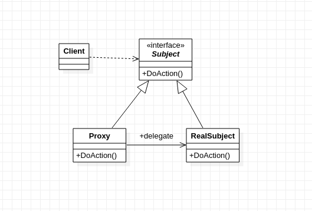

`subject`(抽象主题角色)：

​	真实主题与代理主题的共同接口。

`RealSubject`(真实主题角色)：

​	定义了代理角色所代表的真实对象。

`Proxy`（代理主题角色）：

​	含有对真实主题角色的引用，代理角色通常在将客户端调用传递给给真实主题对象之前或者之后执行某些操作，而不是单纯返回真实的对象。

适用于：对某些对象提供一种代理以控制对这个对象的访问。

**为什么要用代理模式？**

- **中介隔离作用：**在某些情况下，一个客户类不想或者不能直接引用一个委托对象，而代理类对象可以在客户类和委托对象之间起到中介的作用，其特征是代理类和委托类实现相同的接口。
- **开闭原则，增加功能：**代理类除了是客户类和委托类的中介之外，我们还可以通过给代理类增加额外的功能来扩展委托类的功能，这样做我们只需要修改代理类而不需要再修改委托类，符合代码设计的开闭原则。代理类主要负责为委托类预处理消息、过滤消息、把消息转发给委托类，以及事后对返回结果的处理等。代理类本身并不真正实现服务，而是同过调用委托类的相关方法，来提供特定的服务。真正的业务功能还是由委托类来实现，但是可以在业务功能执行的前后加入一些公共的服务。例如我们想给项目加入缓存、日志这些功能，我们就可以使用代理类来完成，而没必要打开已经封装好的委托类。

代码实现：

```cpp
//
// Created by andrew on 2020/11/15.
//
#include <iostream>

using namespace std;

class Subject {
public:
    virtual ~Subject(){

    }
    virtual void sailBook() = 0;
};

class RealSubjectBook : public Subject {
public:
    virtual void sailBook() {
        cout << "sail book" << endl;
    }
};

class taobaoProxy : public Subject {
public:
    virtual void sailBook(){
        RealSubjectBook *rsb = new RealSubjectBook;
        dazhe();
        rsb->sailBook();
        dazhe();
    }

public:
    void dazhe(){
        cout << "双 11 打折" << endl;
    }

private:
    Subject *m_subject;
};


int main(int argc, char *argv[]) {

    Subject *s = new taobaoProxy;
    s->sailBook();
    delete s;
    return 0;
}
```


#### 装饰者模式

装饰者模式(`Decorator`)又叫包装模式，通过一种对客户端透明的方式来扩展对象的功能，是继承关系的一个替代方案。

装饰模式就是把要添加的功能分别放到单独的类中，并让这个类中包含它要装饰的对象，当需要执行的时候，客户端可以有选择地、按顺序执的使用装饰功能包装的对象。


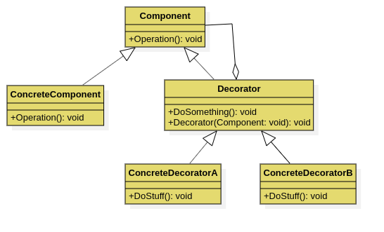

##### 实用性

动态的给一个对象添加一些额外的职责，就增加功能来说，装饰模式比生成子类更加灵活。

在不影响其他对象的情况下，以动态、透明的方式给单个对象添加职责

处理那些可以撤销的职责

当不能采用子类的方法进行扩充时，一种情况是，可能有大量的独立扩展，为支持每一种组合将产生大量的子类，使得子类数目爆炸性增长，另外一种可能是类的定义被隐藏，或类的定义不能用于生成子类。


装饰者模式代码实现：

```cpp
//
// Created by andrew on 2020/11/17.
//
#include <iostream>

using namespace std;

class Car {
public:
    virtual void show() = 0;

    virtual ~Car() {

    }
};

class RunCar : public Car {
public:
    virtual void show() {
        cout << "run car" << endl;
    }

    ~RunCar() {

    }
};

// 当传进来的是runcar的时候，就能实现在不继承runcar的情况下扩展runcar的功能
class SwimCarDirector : public Car {
public:
    SwimCarDirector(Car *car) {
        m_car = car;
    }

    ~SwimCarDirector() {

    }

    void swim() {
        cout << "swim" << endl;
    }

    virtual void show() {
        m_car->show();
        swim();
    }

private:
    Car *m_car;
};

// 当传进来的是runcar的时候，就能实现在不继承runcar的情况下扩展runcar的功能
class FlyCarDirector : public Car {
public:
    FlyCarDirector(Car *car) {
        m_car = car;
    }

    ~FlyCarDirector() {

    }

    void fly() {
        cout << "fly" << endl;
    }

    virtual void show() {
        m_car->show();
        fly();
    }

private:
    Car *m_car;
};


int main(int argc, char *argv[]) {
//   考点，虚基类虽然不能定义对象，但是能定义指针，指针指向子类
    Car *mycar = NULL;
    mycar = new RunCar;
    mycar->show();
    cout << "-------------------------" << endl;
//    修饰模式，将run car修饰之后就能飞了
    FlyCarDirector *flyCar = new FlyCarDirector(mycar);
    flyCar->show();
//
    cout << "-------------------------" << endl;
    SwimCarDirector *swimCar = new SwimCarDirector(mycar);
    swimCar->show();

    delete swimCar;
    delete flyCar;
    delete mycar;

    cout << "decorator demo" << endl;
    return 0;
}

```


#### 适配器模式

将一个类的接口转换为客户希望的另外一个接口。`Adapter`模式使得原本由于接口不兼容而不能一起工作的那些类可以一起工作。

`UML`图如下：


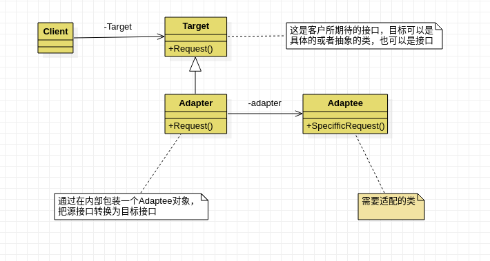

##### 适用性

- 你想使用一个已存在的类，而它的接口不符合你的需求。

- 你想创建一个可以复用的类，该类可以与其他不相关的类或不可预见的类协同工作
- 你想使用一些已经存在的子类，但是不可能对每一个都进行子类化以匹配他们的接口，对象适配器可以适配它的父类接口

代码实现

```cpp
//
// Created by andrew on 2020/11/17.
//

#include <iostream>

using namespace std;

class Current18v {
public:
    virtual void useCurrent18v() = 0;

    virtual ~Current18v() {

    }
};

class Current220v {
public:
    void useCurrent220v() {
        cout << "使用 220v" << endl;
    }
};

class Adapter : public Current18v {
public:
    Adapter(Current220v *current) {
        m_current = current;
    }

    virtual void useCurrent18v() {
        cout << "适配 220v";
        m_current->useCurrent220v();
    }

private:
    Current220v *m_current;
};


int main(int argc, char *argv[]) {

    Current220v *current220v = NULL;
    Adapter *adapter = NULL;

    current220v = new Current220v;
    adapter = new Adapter(current220v);
    adapter->useCurrent18v();

    delete adapter;
    delete current220v;

    return 0;
}
```

可以看到适配器做的工作就是讲`220v`的电压，转化为用户需要的`18v`电压。


#### 桥接模式

`Bridge`模式，又叫做桥接模式，是构造型的设计模式之一。`Bridge`模式基于类的最小设计原则，通过使用封装，聚合以及继承等行为让类承担不同的责任。它的主要特点是把抽象(`Abstraction`)与行为实现(`implementation`)分离开来，从而可以保持各部分的独立性以及对它们的功能扩展。

`UML`实现如下：

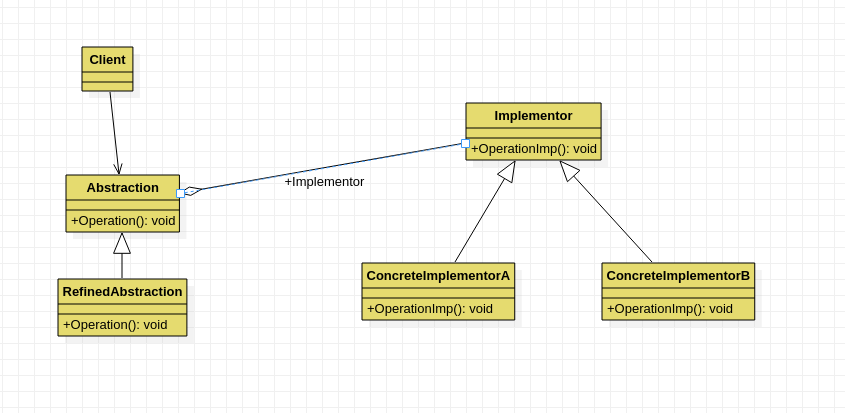


`client`

`Bridge`模式的使用者

`Abstration`

抽象类接口(接口或抽象类)维护对行为实现(`Implementor`)的引用

`Refined Abstraction`

`Abstracton`子类

`Implementor`

行为实现类接口（Abstraction接口定义了基于`Implementor`接口的更高层次的操作）

`ConcreteImplementor`

`Implementor`子类

桥接模式，适用于将抽象部分与实体部分分离(解耦合)，使它们可以独立变化。

桥接模式代码实现：

```cpp
//
// Created by andrew on 2020/11/17.
//
#include <iostream>

using namespace std;

class Engine {
public:
    virtual void InstallEngine() = 0;

    virtual ~Engine() {

    }
};

class Engine4400cc : public Engine {
public:
    virtual void InstallEngine() {
        cout << "I'm 4400cc install over." << endl;
    }
};

class Engine4500cc : public Engine {
public:
    virtual void InstallEngine() {
        cout << "I'm 4500cc install over." << endl;
    }
};

class Car {
public:
    Car(Engine *engine) {
        m_engine = engine;
    }

    virtual ~Car() {

    }

protected:
    Engine *m_engine;
};

class BMW3 : public Car {
public:
    BMW3(Engine *engine) : Car(engine) {

    }

    // 具体实现和car分离
//    m_engine每个car都要有个引擎，抽象出来，放到公共类中，实现抽象和实现分离
    virtual void intallEngine() {
        //安装的动作是在engine里面实现，与car分离
        m_engine->InstallEngine();
    }
};

class BMW5 : public Car {
public:
    BMW5(Engine *engine) : Car(engine) {}

    virtual void installEngine() {
        cout << "BMW5" << endl;
        m_engine->InstallEngine();
    }
};

int main(int argc, char *argv[]) {

    Engine *engine = NULL;
    BMW5 *bmw5 = NULL;

    engine = new Engine4400cc;
    bmw5 = new BMW5(engine);
    bmw5->installEngine();

    delete bmw5;
    delete engine;

    return 0;
}

```

#### 组合模式

`Composite`模式也叫做组合模式，是构造型的设计模式之一。通过递归的手段构造树形的对象结构，并可以通过一个对象来访问整个对象树。

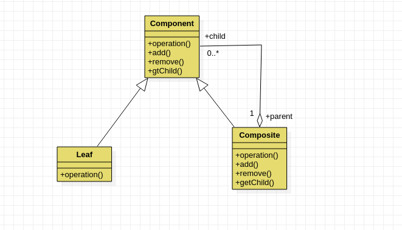

`Component`树形结构的节点抽象

- 为所有的对象定义统一的接口(公共属性，行为等的定义)
- 提供管理子节点对象的接口方法
- [可选]提供管理父节点对象的接口方法

`Leaf`树形结构的叶节点

- `Component`的实现子类

`Composite`树形结构的枝节点

- `Component`的实现子类

**适用于**

​	单个对象的使用具有一致性，将对象组合成树形结构表示`部分--整体`

```cpp
//
// Created by andrew on 2020/11/21.
//
#include <iostream>
#include <string>
#include  <list>

using namespace std;

/*
 * `Composite`模式也叫做组合模式，是构造型的设计模式之一。通过递归的手段构造树形的对象结构，并可以通过一个对象来访问整个对象树。
 * */

class IFile {
public:
    ~IFile() {

    }

    virtual void display() = 0;

    virtual int add(IFile *ifile) = 0;

    virtual int remove(IFile *ifile) = 0;

    virtual list<IFile *> *getChild() = 0;
};

class File : public IFile {
public:
    // explicit 声明只有单个参数的构造函数
    explicit File(string name) {
        m_name = name;
    }

    void display() override {
        cout << m_name << endl;
    }

    int add(IFile *ifile) override {
        return -1;
    }

    int remove(IFile *ifile) override {
        return -1;
    }

    list<IFile *> *getChild() override {
        return NULL;
    }

private:
    string m_name;

};

// 目录节点
class Dir : public IFile {
public:
    explicit Dir(string name) {
        m_name = name;
        m_list = new list<IFile *>;
        m_list->clear();
    }

    void display() override {
        cout << m_name << endl;
    }

    int add(IFile *ifile) override {
        m_list->push_back(ifile);
        return 0;
    }

    int remove(IFile *ifile) override {
        m_list->remove(ifile);
        return 0;
    }

    list<IFile *> *getChild() override {
        return m_list;
    }

private:
//    父目录中有一个或者多个子目录，因此是个链表， 子目录能通过父节点得到
    string m_name;
    list<IFile *> *m_list;
};

// 递归显示树
void showTree(IFile *root, int level) {
    int i = 0;
    if (root == NULL) {
        return;
    }

    for (i == 0; i < level; i++)
    {
        printf("\t");
    }
//    显示根节点
    root->display();
//    若根节点有孩子
//    判断孩子是文件还是文件，显示名字
    list<IFile *> *mylist = root->getChild(); // 获取子目录
    if(mylist != NULL){
        for (auto it = mylist->begin(); it != mylist->end(); it++){
            if((*it)->getChild() == NULL)
            {
//                不是目录就打印文件名 for循环是按照level等级将制表符打印出来
                for(i = 0;i<=level;i++)
                {
                    printf("\t");
                }
                (*it)->display();
            } else
            {
//                是目录就接着递归
                showTree(*it, level+1);
            }
        }
    }

}

int main(int argc, char *argv[]) {

    Dir *root = new Dir("C");
    Dir *dir1 = new Dir("111dir");
    File *aFile = new File("a.txt");

    // 获取root下的节点 孩子集合
    list<IFile *> *mylist = root->getChild();

    root->add(dir1);
    root->add(aFile);
    for(auto it=mylist->begin(); it != mylist->end(); it++)
    {
        (*it)->display();
    }

    Dir *dir2 = new Dir("dir2");
    File *bFile = new File("b.txt");
    dir1->add(dir2);
    dir1->add(bFile);

    cout << "通过 showTree 方式显示root节点下的所有子节点" << endl;

    showTree(root,0);

    cout << "composite pattern" << endl;
    return 0;
}
```

#### 外观模式

`facade`模式也叫外观模式，是由`GoF`提出的23种设计模式中的一种，`facade`模式为一组具有类似功能的类群，比如类库，子系统等等，提供一个一致的简单界面。这个一致的简单的界面被称为`facade`。

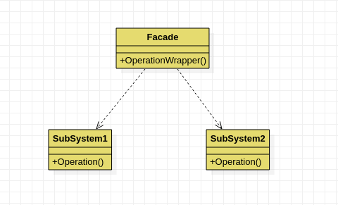

`Facade`

为调用方，定义简单的调用接口

`Clients`

调用者，通过`facade`接口调用提供某功能的内部类群

`Packages`

功能提供者，指提供功能的类群

适用于：为子系统提供统一一套接口，让子系统更加容易使用。

```cpp
//
// Created by andrew on 2020/11/21.
//
#include <iostream>

using namespace std;

class SubSystemA{
public:
    void doThing(){
        cout << "Subsystem A run" << endl;
    }
};

class SubSystemB{
public:
    void doThing(){
        cout << "SubSystem B run" << endl;
    }
};

class SubSystemC{
public:
    void doThing(){
        cout << "SubSystem B run" << endl;
    }
};

class Facade{
public:
    Facade(){
        sysA = new SubSystemA;
        sysB = new SubSystemB;
        sysC = new SubSystemC;
    }
    ~Facade(){
        delete sysA;
        delete sysB;
        delete sysC;
    }

public:
    void doThing(){
        sysA->doThing();
        sysB->doThing();
        sysC->doThing();
    }

private:
    SubSystemA *sysA;
    SubSystemB *sysB;
    SubSystemC *sysC;
};

int main(int argc, char *argv[]) {
//   没有使用之前
    cout << "before use facade" << endl;
    SubSystemA *sysA = new SubSystemA;
    SubSystemB *sysB = new SubSystemB;
    SubSystemC *sysC = new SubSystemC;

    sysA->doThing();
    sysB->doThing();
    sysC->doThing();
    delete sysA;
    delete sysB;
    delete sysC;
//    是要给你之后
    cout << "after usr facade" << endl;
    Facade *f = new Facade;
    f->doThing();
    delete f;
    return 0;
}
```

#### 享元模式

`Flyweight`模式也叫做享元模式，是构造型模式之一，他通过与其他类似对象共享数据来减少内存占用。

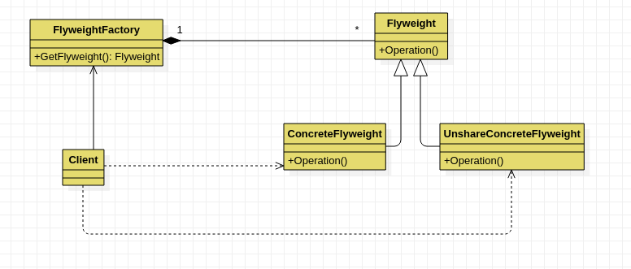

抽象享元模式：

所有具有享元类的父亲，规定一些需要实现的公共接口。

具体享元角色：

抽象享元角色的具体实现类，并实现了抽象享元角色规定的方法

享元工厂角色：

负责创建和管理享元角色

使用场景：

以共享的方式，高效支持大量的细粒度的对象

```cpp
//
// Created by andrew on 2020/11/22.
//
#include <iostream>
#include <string>
#include <map>
#include <utility>

using namespace std;

class Person {
public:
    Person(string name, int age) {
        this->age = age;
        this->m_name = std::move(name);
    }
    // 默认形式的定义
    virtual ~Person()= default;

    virtual void printT() = 0;


protected:
    string m_name;
    int age;
};

class Teacher : public Person {
public:
    Teacher(string name, int age, string id) : Person(name, age) {
        this->m_id = id;
    }

    void printT() override {
        cout << "name:" << m_name << "age:" << age << "m_id:" << m_id << endl;
    }

private:
    string m_id;
};

// 完成 老师节点 储存
class FlyweightTeacherFactory {
public:
    FlyweightTeacherFactory() {
        map1.clear();
    }

    ~FlyweightTeacherFactory() {
        while (!map1.empty()) {
            Person *tmp = NULL;
            auto it = map1.begin();
            // map的第二个元素就是Teacher
            tmp = it->second;
            map1.erase(it);  // 将第一个节点从容器中删除
            delete tmp;
        }
    }

    // 保持所有的数据只有一份
    Person *GetTeacher(string id) {
        Person *tmp = NULL;
        map<string, Person *>::iterator  it;
        it = map1.find(id);
        if (it == map1.end()) { // 结尾
            string tmpname;
            int tmpage;
            cout << "enter teacher name:";
            cin >> tmpname;
            cout << "enter age";
            cin >> tmpage;
            tmp = new Teacher(tmpname, tmpage, id);
            map1.insert(pair<string, Person *>(id, tmp));
        } else
        {
            tmp = it->second;
        }
        return tmp;
    }

private:
    map<string, Person *> map1;
};

int main(int argc, char *argv[]) {

    Person *p1 = NULL;
    Person *p2 = NULL;
    FlyweightTeacherFactory *fwtf = new FlyweightTeacherFactory;
    p1 = fwtf->GetTeacher("001");
    p1->printT();

    p2 = fwtf->GetTeacher("001");
    p2->printT();

    delete fwtf;

    cout << "flyweight demo" << endl;
    return 0;
}
```

#### 模板模式

`Template Method`模式也叫模板方法模式，是行为模式之一，它具有把特定的步骤算法中的某些必要的处理委让给抽象方法，通过子类继承抽象方法的不同实现改变整个算法的行为。

**使用场景**

- 具有统一的操作步骤或者操作过程
- 具有不同的操作细节
- 存在多个具有同样操作步骤的应用场景，某些具体的操作细节却各不相同

在抽象类中统一操作步骤，并规定好接口，让子类实现接口，这样可以把各个具体的子类实现操作步骤解耦合

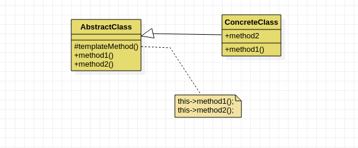

`AbstractClass`

抽象类的父类

`ConcreteClass`

具体的实现子类

`templateMethod():`

模板方法

`method1`与`method2()`

具体操作方法

代码实现：

```cpp
//
// Created by andrew on 2020/11/22.
//
#include <iostream>

using namespace std;

class MakeCar {
public:
    virtual ~MakeCar() = default;
    virtual void MakeHead() = 0;

    virtual void MakeBody() = 0;

    virtual void MakeTail() = 0;

public:
    void Make() // 模板函数，把业务逻辑给做好
    {
        MakeTail();
        MakeBody();
        MakeHead();
    }
};

// 只去实现具体过程，逻辑流程由父类进行规定
class Jeep : public MakeCar {
public:
    virtual void MakeHead() {
        cout << "jeep head" << endl;
    }

    virtual void MakeBody() {
        cout << "jeep body" << endl;
    }

    virtual void MakeTail() {
        cout << "jeep tail" << endl;
    }
};

class Bus : public MakeCar {
public:
    virtual void MakeHead() {
        cout << "bus head" << endl;
    }

    virtual void MakeBody() {
        cout << "bus body" << endl;
    }

    virtual void MakeTail() {
        cout << "bus tail" << endl;
    }
};


int main(int argc, char *argv[]) {
    MakeCar *car = new Bus;
    car->Make();
    delete car;

    MakeCar *car2 = new Jeep;
    car2->Make();
    delete car2;

    return 0;
}
```


#### 命令模式

`Command`模式也叫命令模式，是行为设计模式的一种。`Command`模式通过被称为`Command`的类封装了对目标对象的调用行为以及调用参数。

在面向对象的程序设计中，一个对象调用另外一个对象，一边情况下调用的过程是，创建目标对象实例；设置调用参数，调用目标对象的方法。

但是有些情况下有必要使用一个专门的类对这种调用过程加以封装，我们把这种专门的类称作`Command`类。

整个调用过程比较繁杂，或者存在多处这种调用。这时，使用`Command`类对该调用加以封装，便于功能的再利用。

调用前后需要对调用参数进行某些处理。调用前后需要进行某些额外的处理，比如日志，缓存、记录历史操作等。

**角色和职责**

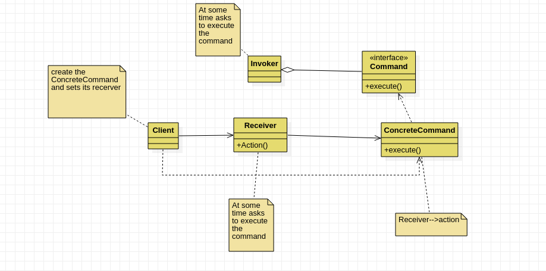

`Command`

`Command`命令的抽象类

`ConcreteCommand`

`ConcreteCommand`的具体实现类

`Receiver`

`Invorker`

通过`Invorker`执行`Command`对象

==适用于==

是将一个请求封装为一个对象，从而使你可以使用不同的请求，对客户端进行参数初始化；对请求排队或记录请求日志，以及支持可撤销的操作

仅仅实现命令的执行

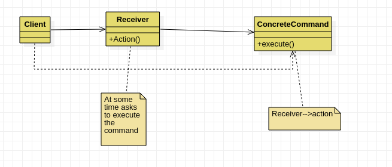

首先实现，后半部分，也就是实现命令的执行，前面半部分相当于当看病的人多的时候需要，需要排队，这似乎`invoker`就开始登场啦。

```cpp
//
// Created by andrew on 2020/11/23.
//
#include <iostream>

using namespace std;

class Doctor {
public:
    void treatEye() {
        cout << "treat eye" << endl;
    }

    void treatNose() {
        cout << "treat nose" << endl;
    }
};

class CommandTreatEye {
public:
    explicit CommandTreatEye(Doctor *doctor) {
        m_doctor = doctor;
    }

    void treat() {
        m_doctor->treatEye();
    }

private:
    Doctor *m_doctor;
};

class CommandTreatNose {
public:
    explicit CommandTreatNose(Doctor *doctor) {
        m_doctor = doctor;
    }

    void treat() {
        m_doctor->treatNose();
    }

private:
    Doctor *m_doctor;
};


int main(int argc, char *argv[]) {

    //   通过一个命令  调用医生实现病的治疗
    Doctor *dcotor = new Doctor;
    CommandTreatEye *commandTreatEye = new CommandTreatEye(dcotor);
    commandTreatEye->treat();
    delete commandTreatEye;
    delete dcotor;
    return 0;
}
```

完整的实现，支持排队+执行的命令模式

```cpp
//
// Created by andrew on 2020/11/23.
//
#include <iostream>
#include <list>

using namespace std;

class Doctor {
public:
    void treatEye() {
        cout << "treat eye" << endl;
    }

    void treatNose() {
        cout << "treat nose" << endl;
    }
};

class Command {
public:
    virtual void treat() = 0;

    virtual ~Command() = default;
};

class CommandTreatEye : public Command {
public:
    explicit CommandTreatEye(Doctor *doctor) {
        m_doctor = doctor;
    }

    void treat() override {
        m_doctor->treatEye();
    }

private:
    Doctor *m_doctor;
};


class CommandTreatNose : public Command {
public:
    explicit CommandTreatNose(Doctor *doctor) {
        m_doctor = doctor;
    }

    void treat() override {
        m_doctor->treatNose();
    }

private:
    Doctor *m_doctor;
};

//小护士
class BeautyNurse {
public:
    explicit BeautyNurse(Command *command) {
        this->command = command;
    }

    void SubmittedCase() { // 提交病历 下单命令
        command->treat();
    }

private:
    Command *command;
};

class HeadNurse {
public:
    HeadNurse() {
        m_list.clear();
    }

    void setCommand(Command *command) {
        m_list.push_back(command);
    }

    void SubmittedCase() { // 提交命令
        for (auto & it : m_list) {
            it->treat();
        }
    }

private:
    list<Command *> m_list;
};


void nurseCommand() {
    BeautyNurse *beautyNurse = nullptr;
    Doctor *doctor = nullptr;
    Command *command = nullptr;

    doctor = new Doctor;
//
    command = new CommandTreatNose(doctor);
    beautyNurse = new BeautyNurse(command);
    beautyNurse->SubmittedCase();

    delete doctor;
    delete command;
    delete beautyNurse;
}

void headNurseCommand() {
//    护士长 提交病历  给以上看病
    HeadNurse *headNurse = NULL;
    Doctor * doctor = NULL;
    Command *command1 = NULL;
    Command *command2 = NULL;

    doctor = new Doctor;
    command1 = new CommandTreatEye(doctor);
    command2 = new CommandTreatNose(doctor);

    headNurse = new HeadNurse;
    headNurse->setCommand(command1);
    headNurse->setCommand(command2);

    headNurse->SubmittedCase(); // 护士长  批量下单命令

    delete doctor;
    delete command1;
    delete command2;
    delete headNurse;
}


int main(int argc, char *argv[]) {

    //   通过一个命令  调用医生实现病的治疗 命令的执行部分实现
    /* Doctor *dcotor = new Doctor;
     CommandTreatEye *commandTreatEye = new CommandTreatEye(dcotor);
     commandTreatEye->treat();
     delete commandTreatEye;
     delete dcotor;*/

    //
    nurseCommand();
    headNurseCommand();

    return 0;
}
```

#### 责任链模式

`Chain of Responsibility CoR`模式，也叫责任链模式或者责任连锁模式，是行为模式之一，该模式构造一系列分别担当不同的职责的类的对象来共同完成一个任务，这些类的对象之间像一条链条一样紧密相连，所以被称为责任链模式。

例1：比如客户`Client`客户想完成一个任务，这个任务包括`a,b,c,d`四个部分。a完成了之后交个b，b完成了之后交给c，c完成了之后交给d。

**角色和职责**

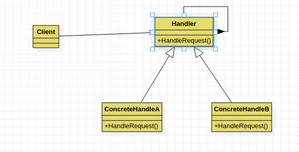

`Handler`

处理类的抽象父类

`concreteHandle`

具体处理类

<u>**责任链优缺点**</u>

**优点**

1. 责任的分组。每个类只需要处理自己该处理的工作(不该处理的传递给下一个对象完成)，明确各类的责任范围，符合类的最小封装原则。
2. 可以根据需要自由组合工作流程。如工作流程发生变化，可以通过重新分配对象链便可适应新的工作流程。
3. 类与类之间可以以松耦合的形式加以组织。

**缺点**

因为处理时以链表的形式在对象间传递消息，根据实现方式不同，有可能会影响处理的速度

*适用于：*

链条式处理事情，工作流程化、消息处理流程化、事物流程化。

```cpp
//
// Created by andrew on 2020/11/25.
//
#include <iostream>

using namespace std;
/*
 * 责任链模式
 * */

// 在造车的过程，一部分造完之后，需要将任务传递下去
class CarHandle {
public:
    virtual void HandleCar() = 0;

    virtual ~CarHandle() = default;

    CarHandle *setNextHandle(CarHandle *handle) {
        m_handle = handle;
        return m_handle;
    }

protected:
    CarHandle *m_handle{}; // 指向下一个处理单元
};

class HeadCarHandle : public CarHandle {
public:
    void HandleCar() override {
        cout << "make head" << endl;
//       开始造车头，车头造好之后，交给下一个调用者
        if (m_handle != nullptr) {
            m_handle->HandleCar();
        }
    }
};

class BodyCarHandle : public CarHandle {
public:
    void HandleCar() override {
        cout << "make body" << endl;
//        车身造好之后，把任务递交给 下一个处理者
        if (m_handle != nullptr) {
            m_handle->HandleCar();
        }
    }
};

class TailCarHandle : public CarHandle {
public:
    void HandleCar() override {
        cout << "make tail" << endl;
//        造车尾  把任务递交给 下一个处理器
        if (m_handle != nullptr) {
            m_handle->HandleCar();
        }
    }
};

int main(int argc, char *argv[]) {
    CarHandle *headHandle = new HeadCarHandle;
    CarHandle *bodyHandle = new BodyCarHandle;
    CarHandle *tailHeadle = new TailCarHandle;

    headHandle->setNextHandle(tailHeadle);
    tailHeadle->setNextHandle(bodyHandle);
    bodyHandle->setNextHandle(nullptr);

    headHandle->HandleCar();

    delete tailHeadle;
    delete bodyHandle;
    delete headHandle;

    return 0;
}
```

#### 策略模式

`Strategy`模式也叫策略模式，是行为模式之一，它对一系列的算法加以封装，为所有算法定义一个抽象算法接口，并通过继承该抽象算法接口对所有的算法加以封装和实现，具体的算法选择交给客户端决定。`strategy`模式主要用来平滑地处理算法切换。

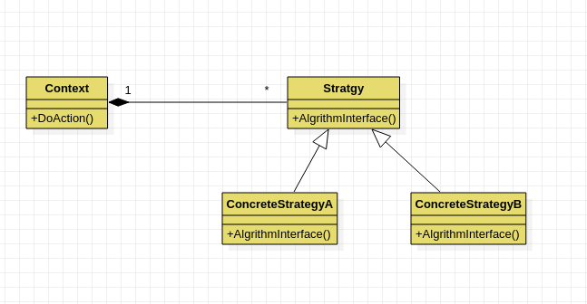

策略模式实现的关键就是将算法的逻辑抽象接口封装到一个类中，在通过委托的方式将具体的算法实现委托给具体的`Strategy`类来实现

`Strategy`

策略(算法)抽象

`ConcreteStrategy`

各种策略(算法)的具体实现

`Context`

策略的外部封装类，或者说策略的容器类。根据不同策略执行不同的行为。策略由外部环境决定。

适用于：准备一组算法，并将每一个算法都封装起来，使得它们可以互换。

策略模式优缺点

它的优点有：

1. 策略模式提供了管理相关的算法族的办法。策略类的等级结构定义了一个算法或行为族。
恰当使用继承可以把公共的代码移到父类里面，从而避免重复的代码。
2. 策略模式提供了可以替换继承关系的办法。继承可以处理多种算法或行为。如果不是用
策略模式，那么使用算法或行为的环境类就可能会有一些子类，每一个子类提供一个不同
的算法或行为。但是，这样一来算法或行为的使用者就和算法或行为本身混在一起。决定
使用哪一种算法或采取哪一种行为的逻辑就和算法或行为的逻辑混合在一起，从而不可能
再独立演化。继承使得动态改变算法或行为变得不可能。
3. 使用策略模式可以避免使用多重条件转移语句。多重转移语句不易维护，它把采取哪一
种算法或采取哪一种行为的逻辑与算法或行为的逻辑混合在一起，统统列在一个多重转移
语句里面，比使用继承的办法还要原始和落后。

策略模式的缺点有：
1. 客户端必须知道所有的策略类，并自行决定使用哪一个策略类。这就意味着客户端必须
   理解这些算法的区别，以便适时选择恰当的算法类。换言之，策略模式只适用于客户端知
     道所有的算法或行为的情况。

2. 策略模式造成很多的策略类。有时候可以通过把依赖于环境的状态保存到客户端里面，
   而将策略类设计成可共享的，这样策略类实例可以被不同客户端使用。换言之，可以使用
     享元模式来减少对象的数量

```cpp
//
// Created by andrew on 2020/11/26.
//
#include <iostream>

using namespace std;

class Strategy {

public:
    virtual void crypt() = 0;

    virtual ~Strategy() = default;
};

class AES : public Strategy {
public:
    void crypt() override {
        cout << "AES strategy" << endl;
    }
};

class DES : public Strategy {
public:
    void crypt() override {
        cout << "DES strategy" << endl;
    }
};


class Context {
public:
    void setStrategy(Strategy *pStrategy) {
        this->strategy = pStrategy;
    }

    void myOperator() {
        strategy->crypt();
    }

private:
    Strategy *strategy;
};

//算法实现和客户端使用完全解耦合
int main(int argc, char *argv[]) {
    Strategy *strategy = nullptr;

    strategy = new AES;
    Context *context = new Context;
    context->setStrategy(strategy);
    context->myOperator();

    delete strategy;
    delete context;

    return 0;
}
```

#### 中介者模式

`Mediator`模式也叫做中介者模式，是行为模式之一，在`Mediator`模式中，类之间的交互行为被统一放在`Mediator`的对象中，对象通过`Mediator`对象同其他对象交互，`Mediator`对象起着控制器的作用。

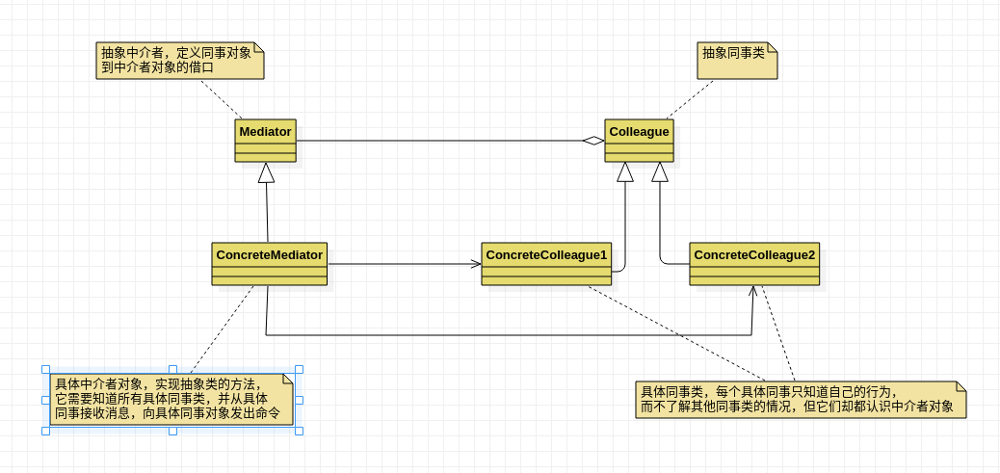

用一个中介者对象来封装一系列的对象交互，中介者使各对象不需要显示的相互引用，从而降低耦合，而且可以独立地改变它们之间的交互。

`Mediator`抽象中介者

中介者类的抽象父类

`ConcreteMediator`

具体的中介者类

`Colleague`

关联类的抽象父类

`concreteColluague`

具体的关联类

适用于：用一个中介对象，封装一些列对象的交换，中介者是各个对象不需要显示的相互作用，从而实现耦合松散，而且可以独立的改变它们之间的交换。

模式优点

1. 将系统按功能分割成更小的对象，符合类的最小设计原则
2. 对关联对象的集中控制
3. 娇小类的耦合程度，明确类之间的相互关系：当类之间的关系过于复杂时，其中任何一个类的修改都会影响到其他类，不符合类的设计的开闭原则，而`mediator`模式将原来相互依存的多对多的类之间的关系简化为`Mediator`控制类与其他关联类的一对多的关系，当其中一个类修改时，可以对其他关联类不产生影响(即使有修改，也集中在`Mediator`控制类)
4. 有利于提高类的重用性

```cpp
//
// Created by andrew on 2020/11/28.
//
#include <iostream>

using namespace std;

class Mediator;

class Person {
public:
    Person(string name, int sex, int condi, Mediator *m) {
        m_name = name;
        m_sex = sex;
        m_condi = condi;
        mediator = m;
    }
    virtual ~Person() = default;

    string getName() {
        return m_name;
    }

    int getSex() const {
        return m_sex;
    }

    int getCondi() const {
        return m_condi;
    }

    virtual void getParter(Person *p) = 0;

protected:
    string m_name;
    int m_sex;
    int m_condi;
    Mediator *mediator;
};

class Mediator {
public:
    virtual ~Mediator() = default;
    void setMan(Person *man) {
        pMan = man;
    }

    void setWoman(Person *woman) {
        pWoman = woman;
    }

    virtual void getParter() {
        if (pWoman->getSex() == pMan->getSex()) {
            cout << "性别相同不能找对象" << endl;
        }
        if (pWoman->getCondi() == pMan->getCondi()) {
            cout << pWoman->getName() << "     and    " << pMan->getName() << "    OK" << endl;
        } else {
            cout << pWoman->getName() << "    and    " << pMan->getName() << "     failed" << endl;
        }
    }


private:
    Person *pMan;
    Person *pWoman;
};

class Woman : public Person {
public:
    Woman(string name, int sex, int condi, Mediator *m) : Person(name, sex, condi, m) {

    }

    virtual void getParter(Person *p) {
        mediator->setMan(p);
        mediator->setWoman(this);
        mediator->getParter(); // 找对象
    }
};

class Man : public Person {
public:
    Man(string name, int sex, int condi, Mediator *m) : Person(name, sex, condi, m) {

    }

    virtual void getParter(Person *p) {
        mediator->setMan(this);
        mediator->setWoman(p);
        mediator->getParter();
    }
};

int main(int argc, char *argv[]) {
    auto *m = new Mediator;
    Person *alice = new Woman("alice", 2, 4, m);

    Person *bob = new Man("bob", 1, 4, m);

    alice->getParter(bob);
    bob->getParter(alice);
    delete bob;
    delete alice;
    delete m;
    cout << "mediator demo" << endl;
    return 0;
}
```

#### 观察者模式

`Observer`模式是行为模式之一，它的作用是当一个对象的状态发生变化时，能够自动通知其他关联对象，自动刷新对象状态。

`Observer`模式提供给关联对象一种同步通信的手段，使得某个对象与依赖它的其他对象之间保持状态同步。

**角色和职责**

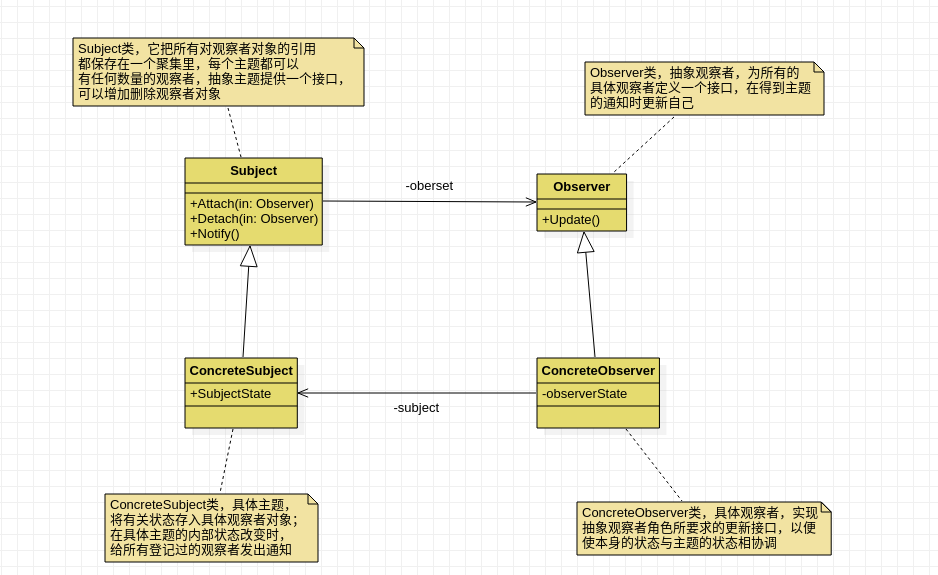

`Suject`-被观察者

被观察的对象，当需要被观察的状态发生改变时，需要通知队列中所有的观察者对象。`Subject`需要维持(添加，删除，通知)一个观察者对象的队列列表。

`ConcreteSubject`

被观察者的具体实现，包含一些基本的属性状态及其他操作

`Observer`-观察者

接口或抽象类，当`Subject`的状态发生变化时，`Observer`对象将通过一个`callback`函数得到通知。

`ConcreteObserver`

观察者的具体实现，得到通知后将完成一些具体的业务逻辑处理

**典型应用场景**

- 侦听事件驱动程序中的外部事件
- 侦听某个对象的状态变化
- 发布者/订阅者模型中，当一个外部事件被触发时，通知邮件列表中的订阅者

适用于：定义对象间一种一对多的依赖关系，使得每一个对象改变状态，则所有依赖它们的对象都会得到通知。

使用场景：定义一种一对多的关系，让多个观察者对象同时监听一个主题，主题对象发生变化时，会通知所有的观察者，使它们能够更新自己。

```cpp
//
// Created by andrew on 2020/11/28.
//
#include <iostream>
#include <list>

using namespace std;

class Secretary;

// 观察者
class PlayerObserver{
public:
    explicit PlayerObserver(Secretary *secretary){
        this->m_secretary = secretary;
    }
    // 没有操作任何私有变量，建议使用 static 类型函数
    void update(const string& action){
        cout << "action" << action << endl;
        cout << "boss is coming" << endl;
    }

private:
    Secretary *m_secretary;
};

class Secretary{
public:
    Secretary(){
        m_list.clear();
    }
     void Notify(string info){
        // 给所有的 观察者 发送情报
        for(auto it=m_list.begin();it!=m_list.end();it++)
        {
            (*it)->update(info);
        }
    }

    void setPlayerObserver(PlayerObserver *o){
        m_list.push_back(o);
    }

private:
    list<PlayerObserver *>m_list;
};

int main(int argc, char* argv[]){

    Secretary *secretary = nullptr;
    PlayerObserver *playerObserver1 = nullptr;
    PlayerObserver *playerObserver2 = nullptr;

    secretary = new Secretary;
    playerObserver1 = new PlayerObserver(secretary);
    playerObserver2 = new PlayerObserver(secretary);

    secretary->setPlayerObserver(playerObserver1);
    secretary->setPlayerObserver(playerObserver2);

    secretary->Notify("boss is coming");
    secretary->Notify("boss in gone");

    delete playerObserver1;
    delete playerObserver2;
    delete secretary;

    cout << "observer demo" << endl;
    return 0;
}
```

#### 备忘录模式

`Memento`模式也叫备忘录模式，是行为模式之一，它的作用是保存对象内部状态，并在需要的时候(`undo`/`roback`)回复对象以前的状态。

**应用场景**

如果一个对象需要保存状态，并通过`undo`或者`roback`等操作回复到通知以前的状态时，可以使用`Memmento`模式。

1. 一个类需要保存它的对象的状态(相当于`Originator`角色)
2. 设计一个类，该类只是用来保存上述对象的状态(相当于`Memento`角色)
3. 需要的时候，`Caretaker`角色要求`Originator`返回一个`Memento`并加以保存
4. `undo`或`roback`操作时，通过`Caretaker`保存的`Memento`恢复`Originator`对象的状态

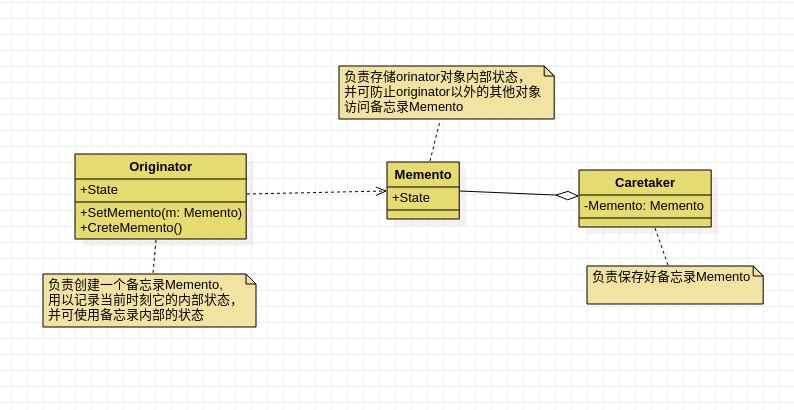

`Originator`-原生者

需要被保存状态以便恢复的那个对象

`Memento`-备忘录

该对象由`Originator`创建，主要用来保存`Originator`的内部状态

`Caretaker`-管理者

负责在适当的时间保存/恢复`Originator`对象的状态

适用于：在不破坏封装的前提下，捕获一个对象的内部状态，并在该对象之外保存这个状态，这样就可以将以后的对象状态恢复到先前保存的状态。适用于功能比较复杂的，需要记录或者维护历史属性的类。

```cpp
//
// Created by andrew on 2020/11/28.
//
#include <iostream>

using namespace std;

// Caretaker 管理者
// Memento 备忘录

class Memento{
public:
    Memento(string name, int age){
        m_name = name;
        m_age = age;
    }
    string getName(){
        return m_name;
    }
    int getAge() const{
        return m_age;
    }
    void setName(string name){
        this->m_name = name;
    }
    void setAge(int age){
        this->m_age = age;
    }

private:
    string m_name;
    int m_age;
};

class Person{
public:
    Person(string name, int age){
       m_name = name;
       m_age = age;
    }
    string getName(){
        return m_name;
    }
    int getAge() const{
        return m_age;
    }
    void setName(string name){
        this->m_name = name;
    }
    void setAge(int age){
        m_age = age;
    }
    // 保存,将需要的信息记录到Memento中
    Memento *createMemento()
    {
        return new Memento(m_name, m_age);
    }
    //还原
    void setMemento(Memento *memento)
    {
        this->m_name = memento->getName();

        this->m_age = memento->getAge();
    }

    void printT(){
        cout << "m_name:" << m_name << "m_age:" << m_age << endl;
    }

private:
    string m_name;
    int m_age;
};

class Caretaker{
public:
    explicit Caretaker(Memento * memento){
        this->memento = memento;
    }
    Memento *getMemento(){
        return memento;
    }

    void setMemento(Memento *memento){
        this->memento = memento;
    }

private:
    Memento *memento;
};

int main(int argc, char* argv[]){

    Caretaker *caretaker = nullptr;
    auto *p = new Person("bob", 32);
    p->printT();

    cout << "----------------------" << endl;
    caretaker = new Caretaker(p->createMemento());
    p->setAge(42);
    p->printT();

    cout << "ro back" << endl;
    p->setMemento(caretaker->getMemento());
    p->printT();

    cout << "memento pattern" << endl;
}
```

#### 访问者模式

`Vistor`模式也叫访问者模式，是行为模式之一，它分离对象的数据和行为，使用`Vistor`模式，可以不修改已有类的情况下，增加新的操作角色和职责。

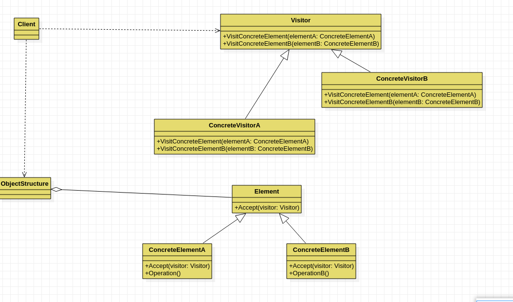

抽象访问者（`Visitor`）角色：声明了一个或者多个访问操作，形成所有的具体元素角色必须实现的接口。

具体访问者（`ConcreteVisitor`）角色：实现抽象访问者角色所声明的接口，也就是抽象访问者所声明的各个访问操作。

抽象节点（`Element`）角色：声明一个接受操作，接受一个访问者对象作为一个参量。

具体节点（`ConcreteElement`）角色：实现了抽象元素所规定的接受操作。

结构对象（`ObiectStructure`）角色：有如下的一些责任，可以遍历结构中的所有元素；如果需要，提供一个高层次的接口让访问者对象可以访问每一个元素；如果需要，可以设计成一个复合对象或者一个聚集，如列（`List`）或集合（`Set`）。

**适用于**：

把数据结构 和 作用于数据结构上的操作 进行解耦合; 适用于数据结构比较稳定的场合

**访问者模式总结**：

访问者模式优点是增加新的操作很容易，因为增加新的操作就意味着增加一个新的访问者。访问者模式将有关的行为集中到一个访问者对象中。
那访问者模式的缺点是是增加新的数据结构变得困难了

**优缺点**

访问者模式有如下的优点：

1. 访问者模式使得增加新的操作变得很容易。如果一些操作依赖于一个复杂的结构对象
   的话，那么一般而言，增加新的操作会很复杂。而使用访问者模式，增加新的操作就意味
   着增加一个新的访问者类，因此，变得很容易。
2. 访问者模式将有关的行为集中到一个访问者对象中，而不是分散到一个个的节点类中。
3. 访问者模式可以跨过几个类的等级结构访问属于不同的等级结构的成员类。迭代子只
   能访问属于同一个类型等级结构的成员对象，而不能访问属于不同等级结构的对象。访问
   者模式可以做到这一点。
4. 积累状态。每一个单独的访问者对象都集中了相关的行为，从而也就可以在访问的过
   程中将执行操作的状态积累在自己内部，而不是分散到很多的节点对象中。这是有益于系
   统维护的优点。

访问者的缺点：

1. 增加新的节点类变得很困难。每增加一个新的节点都意味着要在抽象访问者角色中增
   加一个新的抽象操作，并在每一个具体访问者类中增加相应的具体操作。
2. 破坏封装。访问者模式要求访问者对象访问并调用每一个节点对象的操作，这隐含了
   一个对所有节点对象的要求：它们必须暴露一些自己的操作和内部状态。不然，访问者的
   访问就变得没有意义。由于访问者对象自己会积累访问操作所需的状态，从而使这些状态
   不再存储在节点对象中，这也是破坏封装的。

案例需求：

比如有一个公园，有一到多个不同的组成部分；该公园存在多个访问者：清洁工 A 负责打扫公园的 A 部分，清洁工 B 负责打扫公园的 B 部分，公园的管理者负责检点各项事务是否完成，上级领导可以视察公园等等。也就是说，对于同一个公园，不同的访问者有不同的行为操作，而且访问者的种类也可能需要根据时间的推移而变化（行为的扩展性）。
根据软件设计的开闭原则（对修改关闭，对扩展开放），实现需求。

```cpp
//
// Created by andrew on 2020/11/28.
//
#include <iostream>
#include <list>

using namespace std;

class ParkElement;

class Visitor{
public:
    virtual ~Visitor() = default;
    virtual void visit(ParkElement *parkElement) = 0;
};

class ParkElement{
public:
    virtual ~ParkElement() = default;
    virtual void accept(Visitor *visitor) = 0;
};

class ParkA : public ParkElement{
public:
    void accept(Visitor *v) override{
        // 公园接收访问者， 让访问者操作
        v->visit(this);
    }
};

class ParkB : public ParkElement{
public:
    void accept(Visitor *v) override{
        v->visit(this);
    }
};

// 整个公园
class Park : ParkElement {
public:
    Park(){
        m_list.clear();
    }

    void setParkElement(ParkElement *pe){
        m_list.push_back(pe);
    }

    void accept(Visitor *v) override{
        for(auto it=m_list.begin();it!=m_list.end(); it++)
        {
            (*it)->accept(v);
        }
    }

private:
    list<ParkElement *>m_list;
};

class VisitorA : public Visitor{
    void visit(ParkElement *parkElement) override {
        cout << "part A is clear" << endl;
    }
};

class VisitorB : public Visitor {
public:
    void visit(ParkElement *parkElement) override{
        cout << "part B is clear" << endl;
    }
};

class ManagerVisitor : public Visitor {
public:
    void visit(ParkElement * parkElement) override {
        cout << "visit all part" << endl;
    }
};

void PartVisitor() {
    Visitor *vA = new VisitorA;
    Visitor *vB = new VisitorB;

    auto *parkA = new ParkA;
    auto *parkB = new ParkB;

    parkA->accept(vA);
    parkB->accept(vB);

    delete vA;
    delete vB;
    delete parkB;
    delete parkA;
}

void ManagerVisit() {
    Visitor *vManager = new ManagerVisitor;
    Park *park = new Park;

    ParkElement *parkA = new ParkA;
    ParkElement *parkB = new ParkB;

    park->setParkElement(parkA);
    park->setParkElement(parkB);

//    整个公园接受管理员的访问
    park->accept(vManager);

    delete parkA;
    delete parkB;
    delete park;
    delete vManager;
}

int main(int argc, char* argv[]){

    PartVisitor();
    ManagerVisit();

    return 0;
} 
```


#### 状态模式

`State`模式也叫状态模式，是行为模式的一种，`State`模式允许通过改变对象的内部状态而改变对象的行为，这个对象变现的好像修改了它的类一样。

状态模式主要解决的事当控制一个对象状态的条件表达式过于复杂时的情况。把状态的判断逻辑转移到变现不同的一系列类当中，可以把复杂的判断逻辑简化。

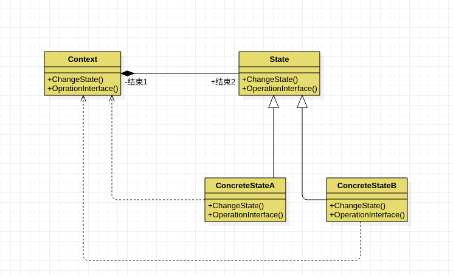

**角色和职责**

`Context`用户对象

拥有一个`State`类型的成员，以标识对象的当前状态

`State`接口或基类

封装与`Context`的特定状态相关的行为

`ConcreteState`接口实现类或子类

实现一个与`Context`某个状态相关的行为

适用于：对象的行为，依赖于它所处的当前状态。行为随着状态而改变的场景

适用于，用户通过状态来改变对象的行为。

```cpp
//
// Created by andrew on 2020/11/29.
//
#include <iostream>

using namespace std;

class Worker;

class State {
public:
    virtual ~State() = default;
    virtual void doSomeThing(Worker *w);
};

void State::doSomeThing(Worker *w) {

}

class Worker {
public:
    Worker();

    void setHour(int hour) {
        m_hour = hour;
    }

    State *getCurrentState() {
        return m_currState;
    }

    void setCurrentState(State *state) {
        m_currState = state;
    }

    void doSomeThing() {
        m_currState->doSomeThing(this);
    }

public:
    int getHour() const {
        return m_hour;
    }

private:
    int m_hour{};
    State *m_currState{}; // 对象当前状态
};

class State1 : public State {
public:
    void doSomeThing(Worker * w) override;
};

class State2 : public State {
public:
    void doSomeThing(Worker * w) override;
};

void State1::doSomeThing(Worker *w) {
    if(w->getHour() == 7 || w->getHour() == 0)
    {
        cout << "morning " << endl;
    }else
    {
        delete w->getCurrentState();
        w->setCurrentState(new State2);  // 状态1不满足，转到状态2
        w->getCurrentState()->doSomeThing(w);

    }
}

void State2::doSomeThing(Worker *w) {
    if(w->getHour() == 9 || w->getHour() == 10)
    {
        cout << "work" << endl;
    }else
    {
        delete w->getCurrentState(); // 状态2不满足转到状态
        w->setCurrentState(new State1);
        cout << "当钱时间点：" << w->getHour() << "unkonwn" << endl;
    }
}

Worker::Worker() {
    m_currState = new State1;
}


int main(int argc, char *argv[]) {
    auto *w1 = new Worker;
    w1->setHour(7);
    w1->doSomeThing();

    w1->setHour(9);
    w1->doSomeThing();

    delete w1;

    cout << "state demo" << endl;
    return 0;
}
```


#### 解释模型

一些应用提供了内建的脚本或者宏语言来让用户可以定义它们能够在系统中进行的操作。`Interpreter`模式的目的就是使用一个解释器为用户提供一个一门定义语言的语法表示的解释器，然后通过这个解释器来解释语言中的句子。

`Interpreter`模式提供了这样一个实现解释器的框架。

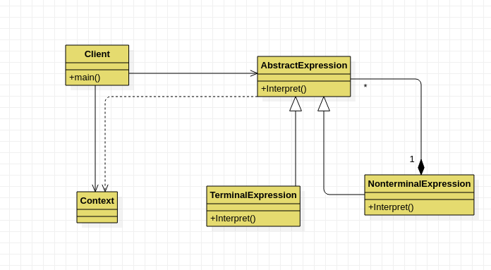

`Interpreter`模式中，提供了`TerminalExpression`和`NonterminalExpression`两种表达式的解释方式，`Context`类用于为解释过程提供一些附加信息。(例如全局的信息)

`Context`

解释器上下文环境类。用来存储解释器的上下文环境，比如需要解释的文法等。

`AbstractExpression`

解释器抽象类

`ConcreteExpression`

解释器具体实现类。

```cpp
//
// Created by andrew on 2020/11/29.
//
#include <iostream>

using namespace std;

class Context {
public:
    explicit Context(int num) {
        this->m_num = num;
    }

    int getNum() const {
        return m_num;
    }

    int getRes() const {
        return m_res;
    }

    void setNum(int num) {
        this->m_num = num;
    }

    void setRes(int res) {
        this->m_res = res;
    }

private:
    int m_num;
    int m_res{};
};

class Expression {
public:
    virtual void interpreter(Context *context) = 0;

private:
    Context *m_context{};
};

//加法
class PlusExpression : public Expression {
public:
    PlusExpression() {
        this->context = nullptr;
    }

    void interpreter(Context *context) override {
        int num  = context->getNum();
        num ++;
        context->setNum(num);
        context->setRes(num);
    }

private:
    Context *context;
};
// 减法
class MinusExpression : public Expression {
public:
    MinusExpression() {
        this->context = nullptr;
    }

    void interpreter(Context * context) override{
        int num = context->getNum();
        num --;
        context->setNum(num);
        context->setRes(num);
    }

private:
    Context * context;
};

int main(int argc, char *argv[]) {
    Expression *expression = nullptr;
    Context  *context = nullptr;

    Expression * expression2 = nullptr;

    context = new Context(10);
    cout << context->getNum() << endl;

    expression = new PlusExpression;
    expression->interpreter(context);

    cout << context->getRes() << endl;

    ////   -----------------------------------------------

    expression2 = new MinusExpression;
    expression2->interpreter(context);
    cout << context->getRes() << endl;

    cout << "interpreter demo" << endl;
    return 0;
}
```


#### 迭代器模式

`Iterator`模式也叫迭代模式，是行为模式之一，他把对容器种包含的内部对象的访问委让给外部类，使用`Iterator`按顺序进行遍历访问的设计模式。

在使用`Iterator`模式之前，首先应该明白`Iterator`模式是用来解决什么问题的。或者说如果不使用`Iterator`模式会存在什么问题。

1. 由容器自己实现顺序遍历。直接在容器类里添加顺序遍历方法
2. 让调用者自己实现遍历，直接暴露数据细节给外部

以上实现方法存在的问题：

方法1，容器承担了太多的功能，一方面需要提供添加删除等本身应有的功能，一方面还需要提供遍历访问功能。

方法2，旺旺容器实现遍历的过程中，需要保存遍历的状态，当跟元素的添加删除等功能夹杂在一起很容易引起混乱和程序运行错误等。

`Iterator` 模式就是为了有效地处理按顺序进行遍历访问的一种设计模式，简单地说 ，`Iterator` 模式提供一种有效的方法，可以屏蔽聚集对象集合的容器类的实现细节，而能对容器内包含的对象元素按顺序进行有效的遍历访问。所以，`Iterator` 模式的应用场景可以归纳为满足以下几个条件：

- 访问容器中包含的内部对象
- 按顺序访问 

角色和职责：提供一种方法顺序访问一个聚敛对象的各个元素，而又不暴露该对象的内部表示。为遍历不同的聚集结构提供如开始，下一个，是否结束，当前一项等统一接口。

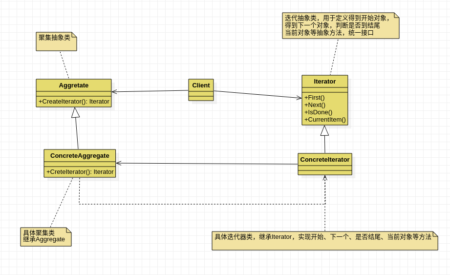

`Iterator`（迭代器接口）：

该接口必须定义实现迭代功能的最小定义方法集，比如提供 `hasNext`()和 `next`()方法。

`ConcreteIterator`（迭代器实现类）：

迭代器接口 `Iterator` 的实现类。可以根据具体情况加以实现。

`Aggregate`（容器接口）： 

定义基本功能以及提供类似 Iterator iterator()的方法。

`concreteAggregate`（容器实现类）：

容器接口的实现类。必须实现 `Iterator` `iterator`()方法。

说明：在迭代器中 持有 一个集合的 引用；所以通过迭代器，就可以访问集合

```cpp
//
// Created by andrew on 2020/11/29.
//
#include <iostream>

using namespace std;

typedef int Object;

#define SIZE 5

class MyIterator {
public:
    virtual ~MyIterator() = default;
    virtual void First() = 0;
    virtual void Next() = 0;
    virtual bool IsDone() = 0;
    virtual Object CurrentItem() = 0;
};

class Aggregate {
public:
    virtual ~Aggregate() = default;
    virtual MyIterator *CreateIterator() = 0;
    virtual Object getItem(int index) = 0;
    virtual int getSize() = 0;
};
// 进行迭代的地方
class ConcreteIterator : public MyIterator {
public:
    ConcreteIterator(Aggregate *ag) {
        _ag = ag;
        _current_index = 0;
    }

    virtual void First() {
        _current_index = 0;
    }

    virtual void Next() {
        if(_current_index < _ag->getSize())
        {
            _current_index ++;
        }
    }
    virtual bool IsDone() {
        return (_current_index == _ag->getSize());
    }

    virtual Object CurrentItem() {
        return _ag->getItem(_current_index);
    }

private:
    int _current_index;
    Aggregate *_ag;
};

// 存储需要迭代的内容
class ConcreteAggregate : public Aggregate {
public:
    ConcreteAggregate() {
        for(int i = 0; i < SIZE; i++) {
            object[i] = i + 100;
        }
    }

    MyIterator *CreateIterator() override{
        return new ConcreteIterator(this); // 让迭代器持有一个集合的引用
    }

    Object getItem(int index) override {
        return object[index];
    }

    int getSize() override {
        return SIZE;
    }
private:
    Object object[SIZE];
};

int main(int argc, char *argv[]) {

    Aggregate *aggregate = new ConcreteAggregate;
    MyIterator *myIterator = aggregate->CreateIterator();

    for(; !(myIterator->IsDone()); myIterator->Next()) {
        cout << myIterator->CurrentItem() << "  ";
    }

    delete myIterator;
    delete aggregate;

    cout << "iterator demo" << endl;
    return 0;
}
```


