## `wireshark`网络协议分析

### `ARP`协议抓包分析 -- `wireshark`

`ARP`- `Address Resolution Protocol`协议，即地址解析协议。该协议功能就是将`IP`地址解析成`MAC`地址。

在发送数据的时候，只知道目标`IP`地址，不知道`MAC`地址，而又不能跨越第二、三层实现通讯，所以需要使用地址解析协议。使用地址解析协议之后，计算机可以根据网络层中的`IP`地址数据，得到目标地址`MAC`地址，以保障通讯的顺利进行。

**`arp`**命令，`ARP`缓存表维护工具

在计算机中都会提供一个`arp`命令，用于增加、删除和查询缓存表中的静态地址对应关系。

使用方式如下：

```bash
arp
Show and manipulate your system's ARP cache.

 - Show current arp table:
   arp -a

 - Clear the entire cache:
   sudo arp -a -d

 - Delete a specific entry:
   arp -d {{address}}

 - Create an entry:
   arp -s {{address}} {{mac_address}}
```

**`arp`**请求报文格式

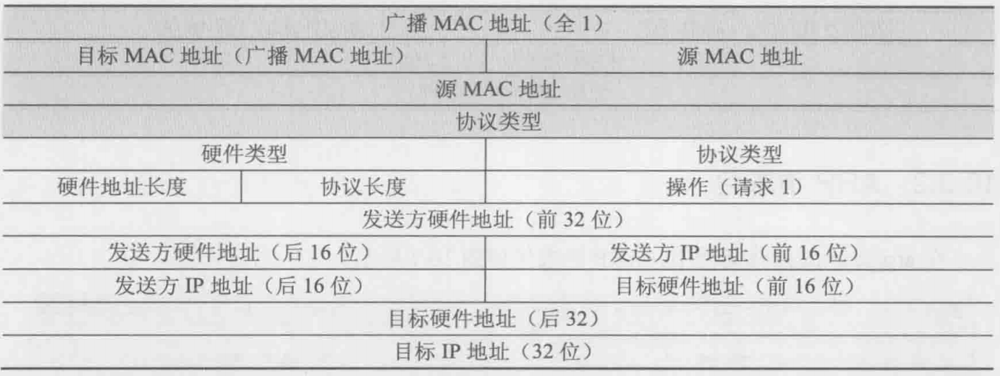

- 第一个字段是广播`MAC`地址，地址为`0x  FF FF FF FF FF FF`，其目标是网络上的所有主机
- 第二个字段，源`MAC`地址
- 第三个字段是协议类型，`arp`的协议类型是`0x0806`

- 硬件类型：占两字节，表示`ARP`报文可以在哪种类型的网络上传输，值为1时表示为以太网地址。
- 上层协议类型：占两字节，表示硬件地址要映射的协议地址类型，映射`IP`地址时的值为`0x0800`。
- MAC地址长度：占一字节，标识`MAC`地址长度，以字节为单位，此处为6。
- `IP`协议地址长度：占一字节，标识`IP`得知长度，以字节为单位，此处为4。
- 操作类型：占2字节，指定本次`ARP`报文类型。1标识`ARP`请求报文，2标识`ARP`应答报文。
- 源MAC地址：占6字节，标识发送设备的硬件地址。
- 源`IP`地址：占4字节，标识发送方设备的`IP`地址。
- 目的`MAC`地址：占6字节，表示接收方设备的硬件地址，在请求报文中该字段值全为0，即00-00-00-00-00-00，表示任意地址，因为现在不知道这个`MAC`地址。
- 目的`IP`地址：占4字节，表示接受方的`IP`地址。


**`arp`**应答报文格式

`arp`应答协议报文和`arp`请求协议报文类似。不同的是，此时以太网头部帧头部分的目的`MAC`地址为发送`ARP`协议地址解析请求的`MAC`地址，而源`MAC`地址为被解析的主机`MAC`地址。同时操作类型为2表示是应答数据报文

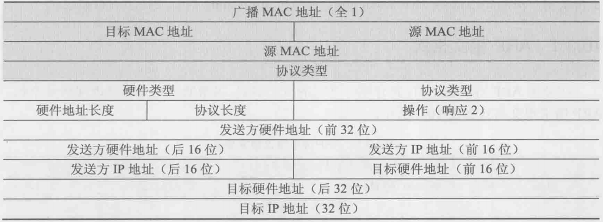

抓获的一个`ARP`请求报文

```bash
No.     Time           Source                Destination           Protocol Length Info
     48 0.585964653    HIWIFI_65:b0:40       Chongqin_e1:18:a9     ARP      42     Who has 192.168.199.235? Tell 192.168.199.1

Frame 48: 42 bytes on wire (336 bits), 42 bytes captured (336 bits) on interface wlp4s0, id 0
Ethernet II, Src: HIWIFI_65:b0:40 (d4:ee:07:65:b0:40), Dst: Chongqin_e1:18:a9 (40:23:43:e1:18:a9)
    Destination: Chongqin_e1:18:a9 (40:23:43:e1:18:a9)
    Source: HIWIFI_65:b0:40 (d4:ee:07:65:b0:40)
    Type: ARP (0x0806)
Address Resolution Protocol (request)
    Hardware type: Ethernet (1)
    Protocol type: IPv4 (0x0800)
    Hardware size: 6
    Protocol size: 4
    Opcode: request (1)
    Sender MAC address: HIWIFI_65:b0:40 (d4:ee:07:65:b0:40)
    Sender IP address: 192.168.199.1
    Target MAC address: 00:00:00_00:00:00 (00:00:00:00:00:00)
    Target IP address: 192.168.199.235
```

抓获的`APP`回复报文

```bash
No.     Time           Source                Destination           Protocol Length Info
     49 0.000021455    Chongqin_e1:18:a9     HIWIFI_65:b0:40       ARP      42     192.168.199.235 is at 40:23:43:e1:18:a9

Frame 49: 42 bytes on wire (336 bits), 42 bytes captured (336 bits) on interface wlp4s0, id 0
Ethernet II, Src: Chongqin_e1:18:a9 (40:23:43:e1:18:a9), Dst: HIWIFI_65:b0:40 (d4:ee:07:65:b0:40)
    Destination: HIWIFI_65:b0:40 (d4:ee:07:65:b0:40)
    Source: Chongqin_e1:18:a9 (40:23:43:e1:18:a9)
    Type: ARP (0x0806)
Address Resolution Protocol (reply)
    Hardware type: Ethernet (1)
    Protocol type: IPv4 (0x0800)
    Hardware size: 6
    Protocol size: 4
    Opcode: reply (2)
    Sender MAC address: Chongqin_e1:18:a9 (40:23:43:e1:18:a9)
    Sender IP address: 192.168.199.235
    Target MAC address: HIWIFI_65:b0:40 (d4:ee:07:65:b0:40)
    Target IP address: 192.168.199.1
```


### 互联网协议`IP`抓包分析 -- `wireshark`

互联网协议`IP`是`Internet Protocol`的缩写，中文缩写是**网协**

互联网协议也就是为计算机相互连接进行通信而设计的协议。

`IP`地址协议报文首部

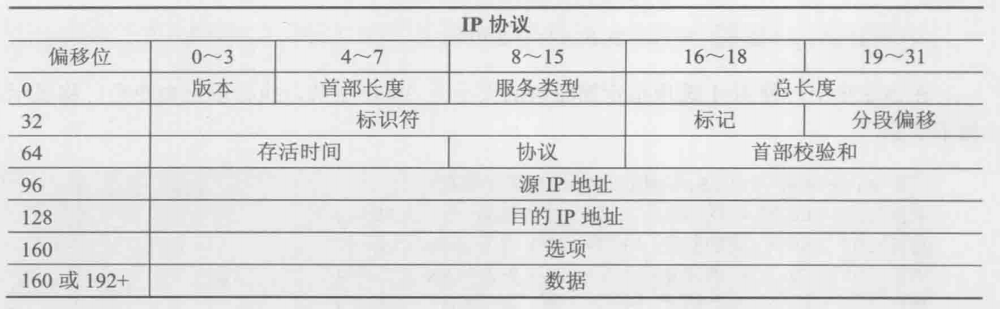


**版本**：`IP`协议的版本，目前的`IP`协议版本号为4，下一代`IP`协议版本号为6。

**首部长度**：`IP`报头的长度。固定部分的长度（20字节）和可变部分的长度之和。共占4位。最大为1111，即10进制的15，代表`IP`报头的最大长度可以为15个`32bits`（4字节），也就是最长可为15*4=60字节，除去固定部分的长度20字节，可变部分的长度最大为40字节。

**服务类型**：优先级标志位和服务类型标志位，被路由器用来进行流量的优先排序。

**总长度**：`IP`报文的总长度。报头的长度和数据部分的长度之和。

**标识符**：唯一的标识主机发送的每一分数据报。通常每发送一个报文，它的值加一。当`IP`报文长度超过传输网络的`MTU`（最大传输单元）时必须分片，这个标识字段的值被复制到所有数据分片的标识字段中，使得这些分片在达到最终目的地时可以依照标识字段的内容重新组成原先的数据。

**标记**：共3位。`R、DF、MF`三位。目前只有后两位有效，`DF`位：为1表示不分片，为0表示分片。`MF`：为1表示“更多的片”，为0表示这是最后一片。

**分片偏移**：本分片在原先数据报文中相对首位的偏移位。（需要再乘以8）

**存活时间**：`IP`报文所允许通过的路由器的最大数量。每经过一个路由器，TTL减1，当为0时，路由器将该数据报丢弃。TTL 字段是由发送端初始设置一个 8 bit字段.推荐的初始值由分配数字 RFC 指定，当前值为 64。发送 `ICMP` 回显应答时经常把 TTL 设为最大值 255。

**协议**：指出`IP`报文携带的数据使用的是那种协议，以便目的主机的`IP`层能知道要将数据报上交到哪个进程（不同的协议有专门不同的进程处理）。和端口号类似，此处采用协议号，TCP的协议号为6，`UDP`的协议号为17。`ICMP`的协议号为1，`IGMP`的协议号为2.

**首部校验和**：计算`IP`头部的校验和，检查`IP`报头的完整性。

**源`IP`地址**：标识`IP`数据报的源端设备。

**目的`IP`地址**：标识`IP`数据报的目的地址。

**选项**：保留作为额外的`IP`选项

**数据**：使用`IP`传递的实际数据

**抓获的`IP`协议报文**

```bash
# 帧数据
Frame 12: 98 bytes on wire (784 bits), 98 bytes captured (784 bits) on interface wlp4s0, id 0
# 以太网帧头部信息
Ethernet II, Src: Chongqin_e1:18:a9 (40:23:43:e1:18:a9), Dst: HIWIFI_65:b0:40 (d4:ee:07:65:b0:40)
    Destination: HIWIFI_65:b0:40 (d4:ee:07:65:b0:40)
    Source: Chongqin_e1:18:a9 (40:23:43:e1:18:a9)
    Type: IPv4 (0x0800)
# IPv4 包头部信息
Internet Protocol Version 4, Src: 192.168.199.235, Dst: 192.168.199.1
# 版本号为 4
    0100 .... = Version: 4
    # 首部长度
    .... 0101 = Header Length: 20 bytes (5)
    # 服务类型
    Differentiated Services Field: 0x00 (DSCP: CS0, ECN: Not-ECT)
    # 总长度
    Total Length: 84
    # 标识符
    Identification: 0x420a (16906)
    # 标志
    Flags: 0x4000, Don't fragment
    # 分段偏移
    Fragment offset: 0
    # TTL
    Time to live: 64
    # 协议类型
    Protocol: ICMP (1)
    # 首部校验和
    Header checksum: 0xe860 [validation disabled]
    [Header checksum status: Unverified]
    Source: 192.168.199.235
    Destination: 192.168.199.1
Internet Control Message Protocol
    Type: 8 (Echo (ping) request)
    Code: 0
    Checksum: 0x0fae [correct]
    [Checksum Status: Good]
    Identifier (BE): 10 (0x000a)
    Identifier (LE): 2560 (0x0a00)
    Sequence number (BE): 2 (0x0002)
    Sequence number (LE): 512 (0x0200)
    [Response frame: 24]
    Timestamp from icmp data: Oct  3, 2020 19:21:22.000000000 CST
    [Timestamp from icmp data (relative): 0.767224513 seconds]
    Data (48 bytes)
```


**在`Linux ping`大于 1500字节的包**

`-c ping`的次数

`-s`每个包的大小

```bash
ping -c 4 -s 1600 {{ip_address}}
```


### `UDP`协议抓包分析 -- `wireshark`

`UDP`是`User Datagram Protocol`用户数据报协议的简称。他是`OSI`七层模型中一种无连接的传输层协议，提供面向事务的简单的不可靠信息传送服务。

`UDP`协议就是一种无连接协议，该协议用来支撑那些需要在计算机之间传输数据的网络应用，包括网络视频会议系统在内的众多的客户端-服务器模式的网络应用。

`UDP`协议的主要作用就是讲网络数据流量压缩成数据包的形式。一个典型的数据包就是一个二进制数据的传输单元，每一个数据包的前8字节用来包含包头信息，剩余字节则用来包含具体的传输数据。

**特点**

- `UDP`是一种无连接协议，无连接也就代表者传输不可靠

- 不需要建立连接，一天服务器可以向多个客户机传输相同的消息
- `UDP`信息包的标题很短，只有8个字节的大小，相比于`TCP`的20字节信息包，额外开销非常的小
- 吞吐量不受拥塞控制算法的调节，只受软件生成数据速率、传输宽带、源端和目标端主机性能的限制
- `UDP`使用尽最大努力交付
- `UDP`是面向报文的

**`UDP`报文分析**

使用`udp`关键字过滤抓取的数据包，可以看到`DNS DHCP SSDP`等协议都是基于`UDP`实现的

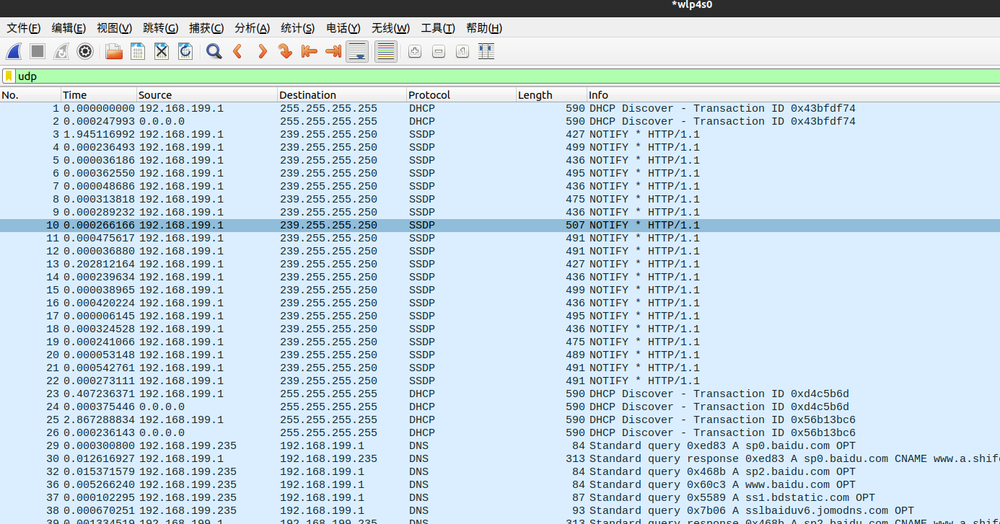

`UDP`首部格式

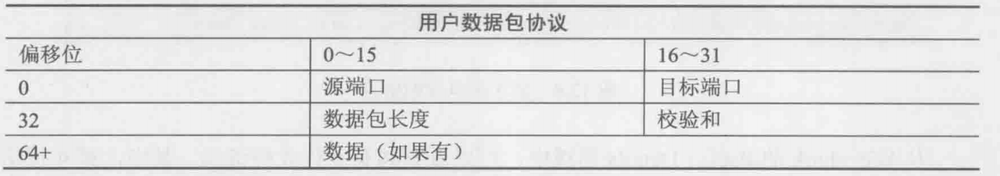

- 源端口
- 目标端口
- 数据报文长度
- 校验和
- 数据

```bash
# UDP 
User Datagram Protocol, Src Port: 68, Dst Port: 67
	# 源端口
    Source Port: 68
    # 目标端口
    Destination Port: 67
    # 数据报文长度
    Length: 556
    # 校验和
    Checksum: 0xc24c [unverified]
    [Checksum Status: Unverified]
    [Stream index: 0]
    [Timestamps]
        [Time since first frame: 0.000000000 seconds]
        [Time since previous frame: 0.000000000 seconds]

```


### `TCP`协议抓包分析 -- `wireshark`

`TCP`- (`Transmission Control Protocol`，传输控制协议)是一种面向连接的、可靠的、基于`IP`的传输层协议。它的主要目的就是为数据提供可靠的端到端的传输服务。参考`RFC793`

`TCP`是面向连接的通信协议，在通信过程中，通过三次握手建立连接，通信结束之后还需要断开连接。如果要发送的数据包没有被送到目的地还会进行数据包的重传。

相比于`UDP` `TCP`提供可靠的网络传输服务，可以提高网络的安全性，因为使用`TCP`进行数据传输时，每个数据包都要进行确认。若果有一个数据包丢失就收不到确认包，发送方就知道应该重发这个数据包，这样就保证了数据的安全性。

以下是三次握手的建立过程

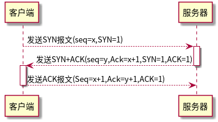

- 第一次握手建立时，客户端向服务器发送`SYN`报文(Seq=x,SYN=1)，并进入`SYN_SEND`状态，等待服务器确认。

- 第二次握手，分两部分来完成，即`SYN+ACK`(请求和确认)报文

1. 服务器收到客户端的请求，向客户端确认信息(`Ack=x+1`)
2. 服务器再向客户端发送一个`SYN`包(`Seq=y`)建立连接的请求，此时服务器进入`SYN_RECV`状态

- 第三次握手客户端收到服务器的回复(`SYN+ACK`)，此时，客户端也要向服务器发送确认包(`ACK`)，此包发送完毕客户端和服务器进入`ESTABLISHED`状态，完成三次握手。

以下是`TCP`四次挥手的计算过程

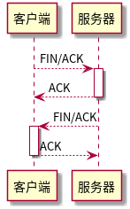

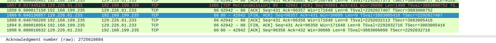

**`TCP`重置**

在理想的情况中，每一个连接都会以`TCP`四次断开来正常的结束会话，但是在现实中，连接经常会突然断掉。例如，这可能由于一个潜在的攻击者正在进行断开扫描，或者仅仅是主机配置错误，在这种其概况下就需要使用设置了`RST`标志的`TCP`数据包，`RST`标志用来指出连接异常终止或拒绝连接请求的包。

**`TCP`各个协议之间的关系**

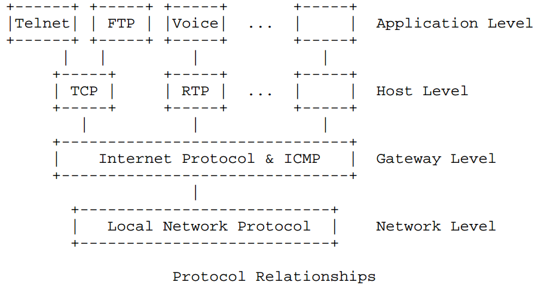


**`TCP`首部**

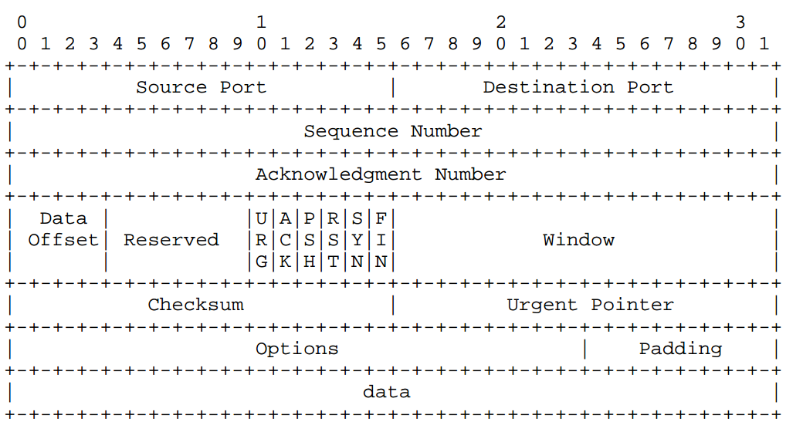

- Source Port`: 用来传输数据包的端口 :deer:
- `Destination Port`: 接收数据的端口
- `Sequence Number`: 该数字表示一个`TCP`片段，这个部分用来表示数据部分没有丢失
- `Acknowledgment Number`: 该数字是通信中希望从对方中得到的下一个数据包的序号
- `Data offset`: 数据偏移
- `Reserved`: 保留
- 标记
- `Window`: 窗口大小
- `checksum`: 校验和
- `Urgent Pointer`: 紧急指针
- `Options`: 选项

**标记**

`URG`：紧急标志，此标志表示`TCP`包的紧急指针域有效，用来保证`TCP`连接不被中断，并催促中间设备要尽快处理这些数据

`ACK`：确认标志，分别为1或者0，为1的时候代表应答优先，反之为0

`PSH`：该标志是`PUSH`操作，代表着数据到达接收端以后，立即传送给应用程序，而不是在缓冲区中排队

`RST`：该标志表示连接复位请求，用来复位那些产生的错误连接，也用来拒绝错误和非法的数据包

`SYN`：表示同步序号，`SYN`标志位和`ACK`标志位搭配使用，当连接请求的时候，`SYN=1,ACK=0`；当连接响应的时候`SYN=1,ACK=1`。标志的数据经常用来进行端口扫描，扫描者发送一个只有`SYN`的数据包，如果对方主机回应一个数据包，则说明该主机的对应端口是存在监听的。

`FIN`：说明数据结束了，也就是双方数据传输完成，断开连接的意思。该标记也可以用于进行端口扫描，当发送一个带有`FIN`标记的数据包的时候，如果对方相应一个`RST`说明这台计算机对应的端口是不存在的，但是对应的计算机是存在的，若是对方没有反馈任何数据包，就表明这台被扫描的计算机是存在这个端口

---

**三次握手报文**

`TCP`第一次握手

```bash
Transmission Control Protocol, Src Port: 42942, Dst Port: 80, Seq: 0, Len: 0
    Source Port: 42942
    Destination Port: 80
    [Stream index: 42]
    [TCP Segment Len: 0]
    Sequence number: 0    (relative sequence number)
    Sequence number (raw): 2725618253
    [Next sequence number: 1    (relative sequence number)]
    Acknowledgment number: 0
    Acknowledgment number (raw): 0
    1010 .... = Header Length: 40 bytes (10)
    Flags: 0x002 (SYN)   # 这里表明是SYN
        000. .... .... = Reserved: Not set
        ...0 .... .... = Nonce: Not set
        .... 0... .... = Congestion Window Reduced (CWR): Not set
        .... .0.. .... = ECN-Echo: Not set
        .... ..0. .... = Urgent: Not set
        .... ...0 .... = Acknowledgment: Not set
        .... .... 0... = Push: Not set
        .... .... .0.. = Reset: Not set
        .... .... ..1. = Syn: Set
            [Expert Info (Chat/Sequence): Connection establish request (SYN): server port 80]
                [Connection establish request (SYN): server port 80]
                [Severity level: Chat]
                [Group: Sequence]
        .... .... ...0 = Fin: Not set
        [TCP Flags: ··········S·]
    Window size value: 64240
    [Calculated window size: 64240]
    Checksum: 0x488e [unverified]
    [Checksum Status: Unverified]
    Urgent pointer: 0
    Options: (20 bytes), Maximum segment size, SACK permitted, Timestamps, No-Operation (NOP), Window scale
        TCP Option - Maximum segment size: 1460 bytes
            Kind: Maximum Segment Size (2)
            Length: 4
            MSS Value: 1460
        TCP Option - SACK permitted
            Kind: SACK Permitted (4)
            Length: 2
        TCP Option - Timestamps: TSval 2292026825, TSecr 0
            Kind: Time Stamp Option (8)
            Length: 10
            Timestamp value: 2292026825
            Timestamp echo reply: 0
        TCP Option - No-Operation (NOP)
            Kind: No-Operation (1)
        TCP Option - Window scale: 7 (multiply by 128)
            Kind: Window Scale (3)
            Length: 3
            Shift count: 7
            [Multiplier: 128]
    [Timestamps]
        [Time since first frame in this TCP stream: 0.000000000 seconds]
        [Time since previous frame in this TCP stream: 0.000000000 seconds]
```

`TCP`第二次握手

```bash
Transmission Control Protocol, Src Port: 80, Dst Port: 42942, Seq: 0, Ack: 1, Len: 0
    Source Port: 80
    Destination Port: 42942
    [Stream index: 42]
    [TCP Segment Len: 0]
    Sequence number: 0    (relative sequence number)
    Sequence number (raw): 3580910260
    [Next sequence number: 1    (relative sequence number)]
    Acknowledgment number: 1    (relative ack number)
    Acknowledgment number (raw): 2725618254
    1010 .... = Header Length: 40 bytes (10)
    Flags: 0x012 (SYN, ACK)  # 表明是第二次进行握手
        000. .... .... = Reserved: Not set
        ...0 .... .... = Nonce: Not set
        .... 0... .... = Congestion Window Reduced (CWR): Not set
        .... .0.. .... = ECN-Echo: Not set
        .... ..0. .... = Urgent: Not set
        .... ...1 .... = Acknowledgment: Set
        .... .... 0... = Push: Not set
        .... .... .0.. = Reset: Not set
        .... .... ..1. = Syn: Set
            [Expert Info (Chat/Sequence): Connection establish acknowledge (SYN+ACK): server port 80]
                [Connection establish acknowledge (SYN+ACK): server port 80]
                [Severity level: Chat]
                [Group: Sequence]
        .... .... ...0 = Fin: Not set
        [TCP Flags: ·······A··S·]
    Window size value: 28960
    [Calculated window size: 28960]
    Checksum: 0x9240 [unverified]
    [Checksum Status: Unverified]
    Urgent pointer: 0
    Options: (20 bytes), Maximum segment size, SACK permitted, Timestamps, No-Operation (NOP), Window scale
        TCP Option - Maximum segment size: 1412 bytes
            Kind: Maximum Segment Size (2)
            Length: 4
            MSS Value: 1412
        TCP Option - SACK permitted
            Kind: SACK Permitted (4)
            Length: 2
        TCP Option - Timestamps: TSval 3883000206, TSecr 2292026825
            Kind: Time Stamp Option (8)
            Length: 10
            Timestamp value: 3883000206
            Timestamp echo reply: 2292026825
        TCP Option - No-Operation (NOP)
            Kind: No-Operation (1)
        TCP Option - Window scale: 7 (multiply by 128)
            Kind: Window Scale (3)
            Length: 3
            Shift count: 7
            [Multiplier: 128]
    [SEQ/ACK analysis]
        [This is an ACK to the segment in frame: 1701]
        [The RTT to ACK the segment was: 0.036923396 seconds]
        [iRTT: 0.036936408 seconds]
    [Timestamps]
        [Time since first frame in this TCP stream: 0.036923396 seconds]
        [Time since previous frame in this TCP stream: 0.036923396 seconds]
```

`TCP`第三次握手信息

```bash
Transmission Control Protocol, Src Port: 42942, Dst Port: 80, Seq: 1, Ack: 1, Len: 0
    Source Port: 42942
    Destination Port: 80
    [Stream index: 42]
    [TCP Segment Len: 0]
    Sequence number: 1    (relative sequence number)
    Sequence number (raw): 2725618254
    [Next sequence number: 1    (relative sequence number)]
    Acknowledgment number: 1    (relative ack number)
    Acknowledgment number (raw): 3580910261
    1000 .... = Header Length: 32 bytes (8)
    Flags: 0x010 (ACK) # 确认包
        000. .... .... = Reserved: Not set
        ...0 .... .... = Nonce: Not set
        .... 0... .... = Congestion Window Reduced (CWR): Not set
        .... .0.. .... = ECN-Echo: Not set
        .... ..0. .... = Urgent: Not set
        .... ...1 .... = Acknowledgment: Set
        .... .... 0... = Push: Not set
        .... .... .0.. = Reset: Not set
        .... .... ..0. = Syn: Not set
        .... .... ...0 = Fin: Not set
        [TCP Flags: ·······A····]
    Window size value: 502
    [Calculated window size: 64256]
    [Window size scaling factor: 128]
    Checksum: 0x4886 [unverified]
    [Checksum Status: Unverified]
    Urgent pointer: 0
    Options: (12 bytes), No-Operation (NOP), No-Operation (NOP), Timestamps
        TCP Option - No-Operation (NOP)
            Kind: No-Operation (1)
        TCP Option - No-Operation (NOP)
            Kind: No-Operation (1)
        TCP Option - Timestamps: TSval 2292026862, TSecr 3883000206
            Kind: Time Stamp Option (8)
            Length: 10
            Timestamp value: 2292026862
            Timestamp echo reply: 3883000206
    [SEQ/ACK analysis]
        [This is an ACK to the segment in frame: 1713]
        [The RTT to ACK the segment was: 0.000013012 seconds]
        [iRTT: 0.036936408 seconds]
    [Timestamps]
        [Time since first frame in this TCP stream: 0.036936408 seconds]
        [Time since previous frame in this TCP stream: 0.000013012 seconds]
```


**四次挥手报文**

`TCP`第一次挥手

```bash
Transmission Control Protocol, Src Port: 80, Dst Port: 42942, Seq: 96357, Ack: 431, Len: 0
    Source Port: 80
    Destination Port: 42942
    [Stream index: 42]
    [TCP Segment Len: 0]
    Sequence number: 96357    (relative sequence number)
    Sequence number (raw): 3581006617
    [Next sequence number: 96358    (relative sequence number)]
    Acknowledgment number: 431    (relative ack number)
    Acknowledgment number (raw): 2725618684
    1000 .... = Header Length: 32 bytes (8)
    Flags: 0x011 (FIN, ACK)
        000. .... .... = Reserved: Not set
        ...0 .... .... = Nonce: Not set
        .... 0... .... = Congestion Window Reduced (CWR): Not set
        .... .0.. .... = ECN-Echo: Not set
        .... ..0. .... = Urgent: Not set
        .... ...1 .... = Acknowledgment: Set
        .... .... 0... = Push: Not set
        .... .... .0.. = Reset: Not set
        .... .... ..0. = Syn: Not set
        .... .... ...1 = Fin: Set  #  设置了FIN 位
            [Expert Info (Chat/Sequence): Connection finish (FIN)]
                [Connection finish (FIN)]
                [Severity level: Chat]
                [Group: Sequence]
        [TCP Flags: ·······A···F]
    Window size value: 235
    [Calculated window size: 30080]
    [Window size scaling factor: 128]
    Checksum: 0xa05d [unverified]
    [Checksum Status: Unverified]
    Urgent pointer: 0
    Options: (12 bytes), No-Operation (NOP), No-Operation (NOP), Timestamps
        TCP Option - No-Operation (NOP)
            Kind: No-Operation (1)
        TCP Option - No-Operation (NOP)
            Kind: No-Operation (1)
        TCP Option - Timestamps: TSval 3883005416, TSecr 2292027407
            Kind: Time Stamp Option (8)
            Length: 10
            Timestamp value: 3883005416
            Timestamp echo reply: 2292027407
    [Timestamps]
        [Time since first frame in this TCP stream: 5.246526261 seconds]
        [Time since previous frame in this TCP stream: 4.663717779 seconds]
```

第二次挥手

```bash
Transmission Control Protocol, Src Port: 42942, Dst Port: 80, Seq: 431, Ack: 96358, Len: 0
    Source Port: 42942
    Destination Port: 80
    [Stream index: 42]
    [TCP Segment Len: 0]
    Sequence number: 431    (relative sequence number)
    Sequence number (raw): 2725618684
    [Next sequence number: 431    (relative sequence number)]
    Acknowledgment number: 96358    (relative ack number)
    Acknowledgment number (raw): 3581006618
    1000 .... = Header Length: 32 bytes (8)
    Flags: 0x010 (ACK)
        000. .... .... = Reserved: Not set
        ...0 .... .... = Nonce: Not set
        .... 0... .... = Congestion Window Reduced (CWR): Not set
        .... .0.. .... = ECN-Echo: Not set
        .... ..0. .... = Urgent: Not set
        .... ...1 .... = Acknowledgment: Set
        .... .... 0... = Push: Not set
        .... .... .0.. = Reset: Not set
        .... .... ..0. = Syn: Not set
        .... .... ...0 = Fin: Not set
        [TCP Flags: ·······A····]
    Window size value: 1341
    [Calculated window size: 171648]
    [Window size scaling factor: 128]
    Checksum: 0x4886 [unverified]
    [Checksum Status: Unverified]
    Urgent pointer: 0
    Options: (12 bytes), No-Operation (NOP), No-Operation (NOP), Timestamps
        TCP Option - No-Operation (NOP)
            Kind: No-Operation (1)
        TCP Option - No-Operation (NOP)
            Kind: No-Operation (1)
        TCP Option - Timestamps: TSval 2292032113, TSecr 3883005416
            Kind: Time Stamp Option (8)
            Length: 10
            Timestamp value: 2292032113
            Timestamp echo reply: 3883005416
    [SEQ/ACK analysis]
        [This is an ACK to the segment in frame: 1886]
        [The RTT to ACK the segment was: 0.041837077 seconds]
        [iRTT: 0.036936408 seconds]
    [Timestamps]
        [Time since first frame in this TCP stream: 5.288363338 seconds]
        [Time since previous frame in this TCP stream: 0.041837077 seconds]
```

第三次挥手

```bash
Transmission Control Protocol, Src Port: 42942, Dst Port: 80, Seq: 431, Ack: 96358, Len: 0
    Source Port: 42942
    Destination Port: 80
    [Stream index: 42]
    [TCP Segment Len: 0]
    Sequence number: 431    (relative sequence number)
    Sequence number (raw): 2725618684
    [Next sequence number: 432    (relative sequence number)]
    Acknowledgment number: 96358    (relative ack number)
    Acknowledgment number (raw): 3581006618
    1000 .... = Header Length: 32 bytes (8)
    Flags: 0x011 (FIN, ACK)
        000. .... .... = Reserved: Not set
        ...0 .... .... = Nonce: Not set
        .... 0... .... = Congestion Window Reduced (CWR): Not set
        .... .0.. .... = ECN-Echo: Not set
        .... ..0. .... = Urgent: Not set
        .... ...1 .... = Acknowledgment: Set
        .... .... 0... = Push: Not set
        .... .... .0.. = Reset: Not set
        .... .... ..0. = Syn: Not set
        .... .... ...1 = Fin: Set
            [Expert Info (Chat/Sequence): Connection finish (FIN)]
                [Connection finish (FIN)]
                [Severity level: Chat]
                [Group: Sequence]
        [TCP Flags: ·······A···F]
    Window size value: 1341
    [Calculated window size: 171648]
    [Window size scaling factor: 128]
    Checksum: 0x4886 [unverified]
    [Checksum Status: Unverified]
    Urgent pointer: 0
    Options: (12 bytes), No-Operation (NOP), No-Operation (NOP), Timestamps
        TCP Option - No-Operation (NOP)
            Kind: No-Operation (1)
        TCP Option - No-Operation (NOP)
            Kind: No-Operation (1)
        TCP Option - Timestamps: TSval 2292032716, TSecr 3883005416
            Kind: Time Stamp Option (8)
            Length: 10
            Timestamp value: 2292032716
            Timestamp echo reply: 3883005416
    [Timestamps]
        [Time since first frame in this TCP stream: 5.891095824 seconds]
        [Time since previous frame in this TCP stream: 0.602732486 seconds]
```

第四次挥手

```bash
Transmission Control Protocol, Src Port: 80, Dst Port: 42942, Seq: 96358, Ack: 432, Len: 0
    Source Port: 80
    Destination Port: 42942
    [Stream index: 42]
    [TCP Segment Len: 0]
    Sequence number: 96358    (relative sequence number)
    Sequence number (raw): 3581006618
    [Next sequence number: 96358    (relative sequence number)]
    Acknowledgment number: 432    (relative ack number)
    Acknowledgment number (raw): 2725618685
    1000 .... = Header Length: 32 bytes (8)
    Flags: 0x010 (ACK)
        000. .... .... = Reserved: Not set
        ...0 .... .... = Nonce: Not set
        .... 0... .... = Congestion Window Reduced (CWR): Not set
        .... .0.. .... = ECN-Echo: Not set
        .... ..0. .... = Urgent: Not set
        .... ...1 .... = Acknowledgment: Set
        .... .... 0... = Push: Not set
        .... .... .0.. = Reset: Not set
        .... .... ..0. = Syn: Not set
        .... .... ...0 = Fin: Not set
        [TCP Flags: ·······A····]
    Window size value: 235
    [Calculated window size: 30080]
    [Window size scaling factor: 128]
    Checksum: 0x88f5 [unverified]
    [Checksum Status: Unverified]
    Urgent pointer: 0
    Options: (12 bytes), No-Operation (NOP), No-Operation (NOP), Timestamps
        TCP Option - No-Operation (NOP)
            Kind: No-Operation (1)
        TCP Option - No-Operation (NOP)
            Kind: No-Operation (1)
        TCP Option - Timestamps: TSval 3883006098, TSecr 2292032716
            Kind: Time Stamp Option (8)
            Length: 10
            Timestamp value: 3883006098
            Timestamp echo reply: 2292032716
    [SEQ/ACK analysis]
        [This is an ACK to the segment in frame: 1894]
        [The RTT to ACK the segment was: 0.037212056 seconds]
        [iRTT: 0.036936408 seconds]
    [Timestamps]
        [Time since first frame in this TCP stream: 5.928307880 seconds]
        [Time since previous frame in this TCP stream: 0.037212056 seconds]
```

---

**`TCP reset`包**

```bash
Transmission Control Protocol, Src Port: 58842, Dst Port: 443, Seq: 1, Ack: 33, Len: 0
    Source Port: 58842
    Destination Port: 443
    [Stream index: 0]
    [TCP Segment Len: 0]
    Sequence number: 1    (relative sequence number)
    Sequence number (raw): 2675798108
    [Next sequence number: 1    (relative sequence number)]
    Acknowledgment number: 33    (relative ack number)
    Acknowledgment number (raw): 4035810720
    0101 .... = Header Length: 20 bytes (5)
    Flags: 0x014 (RST, ACK)
        000. .... .... = Reserved: Not set
        ...0 .... .... = Nonce: Not set
        .... 0... .... = Congestion Window Reduced (CWR): Not set
        .... .0.. .... = ECN-Echo: Not set
        .... ..0. .... = Urgent: Not set
        .... ...1 .... = Acknowledgment: Set
        .... .... 0... = Push: Not set
        .... .... .1.. = Reset: Set  # 设置reset标记
            [Expert Info (Warning/Sequence): Connection reset (RST)]
                [Connection reset (RST)]
                [Severity level: Warning]
                [Group: Sequence]
        .... .... ..0. = Syn: Not set
        .... .... ...0 = Fin: Not set
        [TCP Flags: ·······A·R··]
    Window size value: 501
    [Calculated window size: 501]
    [Window size scaling factor: -1 (unknown)]
    Checksum: 0x7114 [unverified]
    [Checksum Status: Unverified]
    Urgent pointer: 0
    [Timestamps]
        [Time since first frame in this TCP stream: 3.678235464 seconds]
        [Time since previous frame in this TCP stream: 3.678165023 seconds]
```


**`TCP`连接状态机**

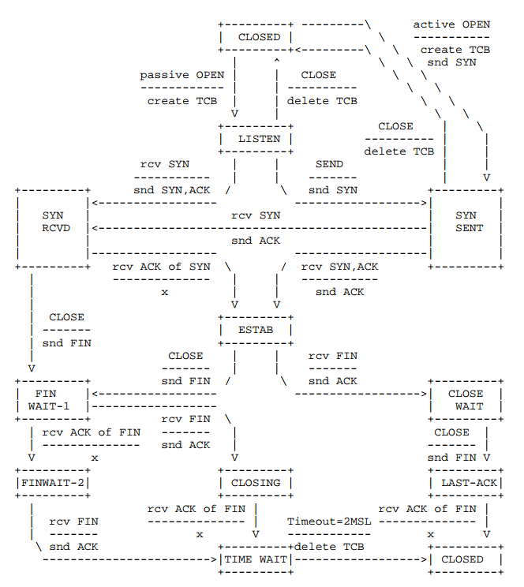


### `ICMP`协议抓包分析--`wireshark`

`ICMP`- (`Internet Control Message Protocol`，网际报文协议)是`Internet`协议族的核心协议之一，也可称为是网际控制报文协议，是`TCP/IP`协议族的一个子协议，它主要用在网络计算机操作系统之间发送出错信息。例如：提示请求服务不可用、主机路由不可达等，通常是`IP`协议的一个集成部分。一般不用于端系统之间传送数据，不被用户网络程序直接使用。

是一种面向无连接的协议，用于传输出错报告控制信息，他是一个重要的协议，对于网络安全具有极其重要的意义。

学习`ICMP`协议对于网络安全具有极其重要的意义。`ICMP`协议本身的特点决定了它非常容易被用于攻击网络上的路由器和主机。例如：用户可以利用操作系统规定的`ICMP`数据包最大不能超过`64KB`这一规定，向主机发起`Ping of Death`（死亡之`Ping`）攻击，原理就是当`ICMP`数据包的尺寸超过`64KB`上限时，主机会出现内存非配错误，导致`TCP/IP`堆栈崩溃，致使主机死机。另外也可以使用大量的`ICMP`进行攻击，称为`ICMP`风暴。

**捕获`ICMP`数据**

在一个主机上，开启`wireshark`并开始`ping`一个网址，`ping`将`ping`的过程抓获

**`ICMP`首部**

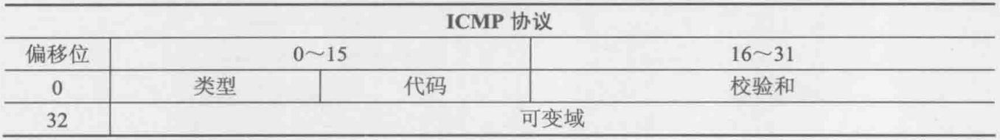

以上表格中`ICMP`首部各个字段含义如下：

- 类型
- `Code`：`RFC`子规范类型
- 校验和：用来保证`ICMP`数据的完整性
- 可变域：依赖于类型和`Code`域的部分

**类型**

| 类型 | `Code` | 描述           |
| ---- | ------ | -------------- |
| 8    | 0      | 回显请求       |
| 10   | 0      | 路由请求       |
| 13   | 0      | 时间戳请求     |
| 15   | 0      | 信息请求(废弃) |
| 17   | 0      | 地址掩码请求   |

**类型**

| 类型 | 描述           |
| ---- | -------------- |
| 0    | 相应应答       |
| 3    | 目标主机不可达 |
| 4    | 源点抑制       |
| 5    | 重定向         |
| 8    | 相应请求       |
| 9    | 路由器公告     |
| 10   | 路由器请求     |
| 11   | 超时           |
| 12   | 参数问题       |

`echo`和`ping`经常会有人搞混淆，但记住`Ping`实际上是一个工具的名字，`Ping`工具用于发送`ICMP echo`请求数据包


### `DHCP`数据抓包分析--`wireshark`

`DHCP`-(`Dynamic Host Configuration Procotol`，动态主机配置协议)，是一个局域网的网络协议，主要用于给内部网络或网络服务供应商自动分匹配`IP`地址。属于`TCP/IP`协议，使用`UDP`进行工作。

`DHCP`有三个端口，其中`UDP67`和`UDP68`为正常的`DHCP`服务端口，分别为`DHCP Server`和`DHCP Client`的服务窗口，546号端口用于`DHCPv6 Client`，而不是`DHCPv4`，是因为`DHCP failover`服务。该服务是需要特别开启的服务，用于做双击热备份。

**作用**

- 保证任何统一时刻，同一局域网内只能由一台`DHCP`客户机所使用

- `DHCP`可以给用户分配永久固定的`IP`地址
- `DHCP`允许用其他方法获得`IP`地址的主机共存，如手动配置`IP`地址
- `DHCP`服务器向所有的`BOOTP`客户端提供服务

`DHCP`的三种地址分配方式

1. 自动分配：`DHCP`服务器给客户端分配永久性的`IP`地址
2. 动态分配：`DHCP`给客户端分配的`IP`地址过一段时间之后会过期，或者客户端可以主动释放该地址
3. 手动配置：由用户手动为客户端指定`IP`地址

**`DHCP`工作流程**

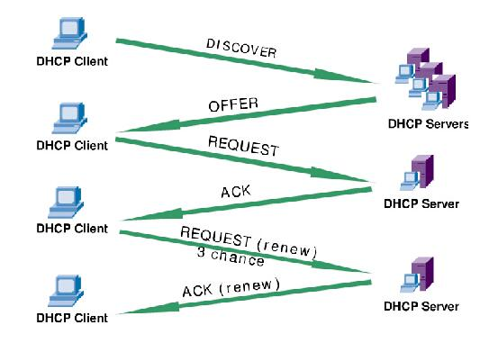

1. 发现阶段，即`DHCP`客户端寻找`DHCP`服务器的阶段。`DHCP`客户端以广播的方式发送`DHCP Discover`包，来寻找`DHCP`服务器，即向地址`255.255.255.255`发送广播信息，网络上所有装有`TCP/IP`协议的主机都会接收到该广播信息，但是只有`DHCP`服务器才会做出响应。
2. 提供阶段：`DHCP`服务器提供地址的阶段，所有接收到请求的服务器都会从地址池中选一个`IP`地址给客户端。
3. 选择阶段：即`DHCP`从接收到的所有`DHCP`提供的`IP`地址中选择一个`IP`地址的过程，广播方式传输，这样所有`DHCP`服务器就直到了他选择了哪个`DHCP`服务器提供的地址。

4. 确认阶段：即`DHCP`服务器确认所提供的`IP`地址阶段。当`DHCP`服务器收到客户端发送的`DHCP Request`请求信息之后，便向`DHCP`客户端发送一个包含所提供的`IP`地址和其他设置的`DHCP Ack`

在`Linux`上抓`DHCP`报文

开启`wireshark`开始抓包，然后在命令行上使用以下命令重新获取`IP`地址

```bash
# 释放对应网卡上的IP地址
$ sudo dhclient -r wlp4s0
# 指定网卡使用`DHCP`获取IP地址
$ sudo dhclient  wlp4s0
```

或者在简单点,但是这样做需要足够快，因为网卡禁用之后就无法使用`wireshark`进行抓包了，所以需要拉网同的同时赶快开始抓包，能不能抓到就看手速了 :joy_cat:

```bash
# 下网卡
ifconfig wlp4s0 down
# 上网卡
ifconfig wlp4s0 up
```

**`DHCP`报文格式**

```
   0                   1                   2                   3
   0 1 2 3 4 5 6 7 8 9 0 1 2 3 4 5 6 7 8 9 0 1 2 3 4 5 6 7 8 9 0 1
   +-+-+-+-+-+-+-+-+-+-+-+-+-+-+-+-+-+-+-+-+-+-+-+-+-+-+-+-+-+-+-+-+
   |     op (1)    |   htype (1)   |   hlen (1)    |   hops (1)    |
   +---------------+---------------+---------------+---------------+
   |                            xid (4)                            |
   +-------------------------------+-------------------------------+
   |           secs (2)            |           flags (2)           |
   +-------------------------------+-------------------------------+
   |                          ciaddr  (4)                          |
   +---------------------------------------------------------------+
   |                          yiaddr  (4)                          |
   +---------------------------------------------------------------+
   |                          siaddr  (4)                          |
   +---------------------------------------------------------------+
   |                          giaddr  (4)                          |
   +---------------------------------------------------------------+
   |                                                               |
   |                          chaddr  (16)                         |
   |                                                               |
   |                                                               |
   +---------------------------------------------------------------+
   |                                                               |
   |                          sname   (64)                         |
   +---------------------------------------------------------------+
   |                                                               |
   |                          file    (128)                        |
   +---------------------------------------------------------------+
   |                                                               |
   |                          options (variable)                   |
   +---------------------------------------------------------------+
```

- `op`： 报文的操作类型，分为请求报文和响应报文，1请求报文，2为响应报文，具体的报文类型在`options`字段中标识
- `htype`: `DHCP`客户端的硬件地址类型1表示是`ethernet`地址
- `hlen`: `DHCP`客户端的硬件地址长度
- `hops`: `DHCP`报文经过的`DHCP`中继的数目。初始为0，报文每经过一个`DHCP`中继，该字段就会增加1
-  `xid`: 客户端发起一次请求时选择的随机数，用来标识一次地址请求过程
- `secs`: `DHCP`客户端开始`DHCP`请求后所经过的时间，目前未使用，固定为0
- `flags`: `DHCP`服务器相应报文是采用单播还是广播方式发送，只使用第0位比特位，0表示采用单播方式，1表示采用广播方式，其余比特位保留不用
- `ciaddr`：`DHCP`客户端的`IP`地址
- `yiaddr`： `DHCP`服务器分配给客户端的`IP`地址
- `siaddr`：`DHCP`客户端获取`IP`地址等信息的服务器`IP`地址
- `giaddr`：`DHCP`客户端发送请求报文后经过的第一个`DHCP`中继的`IP`地址
- `chaddr`： `DHCP`客户端的硬件地址
- `sname`：`DHCP`客户端获取`IP`地址等信息的服务器名称
- `file`： `DHCP`服务器为`DHCP`客户端指定的启动配置文件名称及路径信息。
- `options`：可选变长字段选项字段，包含报文的类型、有效租期、`DNS`服务器的`IP`地址和`WINS`服务器的`IP`地址等配置信息。

**`DHCP`报文类型**

​							-- 来自`wireshark数据包分析`

| `DHCP`报文类型  | 描述                                                         |
| --------------- | ------------------------------------------------------------ |
| `DHCP Discover` | `DHCP Discover DHCP`客户端请求地址时，并不知道`DHCP`服务器的位置，因此`DHCP`客户端会在本地网络内以广播方式发送请求报文，这个报文成为Discover报文，目的是发现网络中的`DHCP`服务器，所有收到Discover报文的`DHCP`服务器都会发送回应报文，`DHCP`客户端据此就可以知道网络中存在的`DHCP`服务器的位置。 |
| `DHCP Offer`    | `DHCP Offer DHCP`服务器收到`Discover`报文后，就会在所配置的地址池中查找一个合适的`ip`地址，加上相应的租约期限和其他配置信息（网关，`DNS`服务器等），构造一个`Offer`报文，发送给客户，告知用户本服务器可以为其提供`IP`地址。（只是告诉client可以提供，是预分配，还需要client通过`ARP`检测该`IP`是否重复） |
| `DHCP Request`  | `DHCP Request DHCP`客户端会收到很多`Offer`，所以必须在这些回应中选择一个。Client通常选择第一个回应Offer报文的服务器作为自己的目标服务器，并回应一个广播Request报文，通告选择的服务器。`DHCP`客户端成功获取`IP`地址后，在地址使用租期过去1/2时，会向`DHCP`服务器发送单播Request报文续延租期，如果没有收到`DHCP ACK`报文，在租期过去3/4时，发送广播Request报文续延租期。 |
| `DHCP ACK`      | `DHCP ACK DHCP`服务器收到`Request`报文后，根据`Request`报文中携带的用户`MAC`来查找有没有相应的续约记录，如果有则发送`ACK`报文作为回应，通知用户可以使用分配的`ip`地址 |
| `DHCP NAK`      | `DHCP NAK` 如果`DHCP`服务器收到`Request`报文后，没有发现相应的租约记录或者由于某些原因无法正常分配`ip`地址，则发送`ACK`报文作为回应，通知用户无法分配合适的`ip`地址。 |
| `DHCP Release`  | `DHCP Release` 当用户不在需要使用分配`ip`地址时，就会向`DHCP`服务器发送`Release`报文，告知服务器用户不再需要分配`ip`地址，`DHCP`服务器会释放被绑定的租约。 |
| `DHCP Decline`  | `DHCP Decline DHCP`客户端收到`DHCP`服务器回应的`ACK`报文后，通过地址冲突检测发现服务器分配的地址冲突或者由于其他原因导致不能使用，则发送Decline报文，通知服务器所分配的`ip`地址不可用。 |
| `DHCP Inform`   | `DHCP Inform DHCP`客户端如果需要从`DHCP`服务器端获取更为详细的配置信息，则发送`Inform`报文向服务器进行请求，服务器收到该报文后，将根据租约进行查找，找到相应的配置信息后，发送`ACK`报文回应`DHCP`客户端（极少用到）。 |


**以下是整个`DHCP`正常交互的过程**

```bash
# 1. 首先发送 发现包
Frame 68: 342 bytes on wire (2736 bits), 342 bytes captured (2736 bits) on interface wlp4s0, id 0
# ff:ff:ff:ff:ff:ff MAC地址采用广播的形式
Ethernet II, Src: Chongqin_e1:18:a9 (40:23:43:e1:18:a9), Dst: Broadcast (ff:ff:ff:ff:ff:ff)
# 255.255.255.255 IP地址采用广播的形式
Internet Protocol Version 4, Src: 0.0.0.0, Dst: 255.255.255.255
User Datagram Protocol, Src Port: 68, Dst Port: 67
Dynamic Host Configuration Protocol (Discover)
    Message type: Boot Request (1)
    Hardware type: Ethernet (0x01)
    Hardware address length: 6
    Hops: 0
    Transaction ID: 0x2e2bec50
    Seconds elapsed: 0
    Bootp flags: 0x0000 (Unicast)
        0... .... .... .... = Broadcast flag: Unicast
        .000 0000 0000 0000 = Reserved flags: 0x0000
    Client IP address: 0.0.0.0
    Your (client) IP address: 0.0.0.0
    Next server IP address: 0.0.0.0
    Relay agent IP address: 0.0.0.0
    Client MAC address: Chongqin_e1:18:a9 (40:23:43:e1:18:a9)
    Client hardware address padding: 00000000000000000000
    Server host name not given
    Boot file name not given
    Magic cookie: DHCP
    Option: (53) DHCP Message Type (Discover)
        Length: 1
        DHCP: Discover (1)
    Option: (12) Host Name
        Length: 14
        Host Name: andrew-G3-3590
    Option: (55) Parameter Request List
        Length: 13
        Parameter Request List Item: (1) Subnet Mask
        Parameter Request List Item: (28) Broadcast Address
        Parameter Request List Item: (2) Time Offset
        Parameter Request List Item: (3) Router
        Parameter Request List Item: (15) Domain Name
        Parameter Request List Item: (6) Domain Name Server
        Parameter Request List Item: (119) Domain Search
        Parameter Request List Item: (12) Host Name
        Parameter Request List Item: (44) NetBIOS over TCP/IP Name Server
        Parameter Request List Item: (47) NetBIOS over TCP/IP Scope
        Parameter Request List Item: (26) Interface MTU
        Parameter Request List Item: (121) Classless Static Route
        Parameter Request List Item: (42) Network Time Protocol Servers
    Option: (255) End
        Option End: 255
    Padding: 000000000000000000000000000000000000000000000000…

No.     Time           Source                Destination           Protocol Length Info
     69 0.003566600    192.168.199.1         192.168.199.235       DHCP     342    DHCP Offer    - Transaction ID 0x2e2bec50
# 2. 服务器发送 offer包
Frame 69: 342 bytes on wire (2736 bits), 342 bytes captured (2736 bits) on interface wlp4s0, id 0
# MAC地址 指定 Chongqin_e1:18:a9
Ethernet II, Src: HIWIFI_65:b0:40 (d4:ee:07:65:b0:40), Dst: Chongqin_e1:18:a9 (40:23:43:e1:18:a9)
# 正常的IP地址会指向 255.255.255.255 但是由于我这里抓包的时候，不是释放之后抓奥，而是使用程序重新获取的IP地址，所以服务器直接将offer包发废了设备的老的IP地址
Internet Protocol Version 4, Src: 192.168.199.1, Dst: 192.168.199.235
User Datagram Protocol, Src Port: 67, Dst Port: 68
Dynamic Host Configuration Protocol (Offer)
    Message type: Boot Reply (2)
    Hardware type: Ethernet (0x01)
    Hardware address length: 6
    Hops: 0
    Transaction ID: 0x2e2bec50
    Seconds elapsed: 0
    Bootp flags: 0x0000 (Unicast)
        0... .... .... .... = Broadcast flag: Unicast
        .000 0000 0000 0000 = Reserved flags: 0x0000
    Client IP address: 0.0.0.0
    Your (client) IP address: 192.168.199.235
    Next server IP address: 192.168.199.1
    Relay agent IP address: 0.0.0.0
    Client MAC address: Chongqin_e1:18:a9 (40:23:43:e1:18:a9)
    Client hardware address padding: 00000000000000000000
    Server host name not given
    Boot file name not given
    Magic cookie: DHCP
    Option: (53) DHCP Message Type (Offer)
        Length: 1
        DHCP: Offer (2)
    Option: (54) DHCP Server Identifier (192.168.199.1)
        Length: 4
        DHCP Server Identifier: 192.168.199.1
    Option: (51) IP Address Lease Time
        Length: 4
        IP Address Lease Time: (43200s) 12 hours
    Option: (58) Renewal Time Value
        Length: 4
        Renewal Time Value: (21600s) 6 hours
    Option: (59) Rebinding Time Value
        Length: 4
        Rebinding Time Value: (37800s) 10 hours, 30 minutes
    Option: (1) Subnet Mask (255.255.255.0)
        Length: 4
        Subnet Mask: 255.255.255.0
    Option: (28) Broadcast Address (192.168.199.255)
        Length: 4
        Broadcast Address: 192.168.199.255
    Option: (3) Router
        Length: 4
        Router: 192.168.199.1
    Option: (6) Domain Name Server
        Length: 4
        Domain Name Server: 192.168.199.1
    Option: (15) Domain Name
        Length: 3
        Domain Name: lan
    Option: (255) End
        Option End: 255
    Padding: 000000

No.     Time           Source                Destination           Protocol Length Info
     70 0.000447243    0.0.0.0               255.255.255.255       DHCP     342    DHCP Request  - Transaction ID 0x2e2bec50
# 客户端接受一个IP地址之后 胡以广播的方式 告知接受服务器提供的IP地址信息
Frame 70: 342 bytes on wire (2736 bits), 342 bytes captured (2736 bits) on interface wlp4s0, id 0
Ethernet II, Src: Chongqin_e1:18:a9 (40:23:43:e1:18:a9), Dst: Broadcast (ff:ff:ff:ff:ff:ff)
Internet Protocol Version 4, Src: 0.0.0.0, Dst: 255.255.255.255
User Datagram Protocol, Src Port: 68, Dst Port: 67
Dynamic Host Configuration Protocol (Request)
    Message type: Boot Request (1)
    Hardware type: Ethernet (0x01)
    Hardware address length: 6
    Hops: 0
    Transaction ID: 0x2e2bec50
    Seconds elapsed: 0
    Bootp flags: 0x0000 (Unicast)
        0... .... .... .... = Broadcast flag: Unicast
        .000 0000 0000 0000 = Reserved flags: 0x0000
    Client IP address: 0.0.0.0
    Your (client) IP address: 0.0.0.0
    Next server IP address: 0.0.0.0
    Relay agent IP address: 0.0.0.0
    Client MAC address: Chongqin_e1:18:a9 (40:23:43:e1:18:a9)
    Client hardware address padding: 00000000000000000000
    Server host name not given
    Boot file name not given
    Magic cookie: DHCP
    Option: (53) DHCP Message Type (Request)
        Length: 1
        DHCP: Request (3)
    Option: (54) DHCP Server Identifier (192.168.199.1)
        Length: 4
        DHCP Server Identifier: 192.168.199.1
    Option: (50) Requested IP Address (192.168.199.235)
        Length: 4
        Requested IP Address: 192.168.199.235
    Option: (12) Host Name
        Length: 14
        Host Name: andrew-G3-3590
    Option: (55) Parameter Request List
        Length: 13
        Parameter Request List Item: (1) Subnet Mask
        Parameter Request List Item: (28) Broadcast Address
        Parameter Request List Item: (2) Time Offset
        Parameter Request List Item: (3) Router
        Parameter Request List Item: (15) Domain Name
        Parameter Request List Item: (6) Domain Name Server
        Parameter Request List Item: (119) Domain Search
        Parameter Request List Item: (12) Host Name
        Parameter Request List Item: (44) NetBIOS over TCP/IP Name Server
        Parameter Request List Item: (47) NetBIOS over TCP/IP Scope
        Parameter Request List Item: (26) Interface MTU
        Parameter Request List Item: (121) Classless Static Route
        Parameter Request List Item: (42) Network Time Protocol Servers
    Option: (255) End
        Option End: 255
    Padding: 00000000000000000000000000

No.     Time           Source                Destination           Protocol Length Info
     71 0.005910802    192.168.199.1         192.168.199.235       DHCP     355    DHCP ACK      - Transaction ID 0x2e2bec50
# 服务器确认接受的是自己提供的IP地址之后  会向客户端回复ACK
Frame 71: 355 bytes on wire (2840 bits), 355 bytes captured (2840 bits) on interface wlp4s0, id 0
Ethernet II, Src: HIWIFI_65:b0:40 (d4:ee:07:65:b0:40), Dst: Chongqin_e1:18:a9 (40:23:43:e1:18:a9)
Internet Protocol Version 4, Src: 192.168.199.1, Dst: 192.168.199.235
User Datagram Protocol, Src Port: 67, Dst Port: 68
Dynamic Host Configuration Protocol (ACK)
    Message type: Boot Reply (2)
    Hardware type: Ethernet (0x01)
    Hardware address length: 6
    Hops: 0
    Transaction ID: 0x2e2bec50
    Seconds elapsed: 0
    Bootp flags: 0x0000 (Unicast)
        0... .... .... .... = Broadcast flag: Unicast
        .000 0000 0000 0000 = Reserved flags: 0x0000
    Client IP address: 0.0.0.0
    Your (client) IP address: 192.168.199.235
    Next server IP address: 192.168.199.1
    Relay agent IP address: 0.0.0.0
    Client MAC address: Chongqin_e1:18:a9 (40:23:43:e1:18:a9)
    Client hardware address padding: 00000000000000000000
    Server host name not given
    Boot file name not given
    Magic cookie: DHCP
    Option: (53) DHCP Message Type (ACK)
        Length: 1
        DHCP: ACK (5)
    Option: (54) DHCP Server Identifier (192.168.199.1)
        Length: 4
        DHCP Server Identifier: 192.168.199.1
    Option: (51) IP Address Lease Time
        Length: 4
        IP Address Lease Time: (43200s) 12 hours
    Option: (58) Renewal Time Value
        Length: 4
        Renewal Time Value: (21600s) 6 hours
    Option: (59) Rebinding Time Value
        Length: 4
        Rebinding Time Value: (37800s) 10 hours, 30 minutes
    Option: (1) Subnet Mask (255.255.255.0)
        Length: 4
        Subnet Mask: 255.255.255.0
    Option: (28) Broadcast Address (192.168.199.255)
        Length: 4
        Broadcast Address: 192.168.199.255
    Option: (3) Router
        Length: 4
        Router: 192.168.199.1
    Option: (6) Domain Name Server
        Length: 4
        Domain Name Server: 192.168.199.1
    Option: (15) Domain Name
        Length: 3
        Domain Name: lan
    Option: (12) Host Name
        Length: 14
        Host Name: andrew-G3-3590
    Option: (255) End
        Option End: 255
```


### `DNS`抓包分析--`wireshark`

`DNS`-(`Domain Name System`，域名系统)，是因特网上作为余名和`IP`地址相互映射的一个分布式数据库，能够使用户更加方便地访问互联网，而不是去记住能够被机器直接读取的`IP`数串。通过主机名，从而得到主机名对应的`IP`地址的过程叫做余名解析或者主机名解析。`DNS`运行在`UDP`协议之上，使用端口号53。

这里主要说明`DNS`如何使用`wireshark`抓包定位的，关于什么是`DNS`可以结合百度百科看下，已经写的很详细了。简单的来说域名就是你家地址浙江杭州滨江...，要把邮件寄到你家但是电脑不能直接识别地址就需要转换成东经多少北纬多少的`IP`地址，这个转换工作由`DNS`完成，`DNS`根服务器，其他的镜像服务器根据根服务器来进行地址转换.

`DNS`有称为`IP`翻译官，其具体工作流程如下：

```

                 Local Host                        |  Foreign
                                                   |
    +---------+               +----------+         |  +--------+
    |         | user queries  |          |queries  |  |        |
    |  User   |-------------->|          |---------|->|Foreign |
    | Program |               | Resolver |         |  |  Name  |
    |         |<--------------|          |<--------|--| Server |
    |         | user responses|          |responses|  |        |
    +---------+               +----------+         |  +--------+
                                |     A            |
                cache additions |     | references |
                                V     |            |
                              +----------+         |
                              |  cache   |         |
                              +----------+         |
```

举例：

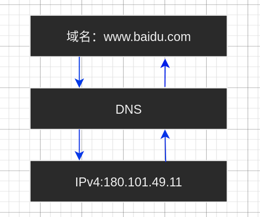

**`DNS`的两种查询方式**

- 递归查询，主机向本地域名服务器的查询一般都是采用递归查询，如果主机所询问的本地域名服务器不指定被查询的域名的`IP`地址，那么本地域名服务器就以客户的身份，向其他根域名服务器继续发出查询请求报文。
- 迭代查询，本地域名服务器向根域名服务器的查询通常采用迭代查询，当根域名服务器收到本地域名服务器的查询请求报文时，要么给出要查询的`IP`地址，要么告诉本地域名服务器下一步向那个域名服务器进行查询，然后让本地域名服务器进行后续的查询。

**`DNS`常用问题类型**

`DNS`查询和相应中所使用的类型域，指明了这个查询或者响应的资源记录类型。

| 值   | 类型    | 描述                                                         |
| ---- | ------- | ------------------------------------------------------------ |
| 1    | A       | `IPv4`主机地址                                               |
| 2    | `NS`    | 权威域名服务器                                               |
| 5    | `CNAME` | 规范别名，定义主机正式名字的别名                             |
| 12   | `PTR`   | 指针，把`IP`地址转换为域名                                   |
| 15   | `MX`    | 邮件交换记录，用于电子邮件系统发送<br />邮件根据收件人的地址后缀<br />定位邮件服务器 |
| 16   | `TXT`   | 文本字符串                                                   |
| 28   | `AAAA`  | `IPv6`主机地址                                               |
| 251  | `IXFR`  | 增量区域传送                                                 |
| 252  | `AXFR`  | 完整区域传送                                                 |


**捕获`DNS`数据**

开启`wireshark`开始抓包，然后使用`dig`触发一个`DNS`查询

```bash
dig www.baidu.com
```

命令`dig`的常用方式和说明

```bash
dig
DNS Lookup utility.

 - Lookup the IP(s) associated with a hostname (A records):
   dig +short {{example.com}}

 - Lookup the mail server(s) associated with a given domain name (MX record):
   dig +short {{example.com}} MX

 - Get all types of records for a given domain name:
   dig {{example.com}} ANY

 - Specify an alternate DNS server to query:
   dig @{{8.8.8.8}} {{example.com}}

 - Perform a reverse DNS lookup on an IP address (PTR record):
   dig -x {{8.8.8.8}}

 - Find authoritative name servers for the zone and display SOA records:
   dig +nssearch {{example.com}}

 - Perform iterative queries and display the entire trace path to resolve a domain name:
   dig +trace {{example.com}}

```

**`DNS`报文格式解析**

```
                                    1  1  1  1  1  1
      0  1  2  3  4  5  6  7  8  9  0  1  2  3  4  5
    +--+--+--+--+--+--+--+--+--+--+--+--+--+--+--+--+
    |                      ID                       |
    +--+--+--+--+--+--+--+--+--+--+--+--+--+--+--+--+
    |QR|   Opcode  |AA|TC|RD|RA|   Z    |   RCODE   |
    +--+--+--+--+--+--+--+--+--+--+--+--+--+--+--+--+
    |                    QDCOUNT                    |
    +--+--+--+--+--+--+--+--+--+--+--+--+--+--+--+--+
    |                    ANCOUNT                    |
    +--+--+--+--+--+--+--+--+--+--+--+--+--+--+--+--+
    |                    NSCOUNT                    |
    +--+--+--+--+--+--+--+--+--+--+--+--+--+--+--+--+
    |                    ARCOUNT                    |
    +--+--+--+--+--+--+--+--+--+--+--+--+--+--+--+--+
```

- `DNS ID`号：用来对应`DNS`查询和`DNS`响应
- 查询/响应(`Query/Response`)：用来指明这个报文是`DNS`查询还是响应，占1比特位，1表示是响应，0表示是查询
- 操作代码`OpCode`: 用来定义消息中请求的类型，占4比特位
- `AA`: 权威应答，如果设置了这个位，这说明这个响应是由权威域名服务器发出的，占1比特位。
- `TC`：截断，由于响应时间太长，无法接入报文而被截断。该标志为1时说明响应已经超过512字节并已被截断
- 期望递归(`Recursion Desired,RD`)：请求中设定了这个值，说明`DNS`客户端在目标域名服务器不含有所请求信息的情况下，要求进行递归查询。
- `RA`： 可用递归，当设置了这个值，说明域名服务器支持递归查询。
- 保留`Z`: 全部设置为0，但是有时候会作为`RCODE`位的扩展
- `RCODE`: `Response Code` 响应代码，在`DNS`响应中，用来指明错误，占4个比特位。 含义如下：
  1. 0表示没有错误
  2. 1表示个数错误
  3. 2表示域名服务器上存在问题
  4. 3表示域参数问题
  5. 4表示类型不支持
  6. 5表示管理上被禁止
  7. 6-15表示保留
- `QDCOUNT`：问题计数，在问题区段中的条目数
- `ANCOUNT`: 在回答区段中的条目数
- `NSCOUNT`: 域名服务器计数，在权威区段的域名资源记录数
- `ARCOUNT`: 再额外信息区段中的其他资源记录数

报文说明

```
Domain Name System (query)
    Transaction ID: 0x9ad0                              #事务ID
    Flags: 0x0000 Standard query                        #报文中的标志字段
        0... .... .... .... = Response: Message is a query
                                                        #QR字段, 值为0, 因为是一个请求包
        .000 0... .... .... = Opcode: Standard query (0)
                                                        #Opcode字段, 值为0, 因为是标准查询
        .... ..0. .... .... = Truncated: Message is not truncated
                                                        #TC字段
        .... ...0 .... .... = Recursion desired: Don't do query recursively 
                                                        #RD字段
        .... .... .0.. .... = Z: reserved (0)           #保留字段, 值为0
        .... .... ...0 .... = Non-authenticated data: Unacceptable   
                                                        #保留字段, 值为0
    Questions: 1                                        #问题计数, 这里有1个问题
    Answer RRs: 0                                       #回答资源记录数
    Authority RRs: 0                                    #权威名称服务器计数
    Additional RRs: 0                                   #附加资源记录数
```

协议交互过程报文

```bash

Frame 5: 87 bytes on wire (696 bits), 87 bytes captured (696 bits) on interface wlp4s0, id 0
Ethernet II, Src: Chongqin_e1:18:a9 (40:23:43:e1:18:a9), Dst: HIWIFI_65:b0:40 (d4:ee:07:65:b0:40)
Internet Protocol Version 4, Src: 192.168.199.235, Dst: 192.168.199.1
User Datagram Protocol, Src Port: 36025, Dst Port: 53
Domain Name System (query)  # DNS协议
    Transaction ID: 0x9f1c  # 事务ID编号
    Flags: 0x0100 Standard query
        0... .... .... .... = Response: Message is a query # DNS查询
        .000 0... .... .... = Opcode: Standard query (0) #操作代码
        .... ..0. .... .... = Truncated: Message is not truncated #截断
        .... ...1 .... .... = Recursion desired: Do query recursively #期望递归
        .... .... .0.. .... = Z: reserved (0)
        .... .... ...0 .... = Non-authenticated data: Unacceptable
    Questions: 1
    Answer RRs: 0
    Authority RRs: 0
    Additional RRs: 1
    Queries
        www.a.shifen.com: type A, class IN
            Name: www.a.shifen.com
            [Name Length: 16]
            [Label Count: 4]
            Type: A (Host Address) (1)
            Class: IN (0x0001)
    Additional records
        <Root>: type OPT
    [Response In: 6]

No.     Time           Source                Destination           Protocol Length Info
      6 0.013373576    192.168.199.1         192.168.199.235       DNS      289    Standard query response 0x9f1c A www.a.shifen.com A 180.101.49.12 A 180.101.49.11 NS ns3.a.shifen.com NS ns4.a.shifen.com NS ns5.a.shifen.com NS ns1.a.shifen.com NS ns2.a.shifen.com A 61.135.165.224 A 220.181.33.32 A 112.80.255.253 A 14.215.177.229 A 180.76.76.95 OPT

Frame 6: 289 bytes on wire (2312 bits), 289 bytes captured (2312 bits) on interface wlp4s0, id 0
Ethernet II, Src: HIWIFI_65:b0:40 (d4:ee:07:65:b0:40), Dst: Chongqin_e1:18:a9 (40:23:43:e1:18:a9)
Internet Protocol Version 4, Src: 192.168.199.1, Dst: 192.168.199.235
User Datagram Protocol, Src Port: 53, Dst Port: 36025
Domain Name System (response)
    Transaction ID: 0x9f1c
    Flags: 0x8180 Standard query response, No error
        1... .... .... .... = Response: Message is a response  #DNS回复
        .000 0... .... .... = Opcode: Standard query (0)
        .... .0.. .... .... = Authoritative: Server is not an authority for domain # 非权威应答
        .... ..0. .... .... = Truncated: Message is not truncated
        .... ...1 .... .... = Recursion desired: Do query recursively
        .... .... 1... .... = Recursion available: Server can do recursive queries #服务支持递归查询
        .... .... .0.. .... = Z: reserved (0)
        .... .... ..0. .... = Answer authenticated: Answer/authority portion was not authenticated by the server
        .... .... ...0 .... = Non-authenticated data: Unacceptable
        .... .... .... 0000 = Reply code: No error (0)
    Questions: 1
    Answer RRs: 2
    Authority RRs: 5
    Additional RRs: 6
    Queries
        www.a.shifen.com: type A, class IN
            Name: www.a.shifen.com
            [Name Length: 16]
            [Label Count: 4]
            Type: A (Host Address) (1)
            Class: IN (0x0001)
    Answers
        www.a.shifen.com: type A, class IN, addr 180.101.49.12
        www.a.shifen.com: type A, class IN, addr 180.101.49.11
    Authoritative nameservers
        a.shifen.com: type NS, class IN, ns ns3.a.shifen.com
        a.shifen.com: type NS, class IN, ns ns4.a.shifen.com
        a.shifen.com: type NS, class IN, ns ns5.a.shifen.com
        a.shifen.com: type NS, class IN, ns ns1.a.shifen.com
        a.shifen.com: type NS, class IN, ns ns2.a.shifen.com
    Additional records
        ns1.a.shifen.com: type A, class IN, addr 61.135.165.224
        ns2.a.shifen.com: type A, class IN, addr 220.181.33.32
        ns3.a.shifen.com: type A, class IN, addr 112.80.255.253
        ns4.a.shifen.com: type A, class IN, addr 14.215.177.229
        ns5.a.shifen.com: type A, class IN, addr 180.76.76.95
        <Root>: type OPT
    [Request In: 5]
    [Time: 0.013373576 seconds]
```


### `HTTP`协议抓包分析

`HTTP`协议(`HyperText Transfer Protocol`，超文本传输协议)是万维网的传输机制，允许浏览器通过`Web`服务器浏览网页。目前大多数的网络组织中，`HTTP`网络所占用的比例还是非常高的，虽然随着安全的提高，`HTTPS`在慢慢替代`HTTP`，但是还是有很多`HTTP`的网站。

**`HTTP`请求方法**

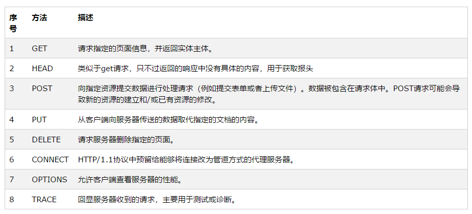


**`HTTP`工作流程**


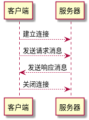

1. 客户端通过`TCP`的三次握手建立连接
2. `TCP`建立连接成功后，向服务器发送`HTTP`请求
3. 服务器收到客户端的`HTTP`请求后，将返回应答，并向客户端发送数据
4. 客户端通过`TCP`的四次挥手，与服务器断开`TCP`连接

**持久性连接和非持久性连接**

- 非持久性连接就是每个`TCP`连接只用于传输一个请求消息和一个响应消息。
- 持久性连接是指服务器在发出响应后可以让`TCP`连接持续打开着，所有的东西都可以持久性发送。

捕获`HTTP`报文，随便访问一个支持`HTTP`协议的网站，然后启用`wireshark`进行抓包

下面是捕获的一个完整的`HTTP`加护的过程

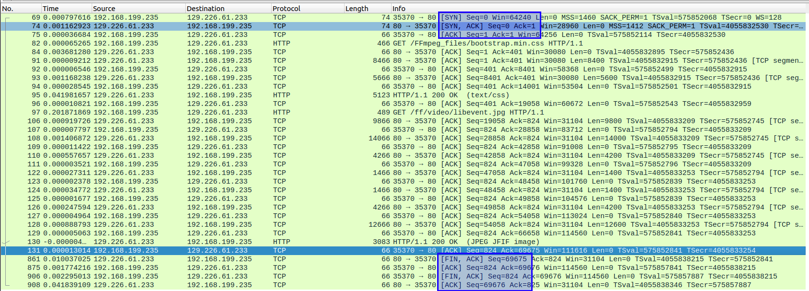

从交互过程中可以看到，`HTTP`协议是建立在`TCP`协议上的，并通过`TCP`协议建立连接传输数据。

`http`协议各个状态代表的意义：

```bash
   		  | "100"  ; Section 10.1.1: Continue
          | "101"  ; Section 10.1.2: Switching Protocols
          | "200"  ; Section 10.2.1: OK
          | "201"  ; Section 10.2.2: Created
          | "202"  ; Section 10.2.3: Accepted
          | "203"  ; Section 10.2.4: Non-Authoritative Information
          | "204"  ; Section 10.2.5: No Content
          | "205"  ; Section 10.2.6: Reset Content
          | "206"  ; Section 10.2.7: Partial Content
          | "300"  ; Section 10.3.1: Multiple Choices
          | "301"  ; Section 10.3.2: Moved Permanently
          | "302"  ; Section 10.3.3: Found
          | "303"  ; Section 10.3.4: See Other
          | "304"  ; Section 10.3.5: Not Modified
          | "305"  ; Section 10.3.6: Use Proxy
          | "307"  ; Section 10.3.8: Temporary Redirect
          | "400"  ; Section 10.4.1: Bad Request
          | "401"  ; Section 10.4.2: Unauthorized
          | "402"  ; Section 10.4.3: Payment Required
          | "403"  ; Section 10.4.4: Forbidden
          | "404"  ; Section 10.4.5: Not Found
          | "405"  ; Section 10.4.6: Method Not Allowed
          | "406"  ; Section 10.4.7: Not Acceptable
          | "407"  ; Section 10.4.8: Proxy Authentication Required
          | "408"  ; Section 10.4.9: Request Time-out
          | "409"  ; Section 10.4.10: Conflict
          | "410"  ; Section 10.4.11: Gone
          | "411"  ; Section 10.4.12: Length Required
          | "412"  ; Section 10.4.13: Precondition Failed
          | "413"  ; Section 10.4.14: Request Entity Too Large
          | "414"  ; Section 10.4.15: Request-URI Too Large
          | "415"  ; Section 10.4.16: Unsupported Media Type
          | "416"  ; Section 10.4.17: Requested range not satisfiable
          | "417"  ; Section 10.4.18: Expectation Failed
          | "500"  ; Section 10.5.1: Internal Server Error
          | "501"  ; Section 10.5.2: Not Implemented
          | "502"  ; Section 10.5.3: Bad Gateway
          | "503"  ; Section 10.5.4: Service Unavailable
          | "504"  ; Section 10.5.5: Gateway Time-out
          | "505"  ; Section 10.5.6: HTTP Version not supported
```


