[TOC]


# PlantUML

## 时序图

### 简单的时序图

```bash
@startuml simple 
' 你可以用 -> 来绘制参与者之间传递的消息,而不必显式地声明参与者。
' 你也可以使用 --> 绘制一个虚线箭头。
' 另外,你还能用 <- 和 <--,这不影响绘图,但可以提高可读性。注意:仅适用于时序图,对于其它示意
' 图,规则是不同的。

Alice -> Bob: Authentication Request
Bob --> Alice: Authentication Response

Alice -> Bob: Another authentication Request
Alice <-- Bob: another authentication Response


@enduml 
```


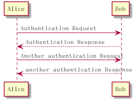


### participant改变先后顺序

关键字 participant 用于改变参与者的先后顺序。
你也可以使用其它关键字来声明参与者:
• actor
• boundary
• control
• entity
• database

```bash
@startuml participant

actor Foo1
boundary Foo2
control Foo3
entity Foo4
database Foo5 

collections Foo6
Foo1 -> Foo2 : To boundary
Foo1 -> Foo3 : To control
Foo1 -> Foo4 : To entity
Foo1 -> Foo5 : To database
Foo1 -> Foo6 : To collections

@enduml
```


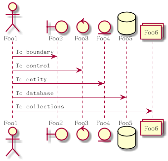


### 使用as重命名参与者

```bash
@startuml sequence_as
actor Bob #red
' The only difference between actor
' and participant is the drawing
participant Alice
participant "I have a really\nlong name" as L #99FF99
/' You can also declare:
participant L as "I have a really\nlong name" #99FF99
'/
Alice->Bob: Authentication Request
Bob->Alice: Authentication Response
Bob->L: Log transaction
@enduml
```


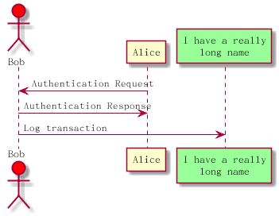


### order改变参与者的顺序

​    使用`order`改变参与者的顺序，`order`的顺序越小越靠前

```bash
@startuml sequence_order
' 通过order 定义参与者顺序
participant Last order 30
participant Middle order 20
participant First order 10
@enduml
```


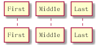

### 使用非字母符号

```bash
@startuml sequence_no_alphabet
' 引号中可以使用非字母符号
' 你可以使用引号定义参与者，还可以使用关键字 as 给参与者定义别名
Alice -> "Bob()" : Hello
"Bob()" -> "This is very\nlong" as Long
' You can also declare:
' "Bob()" -> Long as "This is very\nlong"
Long --> "Bob()" : ok

@enduml 

```


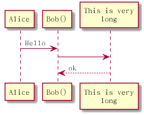

### 修改箭头样式

​    使用不同样式的箭头

```bash
@startuml arrow_num

' • 表示一条丢失的消息:末尾加 x
' • 让箭头只有上半部分或者下半部分:将 < 和 > 替换成 \ 或者 /
' • 细箭头:将箭头标记写两次 (如 >> 或 //)
' • 虚线箭头:用 -- 替代 -
' • 箭头末尾加圈:->o
' • 双向箭头:<->

Bob ->x Alice : 末尾加 x
Bob -> Alice : 常规箭头
Bob ->> Alice : 细箭头
Bob -\ Alice : 粗箭头只保留上半部分
Bob \\- Alice : 细箭头 只保留下半部分
Bob //-- Alice  : 细箭头只保留上半部分
Bob ->o Alice : 实线箭头  带圆圈
Bob o\\-- Alice : 虚线细箭头 只保留一半 带圆圈
Bob <-> Alice : 双向实线箭头
Bob <->o Alice : 双向实线箭头  右侧带圆圈

@enduml 
```

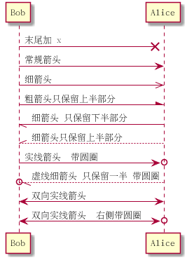


### 修改箭头的箭头的颜色

```bash
@startuml  change_arrow_color
Bob -[#red]> Alice : hello
Alice -[#0000FF]->Bob : ok
@enduml
```


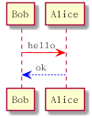

### 对消息序列进行编号

```bash
@startuml  autonumber
autonumber
Bob -> Alice : Authentication Request
Bob <- Alice : Authentication Response
@enduml
```


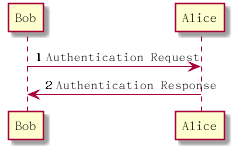


```bash
@startuml autonumber_start_increment

' 语句 autonumber start 用于指定编号的初始值,而 autonumber start increment 可以同时指定编号
' 的初始值和每次增加的值。
autonumber
Bob -> Alice : Authentication Request
Bob <- Alice : Authentication Response
autonumber 15
Bob -> Alice : Another authentication Request
Bob <- Alice : Another authentication Response
autonumber 40 10
Bob -> Alice : Yet another authentication Request
Bob <- Alice : Yet another authentication Response

@enduml 
```


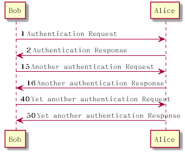

**在双引号中指定编号的方式**

​    可以使用html的方式指定

```bash
@startuml
autonumber "<b>[000]"
Bob -> Alice : Authentication Request
Bob <- Alice : Authentication Response
autonumber 15 "<b>(<u>##</u>)"
Bob -> Alice : Another authentication Request
Bob <- Alice : Another authentication Response
autonumber 40 10 "<font color=red><b>Message 0 "
Bob -> Alice : Yet another authentication Request
Bob <- Alice : Yet another authentication Response
@enduml
```

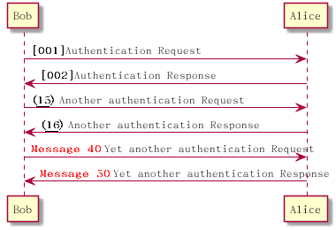

```bash
@startuml autonumber_stop
autonumber 10 10 "<b>[000]"
Bob -> Alice : Authentication Request
Bob <- Alice : Authentication Response
autonumber stop
Bob -> Alice : dummy
autonumber resume "<font color=red><b>Message 0 "
Bob -> Alice : Yet another authentication Request
Bob <- Alice : Yet another authentication Response
autonumber stop
Bob -> Alice : dummy
autonumber resume 1 "<font color=blue><b>Message 0  "
Bob -> Alice : Yet another authentication Request
Bob <- Alice : Yet another authentication Response
@enduml
```

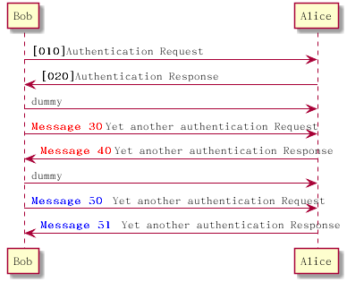

### 组合消息

```bash
@startuml alt
' 我们可以通过以下关键词将组合消息:
' • alt/else
' • opt
' • loop
' • par
' • break
' • critical
' • group, 后面紧跟着消息内容
' 可以在标头 (header) 添加需要显示的文字 (group 除外)。
' 关键词 end 用来结束分组。
' 注意,分组可以嵌套使用
Alice -> Bob: Authentication Request
alt successful case
Bob -> Alice: Authentication Accepted
else some kind of failure
Bob -> Alice: Authentication Failure
group My own label
Alice -> Log : Log attack start
loop 1000 times
Alice -> Bob: DNS Attack
end
Alice -> Log : Log attack end
end
else Another type of failure
Bob -> Alice: Please repeat
end
@enduml
```

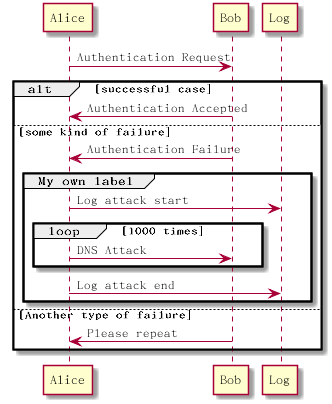


### 添加注释

我们可以使用note left或者note right的形式为时序图添加注释，使用end note添加多行注释

```bash
@startuml  sequence_with_notes
Alice->Bob : hello
note left: this is a first note
Bob->Alice : ok
note right: this is another note
Bob->Bob : I am thinking
note left
a note
can also be defined
on several lines
end note
@enduml
```

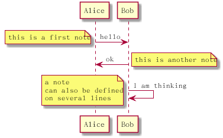

```bash

@startuml note_over
' 可以使用 note left of,note right of 或 note over 在节点 (participant) 的相对位置放置注释。
' 还可以通过修改背景色来高亮显示注释。
' 以及使用关键字 end note 来添加多行注释
participant Alice
participant Bob
note left of Alice #aqua
This is displayed
left of Alice.
end note
note right of Alice: This is displayed right of Alice.
note over Alice: This is displayed over Alice.
note over Alice, Bob #FFAAAA: This is displayed\n over Bob and Alice.
note over Bob, Alice
This is yet another
example of
a long note.
end note
@enduml
```

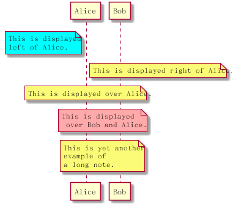


### 改变注释的形状

```bash
@startuml rnote_hnote
' 你可以使用 hnote 和 rnote 这两个关键字来修改备注框的形状
caller -> server : conReq
hnote over caller : idle
caller <- server : conConf
rnote over server
"r" as rectangle
"h" as hexagon
end rnote
@enduml
```

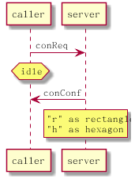

### 使用ref实现引用

```bash
@startuml ref
participant Alice
actor Bob
ref over Alice, Bob : init
Alice -> Bob : hello
ref over Bob
This can be on
several lines
end ref
@enduml
```

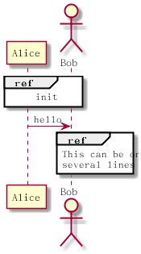


### 延时效果

```bash
@startuml delay
' 你可以使用... 来表示延迟,并且还可以给延迟添加注释
Alice -> Bob: Authentication Request
...
Bob --> Alice: Authentication Response
...5 minutes latter...
Bob --> Alice: Bye !
@enduml
```

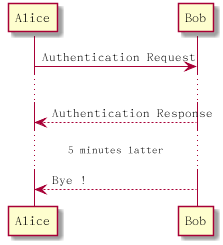

### 使用`|||`增加空间像素

```bash
@startuml  spqce
' 你可以使用 ||| 来增加空间。
' 还可以使用数字指定增加的像素的数量。
Alice -> Bob: message 1
Bob --> Alice: ok
|||
Alice -> Bob: message 2
Bob --> Alice: ok
||45||
Alice -> Bob: message 3
Bob --> Alice: ok
@enduml
```

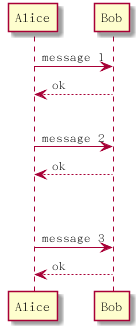

### 生命线的开始和撤销

```bash
@startuml  life_line
participant User
User -> A: DoWork
activate A
A -> B: << createRequest >>
activate B
B -> C: DoWork
activate C
C --> B: WorkDone
destroy C
B --> A: RequestCreated
deactivate B
A -> User: Done
deactivate A
@enduml
```


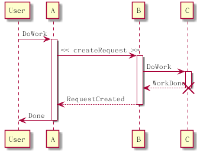


### 生命线的嵌套

```bash
@startuml squence_lifeline
participant User
User -> A: DoWork
activate A #FFBBBB
A -> A: Internal call
activate A #DarkSalmon
A -> B: << createRequest >>
activate B
B --> A: RequestCreated
deactivate B 
deactivate A 
A -> User: Done 
deactivate A 

@enduml
```


### 创建参与者

```bash
@startuml create_sequence
' 你可以把关键字 create 放在第一次接收到消息之前,以强调本次消息实际上是在创建新的对象
Bob -> Alice : hello
create Other
Alice -> Other : new
create control String
Alice -> String
note right : You can also put notes!
Alice --> Bob : ok

@enduml 
```


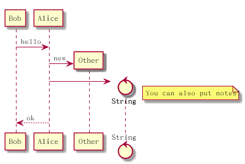

### 进入和发出消息

如果只想关注部分图示,你可以使用进入和发出箭头。
使用方括号 [和] 表示图示的左、右两侧。

```bash
@startuml sequene_[]
[-> A: DoWork
activate A
A -> A: Internal call
activate A
A ->] : << createRequest >>
A<--] : RequestCreated
deactivate A
[<- A: Done
deactivate A
@enduml
```


```bash
@startuml 
[-> Bob
[o-> Bob
[o->o Bob
[x-> Bob
[<- Bob
[x<- Bob
Bob ->]
Bob ->o]
Bob o->o]
Bob ->x]
Bob <-]
Bob x<-]
@enduml
```

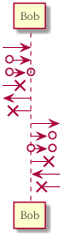

### 构造类型和圈点

```bash
@startuml color_sequence
' 可以使用 << 和 >> 给参与者添加构造类型。
' 在构造类型中,你可以使用 (X,color) 格式的语法添加一个圆圈圈起来的字符

participant "Famous Bob" as Bob << Generated >>
participant Alice << (C,#ADD1B2) Testable >>
Bob->Alice: First message
@enduml
```

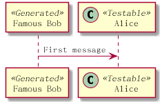

```bash
@startuml sequence_with_circle

' 默认使用 guillemet 字符来显示构造类型。你可以使用外观参数 guillemet 来修改显示行为。
skinparam guillemet false
participant "Famous Bob" as Bob << Generated >>
participant Alice << (C,#ADD1B2) Testable >>

Bob->Alice: First message
@enduml


```

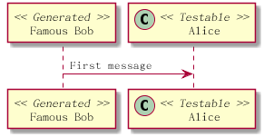


```bash
@startuml new_circle
participant Bob << (C,#ADD1B2) >>
participant Alice << (C,#ADD1B2) >>
Bob->Alice: First message
@enduml
```

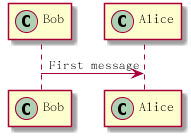

```bash
@startuml coreole
title __Simple__ **communication** example
Alice -> Bob: Authentication Request
Bob -> Alice: Authentication Response
@enduml
```

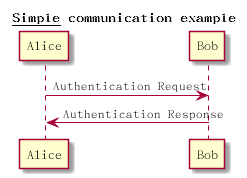

### 多行标题

```bash
@startuml title_endtitle
title
<u>Simple</u> communication example
on <i>several</i> lines and using <font color=red>html</font>
This is hosted by 
end title
Alice -> Bob: Authentication Request
Bob -> Alice: Authentication Response
@enduml
```

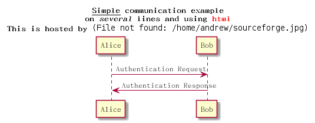


### hide footbox

```bash
@startuml hide foot boot
hide footbox
title Footer removed
Alice -> Bob: Authentication Request
Bob --> Alice: Authentication Response
@enduml
```

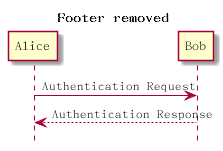

### 增加外观参数

用 skinparam 改变字体和颜色。
可以在如下场景中使用:
• 在图示的定义中,
• 在引入的文件中,
• 在命令行或者 ANT 任务提供的配置文件中。
你也可以修改其他渲染元素,如以下示例:

```bash
@startuml skinparam
skinparam sequenceArrowThickness 2
skinparam roundcorner 20
skinparam maxmessagesize 60
skinparam sequenceParticipant underline

actor User
participant "First Class" as A
participant "Second Class" as B
participant "Last Class" as C
User -> A: DoWork
activate A
A -> B: Create Request
activate B
B -> C: DoWork
activate C
C --> B: WorkDone
destroy C
B --> A: Request Created
deactivate B
A --> User: Done
deactivate A
@enduml


```

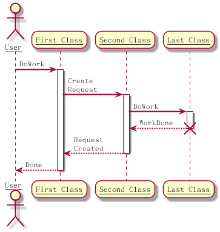


```bash
@startuml sikin
skinparam backgroundColor #EEEBDC
skinparam handwritten true
skinparam sequence {
ArrowColor DeepSkyBlue
ActorBorderColor DeepSkyBlue
LifeLineBorderColor blue
LifeLineBackgroundColor #A9DCDF
ParticipantBorderColor DeepSkyBlue
ParticipantBackgroundColor DodgerBlue
ParticipantFontName Impact
ParticipantFontSize 17
ParticipantFontColor #A9DCDF
ActorBackgroundColor aqua
ActorFontColor DeepSkyBlue
ActorFontSize 17
ActorFontName Aapex
}
actor User
participant "First Class" as A
participant "Second Class" as B
participant "Last Class" as C
User -> A: DoWork
activate A
A -> B: Create Request
activate B
B -> C: DoWork
activate C
C --> B: WorkDone
destroy C
B --> A: Request Created
deactivate B
A --> User: Done
deactivate A

@enduml 
```


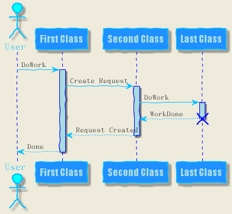

```bash
@startuml
skinparam ParticipantPadding 20
skinparam BoxPadding 10
box "Foo1"
participant Alice1
participant Alice2
end box
box "Foo2"
participant Bob1
participant Bob2
end box
Alice1 -> Bob1 : hello
Alice1 -> Out : out
@enduml
```

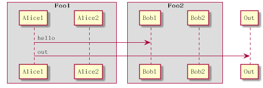

