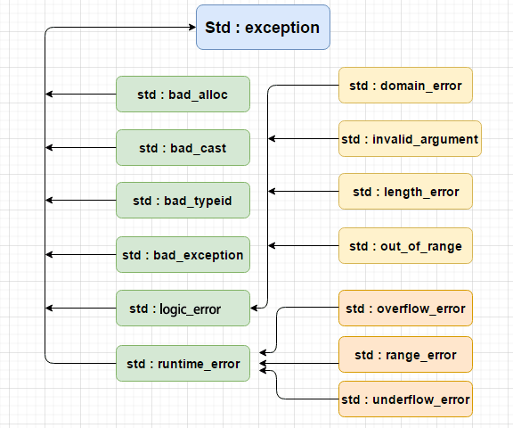

### `C++`的类型转换

`C`风格的类型转换

`C++`风格的类型转换，提供了4种类型操作符来应对不同场合的应用

`static_cast` 静态类型转换，如`int`转换为`char`

`reinterpreter_cast` 重新解释类型

`dynamic_cast`  命名上理解是动态类型转换，如子类父类之间多态类型转换，将父类指针转换为子类的指针，能转成功就说明能够正常使用

`const_cast` 字面上就是去`const`属性

### 异常处理机制

1. 若是有异常则通过`throw`操作创建一个异常对象并抛掷
2. 将可能抛出异常的程序段嵌入到`try`块之中，控制通过正常的顺序执行到`try`语句，然后执行`try`块内的保护段
3. 如果在保护段执行期间没有引起异常，那么跟在`try`块后的`catch`子句就不执行，程序从`try`块后跟随者最后一个`catch`子句后面的语句继续执行下去。
4. `catch`子句按其在`try`块后出现的顺序被检查，匹配的`catch`子句将捕获并处理异常
5. 如果匹配的处理器未找到，则执行函数`teminate`将自动调用，其缺省功能是调用`abort`终止程序
6. 处理不了的异常，可以在`catch`的最后一个分支，使用`throw`的方法继续向上扔

异常处理的好处就是能将异常处理和正常函数流程进行分离，正常流程只处理函数业务上的逻辑，异常处理可以交给单独的异常处理函数进行处理。

#### 栈解旋

异常抛出后，从进入`try`块起，到异常被抛出前，这期间在栈上的构造的所有对象，都会被自动析枸。析枸的顺序与构造的顺序相反，这个过程被称为栈的解旋(`unwinding`)

#### 异常接口声明

为了加强程序的可读性，可以在函数声明中列出可能抛出的所有异常类型，例如：`void func() throw(A,B,C,D)`，这个函数`func()`能够且只能抛出`A,B,C,D`及其子类型的异常。

如果函数声明中国捏没有包含任何类型的异常接口声明，则此函数可以抛出任何类型的异常，例如：`void func()`

一个不抛出任何异常的函数可以声明为`void func() throw()` 

如果一个函数抛出了它的异常接口声明不允许抛出的异常，`unexpected`函数会被调用，该函数默认行为调用`terminate`函数终止程序。

#### 标准异常

| `异常`                   | `描述`                                                       |
| :----------------------- | :----------------------------------------------------------- |
| `**std::exception**`     | `该异常是所有标准 C++ 异常的父类。`                          |
| `std::bad_alloc`         | `该异常可以通过 **new** 抛出。`                              |
| `std::bad_cast`          | `该异常可以通过 **dynamic_cast** 抛出。`                     |
| `std::bad_exception`     | `这在处理 C++ 程序中无法预期的异常时非常有用。`              |
| `std::bad_typeid`        | `该异常可以通过 **typeid** 抛出。`                           |
| `**std::logic_error**`   | `理论上可以通过读取代码来检测到的异常。`                     |
| `std::domain_error`      | `当使用了一个无效的数学域时，会抛出该异常。`                 |
| `std::invalid_argument`  | `当使用了无效的参数时，会抛出该异常。`                       |
| `std::length_error`      | `当创建了太长的 std::string 时，会抛出该异常。`              |
| `std::out_of_range`      | `该异常可以通过方法抛出，例如 std::vector 和 std::bitset<>::operator。` |
| `**std::runtime_error**` | `理论上不可以通过读取代码来检测到的异常。`                   |
| `std::overflow_error`    | `当发生数学上溢时，会抛出该异常。`                           |
| `std::range_error`       | `当尝试存储超出范围的值时，会抛出该异常。`                   |
| `std::underflow_error`   | `当发生数学下溢时，会抛出该异常。`                           |

