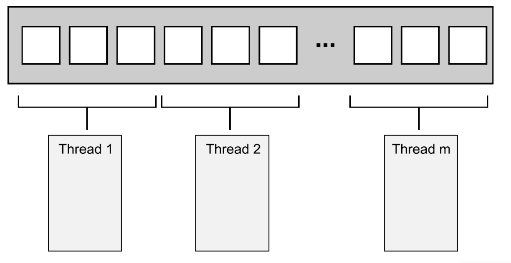

# `STL`


## 容器得值拷贝

 所有的容器都是值语义，而非引用喻意。容器执行插入元素的操作时，内部实施拷贝动作。所以`STL`容器内部必须能够被拷贝(必须提供拷贝构造函数)。
 - 无参构造函数
 - 拷贝构造函数
 - 重载`=`操作符

除了`queue`与`stack`外，每个容器提供可返回迭代器的函数，运用返回的迭代器就可以访问元素

通常`STL`不会丢出异常，要求使用者确保传入正确的参数

每个容器都提供了一个默认构造函数跟一个默认拷贝构造函数

如已有`vecIntA`


## 各个容器使用的时机

| 典型内存结构 | vector | `deque`  | `list`   | `set` | `multiset` | `map`     | `multimap` |
| ------------ | ------ | -------- | -------- | ----- | ---------- | --------- | ---------- |
| 可随机存取   | Y      | Y        | N        | N     | N          | 仅`key`是 | N          |
| 元素搜索速度 | 慢     | 慢       | 非常慢   | 快    | 快         | 对`key`快 | 对`key`快  |
| 快速安插移出 | 尾端   | 头尾两端 | 任何位置 | -     | -          | -         | -          |

- `deque`常用于排队购票系统  
- `list`公家车乘客的存储，比如随时都有可能有乘客下车，支持频繁的不确实位置元素的移除和插入
- `set`有需要排序的数据存储，比如游戏玩家的游戏分数记录
- `map`大量需要查找的数据


## 算法

```cpp
#include <algorithm>
#include <numeric>
#include <functional>
```

`algorithm`是所有`STL`头文件中最大的一个，其中常用到的功能范围涉及到比较、交换、查找、遍历、复制、修改、反转、排序、合并等。

`numeric`体积很小，只包括几个在序列上面进行简单数学运算的模板函数，包括加法和乘法在序列上的一些操作

`functional`中则定义了一些模板类用以声明函数对象

`STL`提供了大量的算法的模板函数，只要能够熟悉`STL`之后，许多代码可以被大大的简化，只需要一两个算法模板，就可以完成需要的功能，从而提高效率。


函数对象(仿函数)


## 函数

`for_each`函数中使用并行对数据进行处理，函数会启用`N`个线程，每个线程处理一部分数据，线程之间不进行通信

```cpp

// 函数对象
/*
 * 类重载了 ()
 * */
template <typename T>
class ShowElem{
public:
    void operator()(const T &t) {
        cout << t << endl;
    }
};

bool IsOdd(int data) {
    return data % 2;
}

void for_each_test() {
    vector<int> vec1;
    vec1.push_back(1);
    vec1.push_back(3);
    vec1.push_back(5);

    for_each(vec1.begin(), vec1.end(), ShowElem<int>()); // 在不是对象的时候就是匿名仿函数

    auto it = find_if(vec1.begin(), vec1.end(), IsOdd);
//    查找到一个就会停止
    cout << "*it is Odd =" << *it << endl;
}
```





