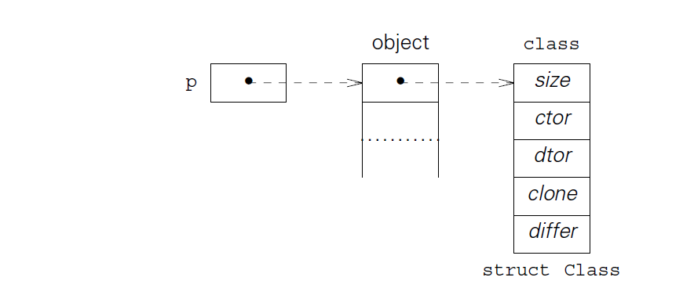

[TOC]


# `DynamicLinkageGenericFunctions`

[代码仓库]:https://github.com/zzu-andrew/linux-sys/blob/6c19498a436902120eec7e08c18e4a74d04dafa2 b+j6/ooc/test/c.02/


## Constructors and Destructors

构造与析构函数

加入我们像下面这样使用函数，为每个类型都定义自己的析构函数，那么就有一个问题，需要为所有的数据安装析构函数和编写`new`函数，如下：

```cc
struct type {
    size_t size; /* size of an object */
    void (* dtor) (void *); /* destructor */
};
struct String {
    char * text; /* dynamic string */
    const void * destroy; /* locate destructor */
};
struct Set {
    ... information ...
    const void * destroy; /* locate destructor */
};
```

`new`数据初始化只是`new`函数的部分工作，需要将dtor函数指向新创建对象中的析构函数，并且`new`中传入不同的参数时需要实现不同的功能。

:alarm_clock:

```c
new(Set); /* make a set */
new(String, "text"); /* make a string */
```

需要进行初始化时，`new`将会根据不同的对象调用不同的构造函数对对象进行初始化，这里需要将对象中的函数指针`ctor`执行对应的构造函数，指向的构造函数如下，用于初始化除了对象之外的对象成员。

```c
/* 构造函数 */
void * new (const void * _class, ...)
{	const struct Class * class = _class;
	void * p = calloc(1, class -> size);

	assert(p);
	/* 强制转换为Class，这样就能实现同样的函数只赋值初始化一次，但是所有定义的
		对象都能够调用 */
	* (const struct Class **) p = class;

	if (class -> ctor)
	{	va_list ap;

		va_start(ap, _class);
		p = class -> ctor(p, & ap);
		va_end(ap);
	}
	return p;
}
/* 析构函数 */
static void * String_ctor (void * _self, va_list * app)
{	struct String * self = _self;
	const char * text = va_arg(* app, const char *);

	self -> text = malloc(strlen(text) + 1);
	assert(self -> text);
	strcpy(self -> text, text);
	return self;
}
```

从上述构造函数的实现可以看出，这个构造函数是没有负责对象的构建的，只是对对象中的成员进行了构造(初始化)，因为对象的构造和析构是`new`和`delete`函数负责的。

并且`delete`函数也是只负责释放释放`new`函数申请的内存，所有构造函数申请的内存全部由析构函数负责进行释放。

```c
/* delete函数只负责释放new函数申请的内存 */
void delete (void * self)
{	const struct Class ** cp = self;

	if (self && * cp && (* cp) -> dtor)
		self = (* cp) -> dtor(self);
	free(self);
}
/* 所有构造函数中申请的内存由，析构函数这里负责释放 */
static void * String_dtor (void * _self)
{	struct String * self = _self;

	free(self -> text), self -> text = 0;
	return self;
}
```

对于一个`String`，有一部分内存是通过构造函数进行申请的，但是`String`却是`new`函数申请的内存，`String`本身需要使用`delete`函数进行释放。

## 方法、信息、类和对象

`delete`函数中传入的对象指针，必须在传入前初始化好，将析构函数指针指向对应对象的析构函数

```c
struct Class {
	size_t size;
	void * (* ctor) (void * self, va_list * app);
	void * (* dtor) (void * self);
	void * (* clone) (const void * self);
	int (* differ) (const void * self, const void * b);
};

struct String {
	const void * class;	/* must be first */
	char * text;
};
```

每个对象的开头都有一个指向自类型的指针`const void * class`，通过这个指针我们能获取得到`new`对象时需要申请的内存大小 `.size`，构造函数`.ctor`，析构函数`.dtor`，`.clone`函数对象复制函数，`.differ`函数对象对比函数。

仔细看来我们的每个对象开头都有一个指向自己类型的指针`const void * class;`，通过`calss`的类型中的提供的信息我们能知道如下信息：

```c
size_t size;  // 提供对象的大小，这里也就是String的大小
void * (* ctor) (void * self, va_list * app); // 构造函数
void * (* dtor) (void * self); // 析构函数
void * (* clone) (const void * self); // 对象克隆函数
int (* differ) (const void * self, const void * b); //对象对比函数

```


### `new`

`new`函数中申请了对象的内存，并通过构造函数对对象中的内容进行了构造，其实这里也就是一个`text`字符串指针，申请一块内存，并将`new`中传入的字符串复制到申请的内存中去。

需要注意的是二级指针的使用方法，通过`new`中申请的是`struct String`那么`p`是指向`String`类型的一个对象，但是`Stirng`类型中`class`才是指向静态方法的结构体的指针，想要调用方法，就需要取出`p`指针中的`class`指针。实现方法就是`* (const struct Class **) p = class;`,要求就是，`class`必须是`object`中的首个指针。

拆分：

```c
*
(const struct Class **) 
p

在按照结合方式从左至右 *先与p结合，然后是(const struct Class **)
上述等价于：
   p->class ==> (*p).class
   * (const struct Class **) p ==> (const struct Class *)p->class
```



```c
void * new (const void * _class, ...)
{	const struct Class * class = _class;
	void * p = calloc(1, class -> size);

	assert(p);
	/* 强制转换为Class，这样就能实现同样的函数只赋值初始化一次，但是所有定义的
		对象都能够调用 */
	* (const struct Class **) p = class;

	if (class -> ctor)
	{	va_list ap;
		//ctor 指向的函数 String_ctor
		va_start(ap, _class);
		p = class -> ctor(p, & ap);
		va_end(ap);
	}
	return p;
}
```


```c
static void * String_ctor (void * _self, va_list * app)
{	struct String * self = _self;
	const char * text = va_arg(* app, const char *);

	self -> text = malloc(strlen(text) + 1);
	assert(self -> text);
	strcpy(self -> text, text);
	return self;
}
```

### `delete`

`delete`函数是对`new`申请的内存进行释放的函数，在确保传入的值不是`NULL`并且构造函数存在的情况下先调用析构函数对`self`中构造函数申请的内存进行释放，在调用`free`释放`new`函数申请的内存。

```c
void delete (void * self)
{	const struct Class ** cp = self;

	if (self && * cp && (* cp) -> dtor)
		self = (* cp) -> dtor(self);
	free(self);
}
```

析构函数

```c
static void * String_dtor (void * _self)
{	struct String * self = _self;

	free(self -> text), self -> text = 0;
	return self;
}
```


### `clone`

对象的克隆

```c
void * clone (const void * self)
{	const struct Class * const * cp = self;

	assert(self && * cp && (* cp) -> clone);
	return (* cp) -> clone(self);
}


```

对象的克隆，就是调用`new`方法新生成一个和传入对象一样的对象

```c
static void * String_clone (const void * _self)
{	const struct String * self = _self;

	return new(String, self -> text);
}
```

### `differ`

差异对比函数，实现了对对象本身以及对象字符串是否相同的对比，如果对象相等那就返回0，如果是不同的对象，对象描述`text`一样也放回0，表示相同；

```c
int differ (const void * self, const void * b)
{	const struct Class * const * cp = self;

	assert(self && * cp && (* cp) -> differ);
	return (* cp) -> differ(self, b);
}
```

```c
static int String_differ (const void * _self, const void * _b)
{	const struct String * self = _self;
	const struct String * b = _b;

	if (self == b)
		return 0;
	if (! b || b -> class != String)
		return 1;
	return strcmp(self -> text, b -> text);
}
```

### `sizeOf`

`sizeOf`函数比较简单，内部只是返回对象中`size`字段中存储的数值

```c
size_t sizeOf (const void * self)
{	const struct Class * const * cp = self;

	assert(self && * cp);
	return (* cp) -> size;
}
```


### `main`

```c
#include <stdio.h>
#include "String.h"
#include "new.h"

int main ()
{	void * a = new(String, "a"), * aa = clone(a);
	void * b = new(String, "b");

	printf("sizeOf(a) == %zu\n", sizeOf(a));
	if (differ(a, b))
		puts("ok");

	if (differ(a, aa))
		puts("differ?");

	if (a == aa)
		puts("clone?");

	delete(a), delete(aa), delete(b);
	return 0;
}
```


----

## 总结

这小节想说的其实就是动态的指针，同样的应用程序将函数指针指向不同的函数，就能实现不同的效果.

在主函数中创建了a、aa、b对象，三个对象都通过calss指针指向了共同的`Class`结构体， `Class`结构中有指向静态函数的指针，在编译的时候通过编译不同的`c`文件实现对函数指针装载不同的函数。

实现的效果也就是通过动态指针指向不同的函数，从而实现同样的主函数，实际执行的时候，执行不同的函数，达到不同的效果，实现对数据的封装。


## `TIPS`


```c
#include <stdio.h>
#include <stdlib.h>
#include <assert.h>
#include <string.h>
#include <stdarg.h>

void test(void);

struct String {
	const void * class;	/* must be first */
	char * text;
};

struct Class {
	size_t size;
	void  (* test) (void);
};
void test(void)
{
    printf("test for point.\n");
}

static const struct Class _String = {
	sizeof(struct String),
	test
};

const void * String = & _String;

/**
 *  
 */
int main(int argc, char const *argv[])
{
    size_t stringSize = sizeof(struct String);
    
    const struct Class * class = String;
	void * p = calloc(1, class -> size);

	assert(p);
     
	* (const struct Class **) p = class;

    struct String {
        const void * class;	/* must be first */
        char * text;
    };
    struct String * p = (struct String *)calloc(1, sizeof(struct String));
    
    return 0;
}
```


我们有如下定义：

```c
struct String {
	const void * class;	/* must be first */
	char * text;
};
struct Class {
	size_t size;
	void  (* test) (void);
};
```

首先我们申请一个内存`void * p = calloc(1, sizeof(struct String));`，这里很好理解，这个时候我们想让`p`变成一个指向`struct String`类型的一块内存，只需要申请的时候加上强制转换就可以了`struct String * p = (struct String *)calloc(1, sizeof(struct String));`，这个时候`p`就是一个指向`struct String`类型元素的一个结构体指针。

接下来看下这个使用方法`*(const struct Class **) p = class;`很多人看到第一眼的时候，第一眼就本能的将后面两个取址符与前面一个解引用相互抵消最终得出下面这样的结论，实际效果相当于：

`(const struct Class *) p = class;`,你要是真的这样想就大错特错了。

这里的意思其实是如下图：


在经过上述操作之后，`p`指针指向了`String`结构体，而`* (const struct Class **) p = class;`的作用就是讲`String`中的`void *`类型的指针`class`指向`String`结构体，注意是结构体不是类型，解如图中那样，`String`结构体其实是一个`struct Class`类型的结构体指针。

```c
static const struct Class _String = {
	sizeof(struct String),
	test
};

const void * String = & _String;
```


```c
所以下面这个绝对不能使用取址和解引用相互抵消的方式进行代码走读，也不要新百度问答上那些讲的这不这样使用不能达到能将String结构体中的void  *指针指向新申请内存的目的
    const struct Class ** -- 告诉编译器这个指针是个二维指针，第一个指针是指向String结构体，结构体中又有两个指针，第二个指针说明的是取结构体指针中的指针，具体取得哪个指针就由前面给出的类型来决定了，这里取得是一个`struct Class`结构体指针。
    因为这个时候取得是双重指针，有因为p本身又是指针，要想和class这个指针对应上，需要对指针进行一次解引用，这也就形成了下面这种方式，在C语言中实现取结构体指针中的指针的方式
* (const struct Class **) p = class;
```


